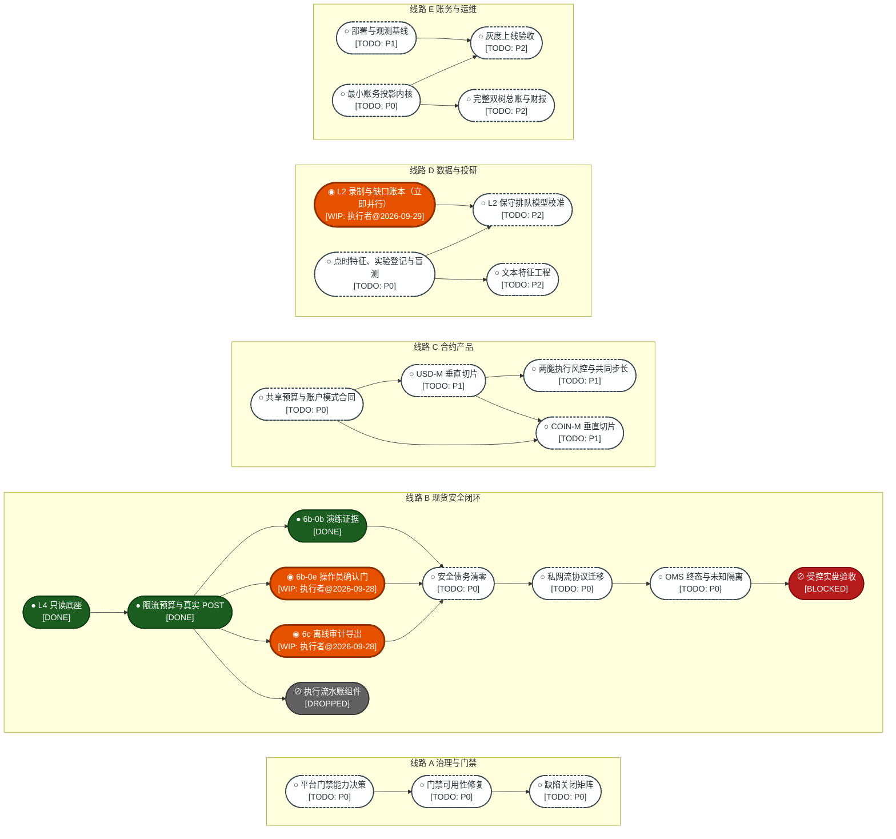
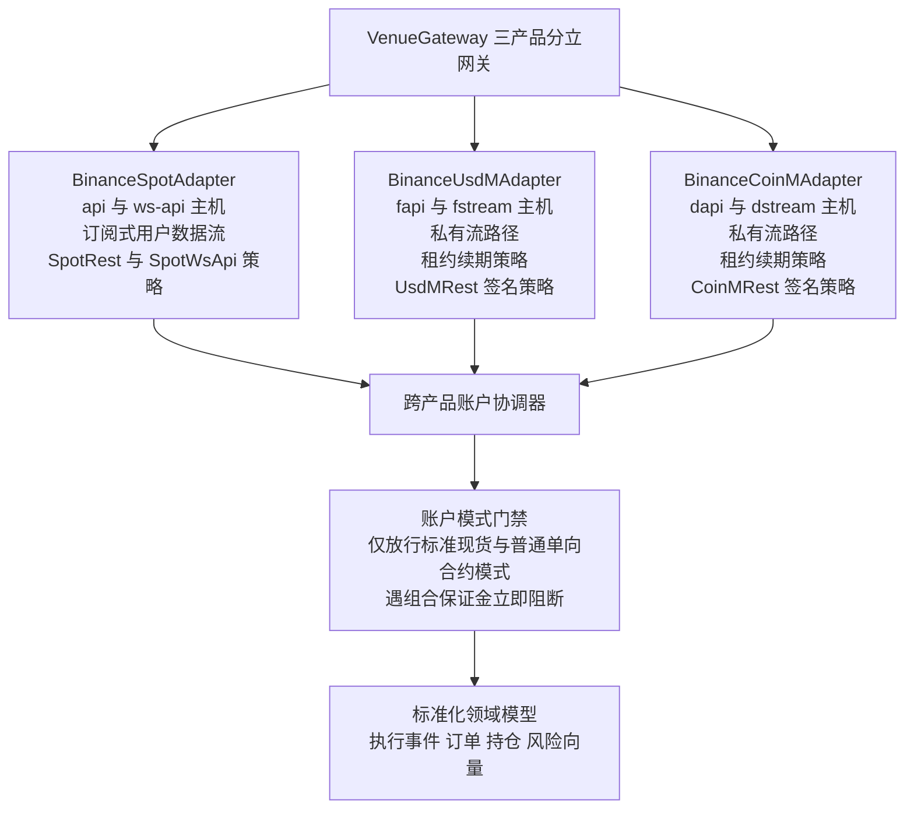
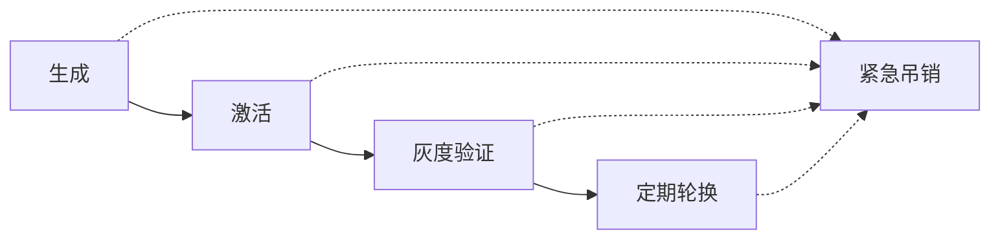
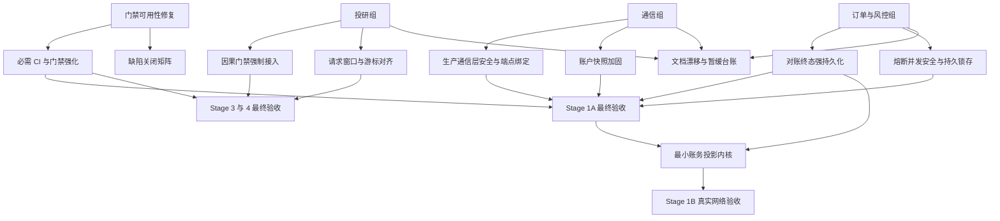
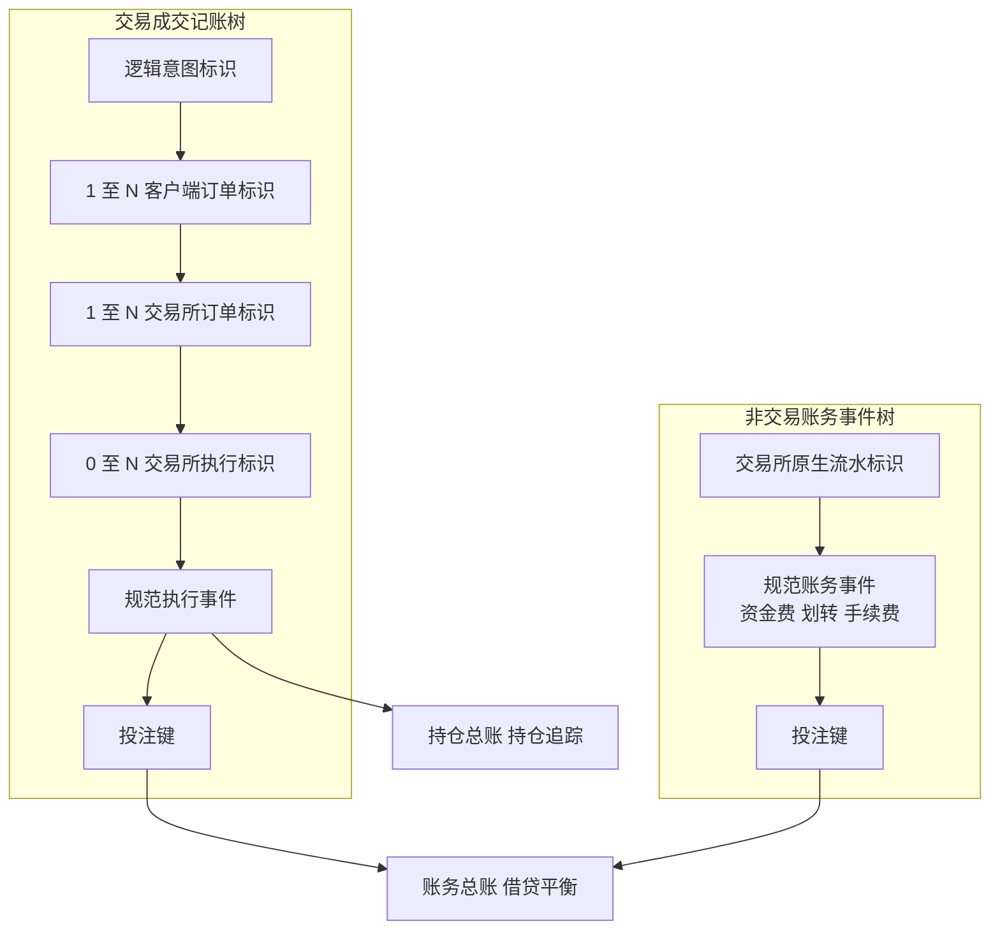

# HengYuan v2 全自动加密货币量化实盘系统实施指南与完整 TODO LIST（v2.7.0）

## 卷 0 文档元数据与阅读约定

### 0.1 版本与同步基线

| 元数据项 | 取值 |
| :--- | :--- |
| 文档版本 | **v2.7.0**（权威调研整合版；上一版 v2.6.1，冻结原文 v2.5.6） |
| 最后代码同步哈希 | 远端主干 **`a7d4183`**（PR #114 合并提交，6b-0e 操作员确认原语已合入） |
| 同步时间（本地快照） | 2026-09-29（以本地工作树、远端 PR 记录、GitHub API 与交易所官方文档实测为准） |
| 外部协议核验时间 | 2026-09-29（现货官方文档仓库，其变更日志最后更新 2026-09-18；衍生品官方文档全量文本同日抓取；逐条见 `5.7`） |
| 本地主干对照 | 本地 `master` = `3278180`（PR #92），落后远端主干 **25 个提交** |
| 并行工作树 | 4 个 `git worktree`：`hengyuan_v2`（本次文档修订，基点 `a7d4183`）、6b-0e 专用工作树（其分支已由 PR #114 合入，远端分支已删除）、`hengyuan_v2_6c`（6c，PR #115，基线之后已合入 `680d3bf`）、`hengyuan_v2_d0`（D0 录制器，PR #117，基线之后已合入 `de80552`） |
| 文档效力层级 | 本文件是**受控工程实施蓝图**；其代码状态断言受 `0.3` 节证据分级约束，其规划条目受各 Stage 章的门禁条件约束，其执行与准入顺序受 `1.5` 约束 |
| 归档副本 | 冻结原文（v2.5.6，SHA256 `9d78643d…93965`）、v2.6.0、v2.6.1（SHA256 `4b5baadb…02ad0`）与核对证据台账，均存于 `docs/archive/` |

### 0.2 文档状态摘要

| 维度 | 状态 | 说明 |
| :--- | :--- | :--- |
| 主干代码演进 | **活跃** | `#70`–`#110` 与 `#114` 为代码合并，`#111`–`#113` 为文档与换行规则收尾；6b-0e 确认原语已合入但尚无生产调用者；基线之后已合入 6c 离线导出（PR #115，`680d3bf`）、D0 录制器（PR #117，`de80552`）、R-10 与 L-30（PR #119 至 #121）、录制器 `pull` 的重试与校验器修正（PR #123、#124），其余为文档（`#116`、`#118`、`#122`） |
| 自动化门禁 | **不可信** | 分支保护在当前私有仓库计划下不可配置；CodeQL 此前为短路空绿，最近一次定时运行以零步骤失败结束（根因 `UNVERIFIED`）；Sanitizer 周更作业已真实跑通，但不构成必需检查。详见 `2.2.3` |
| 现货实盘闭环 | **未验收** | 真实 POST 已合入但无可运行调用者；终态持久化缺失；树内用户数据流依赖的 REST listenKey 端点已于 2026-02-20 下线，迁移为硬前置 |
| 合约（USD-M / COIN-M） | **未开工** | 全部为设计目标；USD-M 关键协议事实已核验（`5.7`） |
| 数据与投研 | **未开工** | 无 L2 录制、无点时特征、无实验治理；数据录制列为最高并行优先级（`1.5`） |
| 账务与运维 | **未开工** | 无复式记账、无部署基线；最小账务投影内核前移至 Stage 1B 之前（`1.5`） |
| 实盘授权 | **未授权** | 真实订单的首次提交始终是账户所有者（Owner）的本人动作 |

### 0.3 证据分级与用词约定

本文档对每一处状态断言要求可指认的证据类型；**无法归入下列类型之一的断言一律记为 `UNVERIFIED`，不使用“应已”“大概”“基本完成”等模糊表述**。

| 证据类型 | 定义 | 取用方式 |
| :--- | :--- | :--- |
| 代码证据 | 工作树内可定位的 `文件:行号` 与符号 | 静态读取当前 `HEAD` |
| 合并证据 | PR 编号与其合并提交 SHA | 远端 PR 记录 |
| 运行证据 | CI run id、作业名与终态结论 | 远端 Actions 记录 |
| 平台证据 | 平台能力或配置的 API 实测返回值 | 平台 API 实测 |
| 协议证据 | 交易所官方文档原文、变更日志条目及其抓取日期 | 官方文档仓库或官方文档站全量文本，登记于 `5.7` |

用词分级（全文严格遵守，不得混用）：

- **已合入主干**：代码进入远端主干，且可指认合并提交；**不蕴含**正确性、覆盖度或可用性。
- **已验收**：具备对应故障注入、恢复、跨平台与运行证据，且证据可在上表所列类型中定位。
- **设计目标**：仅存在于本蓝图或规格文档，仓库内无对应实现；不得在任何状态表中按“已有组件”引用。
- **待实现**：已确认缺口，且已给出可判定的完成条件。
- **阻塞**：受未满足门禁约束，**仅约束验收或真实网络操作**，不禁止离线并行开发。
- **`UNVERIFIED`**：证据不足；不得作为任何决策依据。
- **`EXTERNAL_PROTOCOL_VERIFICATION_REQUIRED`**：依赖交易所协议、但尚未取得协议证据的断言；不得写入任何任务的完成条件或验收标准。

### 0.4 阅读顺序建议

执行者与集成负责人按 `卷 1（含 1.5 执行序）→ 卷 2 → 卷 6 → 卷 7` 顺序阅读；架构与安全评审者按 `卷 4 → 卷 5（含 5.7 与 5.8）→ 附录 D` 顺序阅读；投研与数据负责人按 `卷 3 → 卷 5.5 与 5.7 → 卷 6.5 至 6.7 → 卷 8` 顺序阅读。

本文档另有同目录同名的 `.html` 交互视图，由 `tools/doc_site/build_site.py` 从本 Markdown 解析生成，二者同源：站点图在该视图中以线路动画呈现，并附状态筛选、可开工性判定、完成时间轴与故障用例筛选；本 Markdown 始终是权威副本，交互视图不含任何手工录入的数据。

### 0.5 结构化标注与机器可读索引

文档使用三类结构化标注承载元信息，全部登记于 `附录 E`，不嵌入正文叙述：

| 类型 | 作用 | 使用场景 |
| :--- | :--- | :--- |
| `MODULE_BOUNDARY` | 声明模块的名称、依赖与被依赖 | 卷与附录集合的边界，用于安全地增删模块 |
| `RATIONALE` | 记录备选方案、取舍与可逆路径 | 关键决策节点，供后续重构时还原设计意图 |
| `EXTENSION_POINT` | 声明标识、上下文与预期用法 | 官方扩展接入点，是后续增补内容的约定入口 |

标注以原始 HTML 注释语法逐行保存在 `附录 E.3` 的代码围栏内，因此具备两项性质：其一，任何渲染管线（含禁用原始 HTML 的管线）都不会将其显示为正文；其二，脚本可按行解析，无需依赖渲染器行为。若标注直接置于章节内，禁用原始 HTML 的渲染环境会将其逐字显示，破坏正文可读性，故统一收口到附录。

---

## 卷 1 技术路线站点图

### 1.1 图例与状态约定

本卷以轨道线路图隐喻描述技术路线的阶段推进。站点状态与标记约定如下：

| 标记 | 名称 | 含义 | 必填信息 |
| :---: | :--- | :--- | :--- |
| ● | 实心站点 | 阶段**已完工** | 完成日期、对应章节锚点、合并证据（PR 编号） |
| ◉ | 高亮站点 | 阶段**进行中** | 负责人角色、预期完成时间、当前阻塞项 |
| ○ | 空心站点 | 阶段**待实现** | 优先级、依赖站点、预估工作量 |
| ⊘ | 终止站点 | 阶段**被阻断或已废弃** | 阻断条件或废弃依据 |
| ▣ | 换乘站 | 多线路交汇的共享约束 | 受约束的线路集合 |

说明：本 Markdown 以 ◉ 标记加粗行表达“高亮”，不使用隐式视觉效果，保证在不支持动画的渲染环境中语义不丢失。同目录的 `.html` 交互视图在此基础上补足动态呈现：进行中站点以脉冲环标注，线路巡行列车的位置对应该线路已达进度，下一个可开工站点以旋转虚线环标注，并支持按状态与线路筛选。两种呈现共用同一份数据，状态以本卷 `1.3` 明细表为准。节点内联状态标记统一为 `[DONE]`、`[WIP: 负责人@日期]`、`[TODO: 优先级]`、`[BLOCKED]`、`[DROPPED]` 五种，优先级取 `P0`、`P1`、`P2`。

当前换乘站 ▣ 为 A1、B5、B8 与 E0：A1 约束线路 A 与线路 B；B5 约束线路 B、线路 D 与线路 E；B8 约束线路 B 与线路 E；E0 的最小账务投影内核同时约束线路 C 的真实网络验收与线路 E 的灰度上线。站点编号只表达线路归属，执行与准入顺序以 `1.5` 为准。

### 1.2 线路总览



### 1.3 站点明细

| 站点 | 状态标记 | 阶段 | 完成日期 | 负责人 | 预期完成 | 优先级 | 依赖 | 预估 | 章节锚点 |
| :---: | :--- | :--- | :--- | :--- | :--- | :---: | :--- | :--- | :--- |
| A0 | `[TODO: P0]` | 平台门禁能力决策 | — | Owner | 2026-10-02 | P0 | 无（Owner 决策项） | 1 日 | [2.2.3](#223-平台层门禁能力约束) |
| A1 | `[TODO: P0]` | 门禁可用性修复（GATE-00） | — | CI/集成负责人 | 2026-10-02 | P0 | A0 仅约束第三项；第一项已由 PR #110 满足 | 1–2 日 | [6.0](#60-stage-0-安全债务清零) |
| A2 | `[TODO: P0]` | 缺陷关闭矩阵（GATE-01） | — | CI/集成负责人 | 2026-10-06 | P0 | A1 | 2–4 日 | [4.1](#41-处置状态口径与复验规则) |
| B0 | `[DONE]` | L4 签名只读底座（#60 / #67 / #69） | 2026-08-30 | — | — | — | — | — | [2.3](#23-已合入主干的执行底座) |
| B1 | `[DONE]` | 限流预算（#71）与真实 POST（#72） | 2026-08-31 | — | — | — | — | — | [2.3](#23-已合入主干的执行底座) |
| BD | `[DROPPED]` | 执行流水账组件（原 TODO 1A.5 的一半） | 2026-09-04 | 原生架构负责人 | — | — | 已废弃，不再有依赖 | — | [2.3](#23-已合入主干的执行底座) |
| B2 | `[DONE]` | 6b-0b 演练证据（NOW-01） | 2026-09-26 | 当前工作树执行者 | — | P0 | PR #108 合并提交 `8d81fda`，验证收尾 PR #110 合并为 `5aa4242`；本地变异、MSVC/GCC/ASan、远端 CI/ARM64 均有证据 | 2–4 日 | [6.1](#61-stage-1a-现货最小安全垂直闭环) |
| B3 | `[WIP: 执行者@2026-09-28]` | 6b-0e 操作员确认门（NOW-02） | — | 独立工作树执行者 | 2026-10-03 | P0 | 确认门与输入读取原语已由 PR #114 合入；剩余账户 UID 解析与 harness 装配 | 1–3 日 | [6.1](#61-stage-1a-现货最小安全垂直闭环) |
| B4 | `[WIP: 执行者@2026-09-28]` | 6c 离线审计导出（NOW-03） | — | 独立工作树执行者 | 2026-10-01 | P0 | PR #115 已合入主干（`680d3bf`），代码、测试与变异证据齐备（本地 MSVC 与 GCC-14、ASan+UBSan 通过）；导出契约与互斥保证的审查裁定（附录 C 的 R-05）待审计复核者，裁定后置为 `[DONE]` | 1–3 日 | [6.1](#61-stage-1a-现货最小安全垂直闭环) |
| B5 | `[TODO: P0]` | 安全债务清零（SAFE-01 至 SAFE-06） | — | Native / Python 分工负责人 | 2026-10-08 | P0 | B2、B3、B4 的接口冻结 | 12–20 日 | [6.0](#60-stage-0-安全债务清零) |
| B6 | `[TODO: P0]` | 私网流协议迁移（SPOT-01） | — | Spot 网关负责人 | 2026-10-06 | P0 | A1、B5 的 SAFE-01；仅 HMAC 后端时采用签名订阅方式；SPOT-03（Ed25519，P1）为可选后续，不阻塞本站 | 5–9 日 | [6.1](#61-stage-1a-现货最小安全垂直闭环) |
| B7 | `[TODO: P0]` | OMS 终态、未知隔离与恢复收敛（SPOT-02A/02B） | — | Spot REST/OMS 负责人 | 2026-10-14 | P0 | B5、B6 | 14–27 日 | [6.1](#61-stage-1a-现货最小安全垂直闭环) |
| B8 | `[BLOCKED]` | 受控实盘验收（LIVE-01） | — | Owner + 集成负责人 | 门禁齐备后 2–5 日 | P1 | A0 至 B7 全部，且当前切片适用故障用例全通过 | 2–5 日 | [6.1](#61-stage-1a-现货最小安全垂直闭环) |
| C0 | `[TODO: P0]` | 共享预算与账户模式合同（FUT-01A） | — | Futures 架构负责人 | 2026-10-03 | P0 | 官方整合合同核对（关键协议事实已于 2026-09-29 核验，见 5.7） | 3–6 日 | [6.2](#62-stage-1b-usd-m-单资产与单向模式垂直闭环) |
| C1 | `[TODO: P1]` | USD-M 垂直切片（FUT-01B） | — | USD-M 网关负责人 | 2026-10-27 | P1 | C0；E0 须先于本站真实网络验收完成验收 | 8–15 日 | [6.2](#62-stage-1b-usd-m-单资产与单向模式垂直闭环) |
| C2 | `[TODO: P1]` | COIN-M 垂直切片（FUT-01C） | — | COIN-M 网关负责人 | 2026-11-10 | P1 | C0、C1 的通用合同 | 8–15 日 | [6.4](#64-stage-1d-coin-m-币本位与高级订单扩展) |
| C3 | `[TODO: P1]` | 两腿执行风控与共同步长（Stage 1C） | — | 跨产品负责人 | 2026-11-06 | P1 | C1；币本位垂直切片不构成本站前置 | 10–15 日 | [6.3](#63-stage-1c-期现套利与两腿执行风控闭环) |
| D0 | `[WIP: 执行者@2026-09-29]` | L2 录制与缺口账本（DATA-01） | — | 数据平台负责人 | 2026-10-06 | P0 | 无站点级前置；录制器与校验器已合入主干（PR #117，`de80552`），录制宿主上 D0-0 至 D0-4 的门禁证据已取得（24 小时影子运行与重启存活测试通过，证据见 PR #117 的评论与 `附录 B` 的 B.1）；D0-5（ETH、RPI、更多标的、先连后断的连接轮换）待 Owner 决定范围；录制节点须与交易节点不同机、不同出口地址 | 5–10 日 | [6.7](#67-stage-4-微观结构回测与-l2-数据湖) |
| D1 | `[TODO: P0]` | 点时特征、实验登记与不可变盲测（RESEARCH-01） | — | 投研负责人 | 2026-10-18 | P0 | SAFE-05 因果门禁（仅约束验收）、数据授权 | 8–15 日 | [6.6](#66-stage-3-策略实验治理与防过拟合门禁) |
| D2 | `[TODO: P2]` | L2 保守排队模型校准（RESEARCH-02） | — | 回测负责人 | 2026-11-01 | P2 | D0、D1 | 8–15 日 | [6.7](#67-stage-4-微观结构回测与-l2-数据湖) |
| D3 | `[TODO: P2]` | 文本特征工程（Stage 2） | — | 投研负责人 | 2026-11-05 | P2 | D1 | 6–10 日 | [6.5](#65-stage-2-宏观点时日历与文本特征工程) |
| E0 | `[TODO: P0]` | 最小账务投影内核（LEDGER-01） | — | 账务/OMS 负责人 | 2026-10-20 | P0 | B5 的 SAFE-03 事件合同冻结后开工；B7 的终态持久路径须先于本站验收 | 8–12 日 | [6.1.7](#617-最小账务投影内核前移自-stage-5) |
| E1 | `[TODO: P1]` | 部署与观测基线（OPS-01） | — | 运维/集成负责人 | 2026-10-22 | P1 | 无（部署准备可并行） | 8–15 日 | [6.9](#69-stage-6-生产部署与-canary-上线) |
| E2 | `[TODO: P2]` | 灰度上线验收（Stage 6 门禁） | — | Owner + 运维/集成负责人 | 2026-11-15 | P2 | B8、E0、E1 与全部适用故障门禁 | 5–10 日 | [6.9](#69-stage-6-生产部署与-canary-上线) |
| E3 | `[TODO: P2]` | 完整双树总账与财报（LEDGER-02） | — | 账务负责人 | 2026-11-20 | P2 | E0 | 10–15 日 | [6.8](#68-stage-5-复式记账总账与投后财报) |

> 工时口径：预估单位为**单名熟悉仓库工程师的净开发人日**，不含 CI 排队、交易所可用性与 Owner 审核耗时；标记为“复估”的跨模块合并项需在冻结验收范围后重新估算。站点内联标记的日期字段表示**该状态的最后确认时间**，与“预期完成”列相互独立。v2.7.0 按 `1.5` 的执行序与逾期项重估了预期完成日期，属低置信度规划；原定 2026-09-28 与 2026-09-29 的 A 线目标已逾期。

### 1.4 站点图更新协议

1. **触发条件**：任何一次进入远端主干的合并、任何一次站点状态变更（含新增阻塞、解除阻塞、废弃）、任何一次预期完成时间变更、任何一次 `5.7` 所登记外部协议事实的复核结论变化，均触发本卷更新。
2. **更新范围**：同一次提交内必须同时更新（a）`1.2` 线路总览的对应节点类名与标签，（b）`1.3` 站点明细的对应行，（c）该站点所属章节的完成标记与勾选框，（d）`附录 B` 变更日志的对应条目。四者缺一即视为文档未同步。
3. **`[DONE]` 判定**：仅当存在可指认的合并提交，且该章验收条件在 `0.3` 节证据分级下成立时才可置为 `[DONE]`；“代码已进入主干”本身不足以置为 `[DONE]`。
4. **`[WIP]` 判定**：存在可见的工作树改动或已开 PR，且至少有一个可复核的终态证据（构建、测试或运行日志）。
5. **`⊘` 判定**：被门禁阻断须写明阻断条件与解除责任方；被废弃须给出废弃依据文档或评审记录。
6. **一致性校验**：本卷站点集合与 `卷 6` 各 Stage 的条目集合、`卷 7` 的故障用例集合必须保持双向可追溯；新增站点时须同时登记其对应的故障用例与验收标签。
7. **标注同步**：三类结构化标注的权威副本位于 `附录 E`。新增或删除卷、附录与扩展接入点时，须在同一次提交内更新 `附录 E` 的归属索引与逐行原文。
8. **执行序同步**：`1.5` 的准入顺序变更，须在同一次提交内同步 `1.3` 的依赖列与相关任务的前置条件；站点依赖列只可写入真实的站点级前置，仅约束验收的条件以文字描述，不写站点编号。

### 1.5 生产准入执行序与并行线路

本节是执行与准入顺序的**唯一权威定义**。`卷 6` 按技术域编号，章节编号不表达执行顺序；`1.3` 的依赖列与各任务的前置条件均须与本节一致。

#### 1.5.1 三条并行线路

| 线路 | 当前执行内容 | 当前禁止事项 | 依据 |
| :--- | :--- | :--- | :--- |
| 执行正确性线 | Stage 0 的 SAFE-01、SAFE-03、SAFE-04 与 SAFE-05；Stage 1A 的私网流迁移、限流注入与未知状态隔离对账（站点 B5 至 B7） | 生产资金自动下单 | 当前主要风险为重复发单、终态丢失、熔断失忆与私网流协议失效，而非预测模型 |
| 数据资产线 | 立即启动只读的增量深度、逐笔成交、标记价、资金费与强平流录制及缺口账本（站点 D0），与交易进程隔离 | 以未经缺口校验的数据直接驱动实盘决策 | 合约历史成交查询自 2026-03-19 起仅覆盖最近 1 个月且单次权重为 200，聚合成交查询回溯上限为 48 小时；公开深度为增量流，事后 REST 无法重建历史增量 L2（`5.7` 的 P-09、P-12） |
| 实验治理线 | 实验登记、时点可见性四元组、按标签区间的净化滚动验证、不可变盲测与 DSR、PSR 准入门（站点 D1） | 调参过程中反复查看盲测结果 | 实验登记与不可变盲测当前均不存在；缺失治理时任何回测夏普均不具生产意义 |

#### 1.5.2 生产准入串行顺序

| 序 | 阶段 | 对应站点 | 进入条件 | 准入条件 |
| :---: | :--- | :--- | :--- | :--- |
| 1 | Stage 0 安全债务清零 | A0 至 A2、B5 | 无 | 当前切片适用的 Stage 0 故障用例全部通过；缺陷关闭矩阵成立 |
| 2 | Stage 1A 现货权威对账 | B6、B7、B8 | 序 1 | 私网流迁移完成；终态持久化、未知隔离与重连屏障通过 FI-031、FI-042、FI-043；Testnet 真实 POST 验收完成 |
| 3 | 最小 Stage 5 账务内核 | E0 | 序 2 的终态持久路径 | 规范执行事件经持久追加至幂等账务投影的单向链路通过崩溃注入与重复注入验收；数量对账误差不超过资产量子 |
| 4 | Stage 1B USD-M | C0、C1 | 序 3 | USD-M 垂直切片（查询、发单、未知隔离、账务接入、限流与系统级过载）通过适用用例 |
| 5 | Stage 1C 小本金基差与资金费套利 | C3，并以 E1、E2 灰度方式投入 | 序 4；E1 部署基线已验收 | 共同步长与双腿预留（FI-044）、两腿未知保护（FI-021）与经济性置信下界门禁通过；首笔真实资金订单由 Owner 本人执行并按 E2 灰度门禁运行 |
| 6 | Stage 3 与 Stage 4 统计显著的订单流增强 | D1、D2 | 序 5 的灰度毕业 | 因果门、净化滚动验证、DSR 与 PSR 均不低于 0.95、成本压力后净优势置信下界为正、不可变盲测通过 |
| 7 | 做市与强平反弹 | 卷 8 策略 2 与策略 3B | 序 6 | `8.3` 确认门全部校准通过，且资本门槛满足 `8.1` |

币本位垂直切片（C2）与文本特征工程（D3）不在准入路径上，按站点依赖独立推进；完整双树总账与财报（E3）在 E0 之后推进，不构成准入前置。

#### 1.5.3 并行与准入的边界规则

1. **研发并行，准入串行**：离线开发、单元测试与只读数据采集不受本节顺序约束；本节顺序只约束真实网络写入、真实资金投入与生产准入。
2. **不得跨序替代**：后序阶段的验收不得以前序阶段的 Testnet 或演示证据替代生产证据；Testnet 验收不授权生产真实订单。
3. **数据资产线不等待**：D0 为只读且与交易进程隔离的录制任务，不受序 1 至序 5 约束，应立即开工；其产出在通过缺口账本校验前不得驱动任何实盘决策。
4. **账务内核前置**：任何生产真实资金订单（含现货小额验证）之前，E0 必须已验收；禁止以账户资产快照的差值推断余额变化作为入账依据。
5. **币本位不在关键路径**：推荐起步策略为现货多头加 USD-M 永续空头，C3 不以 C2 为前置；币本位与 USD-M 的双向持仓标志自 2026-04-14 起须保持一致（`5.7` 的 P-17），由 C0 合同以两侧只读查询校验。
6. **策略准入次序固定**：基差与资金费套利先于统计显著的订单流增强，二者均先于做市与强平反弹；次序调整须先修订本节并在 `附录 B` 登记理由。

---

## 目录

- [卷 0 文档元数据与阅读约定](#卷-0-文档元数据与阅读约定)
  - [0.1 版本与同步基线](#01-版本与同步基线)
  - [0.2 文档状态摘要](#02-文档状态摘要)
  - [0.3 证据分级与用词约定](#03-证据分级与用词约定)
  - [0.4 阅读顺序建议](#04-阅读顺序建议)
  - [0.5 结构化标注与机器可读索引](#05-结构化标注与机器可读索引)
- [卷 1 技术路线站点图](#卷-1-技术路线站点图)
  - [1.1 图例与状态约定](#11-图例与状态约定)
  - [1.2 线路总览](#12-线路总览)
  - [1.3 站点明细](#13-站点明细)
  - [1.4 站点图更新协议](#14-站点图更新协议)
  - [1.5 生产准入执行序与并行线路](#15-生产准入执行序与并行线路)
- [卷 2 治理基线与执行状态](#卷-2-治理基线与执行状态)
  - [2.1 基线与证据口径](#21-基线与证据口径)
  - [2.2 云端主干与平台门禁能力](#22-云端主干与平台门禁能力)
  - [2.3 已合入主干的执行底座](#23-已合入主干的执行底座)
  - [2.4 并行工作树状态](#24-并行工作树状态)
  - [2.5 风险与约束登记](#25-风险与约束登记)
  - [2.6 下一开发周期动作](#26-下一开发周期动作)
- [卷 3 认知基线与资产映射](#卷-3-认知基线与资产映射)
  - [3.1 收益来源、风险溢价与小本金生存三铁律](#31-收益来源风险溢价与小本金生存三铁律)
  - [3.2 仓库真实资产映射](#32-仓库真实资产映射)
- [卷 4 审计缺陷处置矩阵](#卷-4-审计缺陷处置矩阵)
  - [4.1 处置状态口径与复验规则](#41-处置状态口径与复验规则)
  - [4.2 上游红队审计映射矩阵](#42-上游红队审计映射矩阵)
  - [4.3 补充审计与已关闭缺陷台账](#43-补充审计与已关闭缺陷台账)
  - [4.4 暂缓优化缺陷台账](#44-暂缓优化缺陷台账)
- [卷 5 目标架构规范](#卷-5-目标架构规范)
  - [5.1 三产品对等网关与账户模式门禁](#51-三产品对等网关与账户模式门禁)
  - [5.2 独立签名策略矩阵与密码学后端](#52-独立签名策略矩阵与密码学后端)
  - [5.3 多产品动态约束引擎与权威货币计算](#53-多产品动态约束引擎与权威货币计算)
  - [5.4 生产级凭据安全与全生命周期管理](#54-生产级凭据安全与全生命周期管理)
  - [5.5 数据源选型与防前视设计](#55-数据源选型与防前视设计)
  - [5.6 可复用开源组件清单](#56-可复用开源组件清单)
  - [5.7 外部协议事实核验台账](#57-外部协议事实核验台账)
  - [5.8 代码评审一票否决模式](#58-代码评审一票否决模式)
- [卷 6 全阶段实施路线](#卷-6-全阶段实施路线)
  - [6.0 Stage 0 安全债务清零](#60-stage-0-安全债务清零)
  - [6.1 Stage 1A 现货最小安全垂直闭环](#61-stage-1a-现货最小安全垂直闭环)
  - [6.2 Stage 1B USD-M 单资产与单向模式垂直闭环](#62-stage-1b-usd-m-单资产与单向模式垂直闭环)
  - [6.3 Stage 1C 期现套利与两腿执行风控闭环](#63-stage-1c-期现套利与两腿执行风控闭环)
  - [6.4 Stage 1D COIN-M 币本位与高级订单扩展](#64-stage-1d-coin-m-币本位与高级订单扩展)
  - [6.5 Stage 2 宏观点时日历与文本特征工程](#65-stage-2-宏观点时日历与文本特征工程)
  - [6.6 Stage 3 策略实验治理与防过拟合门禁](#66-stage-3-策略实验治理与防过拟合门禁)
  - [6.7 Stage 4 微观结构回测与 L2 数据湖](#67-stage-4-微观结构回测与-l2-数据湖)
  - [6.8 Stage 5 复式记账总账与投后财报](#68-stage-5-复式记账总账与投后财报)
  - [6.9 Stage 6 生产部署与 Canary 上线](#69-stage-6-生产部署与-canary-上线)
- [卷 7 强制故障注入注册表](#卷-7-强制故障注入注册表)
  - [7.1 门禁判定准则](#71-门禁判定准则)
  - [7.2 PRE_D3 门禁用例](#72-pre_d3-门禁用例)
  - [7.3 PRE_OWNER_LIVE 门禁用例](#73-pre_owner_live-门禁用例)
  - [7.4 CANARY 门禁用例](#74-canary-门禁用例)
- [卷 8 小本金策略实操与风险矩阵](#卷-8-小本金策略实操与风险矩阵)
  - [8.1 策略候选矩阵](#81-策略候选矩阵)
  - [8.2 组合级风控与资金可行性](#82-组合级风控与资金可行性)
  - [8.3 强平反弹确认门](#83-强平反弹确认门)
- [附录 A 术语表](#附录-a-术语表)
- [附录 B 变更日志 v2.x 聚合](#附录-b-变更日志-v2x-聚合)
- [附录 C 待审查队列](#附录-c-待审查队列)
- [附录 D 已知限制清单](#附录-d-已知限制清单)
- [附录 E 结构化标注索引](#附录-e-结构化标注索引)

---

## 卷 2 治理基线与执行状态

### 2.1 基线与证据口径

本卷全部状态断言基于四项实测来源：本地工作树的静态读取、远端仓库的 PR 与 CI 记录、平台能力的 API 实测、交易所官方文档。四者的时点更新至 2026-09-29。

基线事实如下：

1. 远端主干 `origin/master` 指向 `a7d4183`，即 PR #114（6b-0e 操作员确认原语）的合并提交，合并时间 2026-09-28；合并后主干的 CI Native run `36410033204`、CI Spec Verification run `36410033237` 与 Main Merge Guard run `36410033197` 均为 `success`。当前代码真值基线为 `a7d4183`；其前的 #111 至 #113 仅推进路线图元数据与换行规则。
2. 本地 `master` 指向 `3278180`（PR #92），落后远端主干 25 个提交。**不得以本地 `master` 的源码或测试数量代表当前云端状态。**
3. 基线时仓库本地存在 4 个 `git worktree`：本次文档修订所在的 `hengyuan_v2`、6b-0e 专用工作树（其分支已由 PR #114 合入，远端分支已删除）、`hengyuan_v2_6c`（基于 `a7d4183`）、`hengyuan_v2_d0`（D0 录制器，基于 `a7d4183`）。“工作树”与“分支”是不同概念——本地分支数量为数十个，其中大部分已合并或已废弃，不得以分支存在推断工作在进行。
4. 6b-0e 已合入确认门与输入读取两个原语及其测试（PR #114），但确认门头文件自述账户 UID 必须来自已认证的账户响应，而当前账户解析器丢弃该字段，故尚无生产调用者可装配该门。6c 离线导出以 PR #115 在基线之后合入（`680d3bf`）：合入前把主干合入其分支并重跑，分支头 `482e663` 的 CI Native run `36726639731` 为 `success`，ASan+UBSan 全量与 ARM64 通过（`CI Native Sanitizers` run `36729477248` 的重跑），TSan 作业的 89 项并发测试通过；其“双消费者”负控失败是 CI 缺陷而非本 PR（主干自身同样失败，run `36810545639`），见 `附录 B` 的 B.1 最新条目。
5. `py_core` 当前为 **71 个受跟踪文件、约 16.2 千行**（不含虚拟环境目录，2026-09-29 复测）；该数字随每次合并变动，引用时应以仓库实测为准，不得沿用历史引用值。

### 2.2 云端主干与平台门禁能力

#### 2.2.1 主干提交与 PR 区间

已进入远端主干的**代码 PR** 为 **#70 至 #110** 与 **#114**；#111 至 #113 为文档元数据与换行规则收尾，不改变代码基线。按功能域归类如下：

| 功能域 | 合并内容 |
| :--- | :--- |
| 查询与发单 | #70 签名查询订单、#72 真实 `POST /api/v3/order` 实现、#75 最小持仓真值与磁盘写入诊断 |
| 限流 | #71 现货限流预算、#80 查询订单限流门与缺失 include guard 修复 |
| 用户数据流 | #76 用户数据流管线与对账循环、#77 真实重连状态机与持仓真值折入、#83 listenKey 主动续期调度器 |
| 持久化与恢复 | #79 文档收口（宣告执行流水账组件废弃）与事件类型边界修复、#93 电平触发目标持仓规划、#94 启动恢复状态机与恢复应用 |
| 网络与配置 | #81 可配置 REST 超时、#82 环境绑定新增 `ws_host()` 与 `ws_port()`、#84 复合 `SubmitPort` 将标的注册表接入门禁 1 |
| 凭据与演示 | #85 冷启动 harness 接入真实 Testnet 凭据 |
| 策略与行情 | #86 策略规范 TOML 解析与校验门、#87 流式算子与求值器、#88 跨语言一致性夹具、#89 公共 K 线 WS 会话、#90 K 线至求值器链路、#91 预检 harness、#92 满环失效门禁与行情有效性门、#95 至 #107 公共行情监督、回补、代次与有效性链 |
| 证据与演练 | #108 6b-0b `VerifiedDryRunEvidence` 四路径真实演练与预检 harness 接线；#110 验证收尾与 ASan 构建门禁修复 |
| 操作员确认 | #114 6b-0e 操作员确认门与操作员输入读取原语及其测试（尚未接入任何 harness 或进程） |
| 工程与流程 | #73 依赖升级（`actions/setup-java` 主版本 5 至 6）、#74 CI 规格校验路径过滤器补齐头文件通配、#78 清除过时状态断言并固化 WSL2 回退规则、#113 路线图产物换行规则固定为 LF |

#### 2.2.2 门禁通道的真实状态

PR #114 合并前，其分支头 `f2a963e` 的 CI Native run `36402642522`、CI Spec Verification run `36402642451` 与手动派发的 CI Native Sanitizers run `36402709733` 均为 `success`；定时 CI Native Sanitizers run `36372657188`（基于 `669ad6b`）亦为 `success`。定时 CodeQL run `36466585041`（基于 `a7d4183`）以 `failure` 结束，其唯一作业零步骤、日志不可读取，根因 `UNVERIFIED`；该通道此前为短路空绿，现又出现未执行的失败形态，二者均不产生任何分析结果。

历史终态（保留）：PR #108 及最终验证收尾 PR #110 的收尾 head `c7270bc` 的 CI Native run `36238442566`、CI Spec Verification run `36238444607`、CI Native Sanitizers run `36238447723` 均 `completed/success`，后者的 ASan+UBSan、TSan/负控、ARM64 jobs 均成功；合并后主干 Spec run `36242510677` 与 Main Merge Guard `36242510653` 也成功。CI Python 与上述原生切片无路径交集。

三条通道各自的真实状态：

| 通道 | 触发器 | 当前真实状态 |
| :--- | :--- | :--- |
| CI Native | `push` 与 `pull_request` 到主干，路径过滤 `native/**` | 唯一作业运行于 `ubuntu-24.04`，GCC-14 Release 构建并执行全量 `ctest`。**不存在任何 MSVC 或 Windows 作业。** |
| CI Native Sanitizers | 仅定时（每周一 03:00 UTC）与手动派发 | 三个作业：ASan+UBSan（当前上限 90 分钟并缓存构建树）、TSan 并发与两个负控（上限 25 分钟）、ARM64 Release 硬件弱内存裁决（上限 20 分钟）。follow-up run `36238447723` 三个作业均 `success`，ASan+UBSan 在约 59 分钟完成构建与测试；其后定时 run `36372657188` 与手动派发 run `36402709733` 亦为 `success`。 |
| CodeQL | 仅定时与手动派发 | **空绿或未执行**：仓库为私有且未启用 GitHub Advanced Security，workflow 内所有实质步骤均以私有仓库条件短路，仅剩一条打印跳过原因的 shell；代码扫描 API 直接返回“未为此仓库启用代码扫描”。定时作业的 `success` 结论**不代表任何代码被分析**；最近一次定时运行 `36466585041` 以零步骤 `failure` 结束，同样不产生分析结果。 |

CI Native Sanitizers 的触发策略是**有意**的：其文件头注释明确说明，在私有仓库每月 2000 分钟的 Actions 预算下，把完整 ASan 套件改为每次提交运行将消耗约三分之一的月预算。因此“把 Sanitizer 改为每次 PR 触发”不是免费的流程改动，而是预算与覆盖度的取舍，必须先解决时长问题。

#### 2.2.3 平台层门禁能力约束

**该仓库当前无法配置必需检查（required status checks）。** 仓库为私有且账户计划不支持该功能，分支保护与 rulesets 两处 API 均返回 `403`，提示需升级计划或将仓库转为公开。这是平台不提供的能力，不是“配置不可见”或“证据缺失”。

该约束的三项直接后果：

1. `卷 6` 中所有“以稳定检查名列为 branch-protection 必需检查”的验收动作在平台能力恢复前**不可执行**，只能以仓库内自建守卫替代。
2. 提交者签署的本地 MSVC `/W4 /WX` 日志仅可作为过渡期人工审查证据，不构成机械门禁，不能单独关闭对应缺陷项。
3. 同一平台限制也导致安全扫描能力不可用，与 CodeQL 空绿互为因果。

另一项需要澄清的机制事实：`main-merge-guard` 在 PR 的检查汇总为“空”（无 workflow 命中变更路径）时的行为是**有意放行**，而非拒绝——其输出为 `mode=ok` 与 `reason=pr_no_checks_required`，workflow 内注释明确说明这是为避免纯文档 PR 被永久阻塞。守卫在判定需要回滚时执行 `git revert` 后以**普通推送**方式推回主干，不是强制推送。因此，消除“零检查合并”盲区的唯一途径是让检查汇总永不为空，即新增无路径过滤的兜底 workflow，而不是指望守卫改变放行策略。

### 2.3 已合入主干的执行底座

主干当前具备下列可指认的执行底座；**“已合入”不等于“已验收”**，每项的剩余验收条件见 `卷 6` 对应章。

| 底座 | 现状 | 关键限制 |
| :--- | :--- | :--- |
| 签名只读客户端 | `binance_private_rest.hpp` 实现并单测了 `/time`、`/account`、`/exchangeInfo` 等签名请求 | 仅单一 HMAC-SHA256 后端；端点白名单策略未接线；账户解析丢弃账户 UID，致操作员确认门无法装配 |
| 真实下单客户端 | 同一文件的 `submit_order()` 已实现真实 `POST /api/v3/order`，并具备本地 TLS 夹具单测 | **全仓没有任何可运行进程调用它**：所有 harness 均注入模拟 `SubmitPort`；适配器已实现但未被驱动 |
| 限流预算 | 现货限流预算具备 80/10/10 三分账与三维（权重、原始请求数、订单数）× 三通道共 9 桶结构 | 已接线的是编排层的 POST 门与客户端查询订单门（仅当注入限流器时）；账户查询、交易所信息、时钟同步与 listenKey 三方法**完全未归账**；且**没有任何 `native/src/` 进程为客户端注入限流器**，故该套限流在测试之外是惰性的；交易所用量响应头未用于校正 |
| 对账查询与未知隔离 | `order_tracker.hpp:poll_once` 对未知状态订单按 200 ms 起、倍率 4、上限 5000 ms 的无抖动退避定向查询；满足 R-10 判据（实发查询未决不少于 5 次且自首次进入未知起不少于 5000 ms，或不少于 15 s）即转入 `OrderState::EscalatedToOperator` 并永久占用在途槽位；存活订单按 2000 ms 定频轮询且不升级 | 查询返回“订单不存在”（`-2013`）与传输失败、字段校验不符仍同归不可判定；本地限流早退等未发出的查询已以 `QueryOutcome::NotSent` 区分且不计次；升级事件尚未持久化（SAFE-03）；资金预留概念不存在 |
| 用户数据流 | WS 会话、重连状态机、持仓真值折入与 listenKey 主动续期调度器均已合入 | 依赖的 REST listenKey 端点已于 2026-02-20 07:00 UTC 在现货下线（`5.7` 的 P-07），树内路径对现货生产环境不可用；解析仅覆盖执行报告、账户余额变动与 listenKey 过期三类事件，执行报告未解析佣金 `n`、佣金资产 `N` 与成交标识 `t` |
| 持久化 | 持久审计接收器具备真 `fsync`、操作系统级独占锁、MAC 链与撕裂尾部恢复 | 记账总账与投注键仍为设计目标；对账终态记录从未进入持久 sink |
| 恢复与行情 | 启动恢复状态机、目标持仓规划、公共行情监督与有效性链均已合入 | 启动恢复**仅被测试调用，未接入任何生产路径** |
| 策略规范 | TOML 解析、单向 DAG 执行与流式算子具备 | 算子全部基于开高低收与成交量原始字段，无资金费率与订单簿数据源 |
| 操作员确认原语 | `operator_confirmation_gate.hpp` 一次性确认门与 `operator_input_reader.hpp` 输入读取器及其测试（PR #114） | 装配须提供来自已认证账户响应的账户 UID；当前无生产调用者，确认门尚不是任何进程的停止点 |

关于执行流水账组件（`ExecutionJournal`）的口径：该组件**从未实现，并已于 2026-09 经评估后明确废弃**。仓库内不存在同名头文件或符号，架构文档设有专节记录该决定及其两条备选实现路径。原本设想由它承担的跨机制去重问题，已由累计成交差分消费逻辑关闭。**任何后续任务不得把该组件写为实施前置。**

### 2.4 并行工作树状态

四个 worktree 仍作为并行开发现场保留；6b-0b 已完成，6b-0e 的原语已合入主干而装配未完成，6c 的 PR #115 与 D0 录制器的 PR #117 已于基线之后合入主干，D0 录制器在录制宿主上运行。表中“可见改动”指工作树内可静态确认的文件与差异。

| 工作树 | 分支 | 可见改动 | 状态判定 |
| :--- | :--- | :--- | :--- |
| `hengyuan_v2`（本次文档修订） | `docs/todolist-v2.7.0` | 本蓝图 v2.7.0、站点生成器与四层校验脚本的计数同步、v2.6.1 归档副本 | 文档修订，未改代码 |
| 6b-0e 专用工作树 | 6b-0e 专用分支（已由 PR #114 合入，远端分支已删除） | 合入范围为确认门与输入读取两个头文件、两个测试与构建配置；v2.6.1 记录的其余工作树改动（Sanitizer workflow、WSL 验证脚本与阻塞输入流辅助件）未进入主干 | 原语已合入；账户 UID 解析与 harness 装配待办 |
| `hengyuan_v2_6c`（6c） | `feat/batch6-6c-audit-export` | 基于 `a7d4183` 的离线导出提交 `f369028`，已开 PR #115 | 已合入（`680d3bf`）；导出契约与互斥保证的审查裁定见附录 C 的 R-05 |
| `hengyuan_v2_d0`（D0 录制器） | `feat/d0-l2-recorder` | 基于 `a7d4183` 的只读录制器与离线校验器（仅 `recorder/**` 与其专属工作流），已开 PR #117 | 已合入（`de80552`）；D0-0 至 D0-4 的门禁证据已取得（见附录 B） |

需要显式纠正的两处表述：

- 预检 harness 的“零真实网络写入”**不成立**。该 harness 会调用 listenKey 创建接口，落到对 `/api/v3/userDataStream` 的真实 POST；该端点已于 2026-02-20 在现货生产环境下线（Testnet 是否同步下线 `UNVERIFIED`），因此该调用在现货生产环境必然失败。准确表述是“**零真实订单写入**”：其 `SubmitPort` 为模拟实现，且模拟实现被调用即断言失败。
- “harness 停在操作员未确认门”**不准确**。该门的结果只是探针路径上的一条告警打印，不是停止点；演练套件的返回码取决于四项 drill 的结果。PR #114 合入的确认门原语是一次性、失败即关闭的停止点设计，但在装配之前不改变这一现状。

### 2.5 风险与约束登记

| 风险 / 等级 | 当前证据 | 约束与处置 |
| :--- | :--- | :--- |
| **门禁绿标空转 / CRITICAL** | ① CodeQL 在私有仓库下被短路，空跑仍报成功，最近一次定时运行又以零步骤失败结束；② 计划限制使必需检查不可配置；③ ASan+UBSan 已以缓存构建树与 90 分钟上限真实执行并成功（run `36238447723`、`36372657188`），但仍为周更且不是必需检查 | CodeQL 与必需检查仍需 Owner 决策；本地与本切片适用 CI 结果可作为运行证据，但不等同于平台 required check |
| **Spot 私网协议失效 / CRITICAL** | 官方现货变更日志（2026-01-21 条目）确认 REST listenKey 三端点与 WS API 的 start、ping、stop 三方法自 2026-02-20 07:00 UTC 起不再提供；主干仍含旧 listenKey 创建、续期调度与订阅路径 | 私网流迁移为 Stage 1A 硬前置；仅 HMAC 后端时须采用签名订阅方式（`session.logon` 与会话内订阅仅支持 Ed25519）；旧组件须明确退役方式，不得以旧用例绿标替代新协议联调 |
| **终态真值不在持久日志 / CRITICAL** | 对账确认与升级两条终态记录在整个原生代码中只被构造一次，仅写入内存环形缓冲；用户数据流的排空函数存在同形缺口 | 终态持久化需先解决记录类型问题（复用审计事件类型或新增帧），再讨论确认顺序；恢复扫描因此看不到“已对账为成交或已撤销” |
| **实盘状态真值断链 / CRITICAL** | 真实 POST 已合入，但终态持久化、并发熔断与新协议迁移均未关闭；查询返回“订单不存在”与传输失败当前同归不可判定，第 3 次即转入操作员隔离 | 实盘验收阻塞。任何超时、5xx 或截断响应均保持未知状态并按同一客户端订单号做权威查询，禁止盲重试；“订单不存在”不构成未发送证据（`6.1.3`） |
| **并行 PR 冲突 / HIGH** | 6b-0e 原语已由 PR #114 合入；6c 的 PR #115 基于 `a7d4183` 并修改共享构建配置，已把主干合入其分支、重跑 CI 与本地全量后合入（`680d3bf`） | 每次合并后复核其余工作树基点；基于旧基点的 PR 合入前先合入主干并重跑 CI |
| **共享预算与账户模式 / HIGH** | 合约整合后两产品共享 IP 权重与订单速率额度；持仓模式从任一侧修改会影响两侧，且自 2026-04-14 起币本位双向持仓标志须与 USD-M 一致 | 合约切片须先设置共享预算的单一所有者；保留产品特定签名与风控合同，不得视为额度独立 |
| **历史数据不可回补 / HIGH** | 合约历史成交查询自 2026-03-19 起仅覆盖最近 1 个月，单次权重自 2026-07-29 起由 20 升至 200；USD-M 聚合成交查询回溯上限为 48 小时（2026-08-13）；账户成交仅最近 3 个月（2026-08-26）；账户强平单仅最近 90 天（2026-04-06） | 数据线立即录制并维护缺口账本（`1.5`）；权重上升是限流成本，不得虚构为货币费用 |
| **公开深度非完整流动性镜像 / HIGH** | 现货公开增量深度只提供价档聚合量与更新序号，不含订单级标识，USD-M 增量深度在官方接口目录中同样描述为买卖价档推送；USD-M 零售价格改进订单（RPI）自 2025-11-18 起不出现在普通深度与最优挂单流中 | 排队模型只能是保守 L2 推断（`L2ConservativeQueueModel`）；合约录制须同时采集 RPI 深度流；禁止宣称订单级精确回放 |
| **强平流语义切换 / MEDIUM** | USD-M 强平快照流于 2026-04-14 由“窗口内最新一单”改为“窗口内最大一单” | 强平数据须按语义生效日分段存储与建模；任何累加结果不得称为清算总量 |
| **研究显著性虚高 / HIGH** | 通缩夏普实现以逐期收益条数作为样本量；净化与禁区按固定 bar 数对称剔除，默认值为零 | 高频序列须以非重叠持有期或有效样本量计算，并以区块重采样或 HAC 推断复核（`6.6`） |
| **推理服务总成本增长 / HIGH** | 额外接口或算力、网络延迟、模型漂移与维护成本；本项目尚无相对确定性规则的同域净收益基准 | 快速类型化决策类模型接入维持延期；优先复用现有算力、规则与离线评估 |
| **只读导出与写入者互斥 / MEDIUM** | 导出器要求“写入者持锁期间拒绝运行”；PR #115 已合入（`680d3bf`），含导出头文件、命令行入口与测试（含写入者存活探测相关用例） | 导出任务须以“写入者持锁时导出拒绝启动”的负例作为验收项之一；以审查与合并证据为准 |
| **平台能力与安全能力的耦合 / MEDIUM** | 同一计划限制同时导致分支保护与代码扫描不可用 | 该项不能仅以“忽略”处置：须在 Owner 决策中一并评估计划升级、仓库公开化或仓库内自建守卫三条路径的成本与替代覆盖度 |

### 2.6 下一开发周期动作

本周期按 `1.5` 的三条并行线路组织：

1. **门禁可信度**：GATE-00 第一项已由 PR #110 满足；CodeQL 通道须作出修复或移除决定（空绿之外已出现零步骤失败）；Owner 就必需检查方案作出书面决策。A0 与 A1 原定 2026-09-28 的目标已逾期，重估至 2026-10-02。在该动作完成前，不把任何 CI 绿标写入验收证据。
2. **数据资产线立即开工**：D0 只读录制与缺口账本立即启动，不等待现货闭环；合约录制同时采集 RPI 深度流，强平流按语义生效日分段。
3. **执行正确性线**：B3 完成账户 UID 解析与装配；B4 的审查裁定（R-05）；随后 SAFE-01、SAFE-03、SAFE-04 与私网流迁移按各自合同开工，未知状态隔离按 `6.1.3` 落地。只有在各自门禁与完整恢复证据齐备后，才推进实盘验收；Testnet 与演示环境验证**不授权**生产真实订单。
4. **实验治理线**：D1 的实验登记、时点可见性四元组与不可变盲测立即离线开工；SAFE-05 修复是其验收前置。文本与投研阶段不新增推理服务、专用算力或专门提供方实现任务。
5. **账务内核前移**：SAFE-03 事件合同冻结后立即开工 E0（`6.1.7`），其验收是 USD-M 真实网络验收与任何生产真实资金订单的前置；合约共享额度与账户模式合同同步冻结。
6. **建立可审查的关闭矩阵并修正文档漂移**：以 PR diff 与终态测试日志逐项裁定审计项与故障用例的实装状态；执行边界描述、规格修订编号口径、形式化模型自述清单与忽略规则的校准位置见 `6.0` 的文档校准条目。

---

## 卷 3 认知基线与资产映射

### 3.1 收益来源、风险溢价与小本金生存三铁律

#### 3.1.1 散户认知偏差的来源

简单技术指标在样本外通常难以维持稳定预测优势。策略净期望由胜率、盈亏比与成本共同决定：

$$
E[\text{PnL}] = P(\text{win}) \cdot E[\text{win}] - P(\text{loss}) \cdot E[\text{loss}] - \text{Cost}
$$

在 24 小时不间断、高杠杆爆仓多发的加密市场，对于边际 Alpha 较小的策略，手续费、点差跨价、滑点与市场冲击会迅速使净期望转负。因此“不如抛硬币”的观感，本质是**成本项吞没了微弱优势**，而不是市场完全不可预测。

#### 3.1.2 可研究的收益来源与风险溢价

| 假说 | 收益来源 | 主要残余风险 |
| :--- | :--- | :--- |
| 资金费率与期现基差对冲 | 现货多头与永续空头对冲一阶方向性暴露，赚取 Carry 风险溢价 | 执行腿风险、基差走阔、费率反转、保证金风险；属相对低方向风险与中低运营风险 |
| 微观订单流不平衡与强平踩踏 | 强平发生后秒级至短周期内的流动性真空与均值回复 | 公开深度仅为 L2 聚合价档；强平流为每 1000 ms 窗口最大单的截尾采样；延迟敏感、易追单；做市方逆向选择在极端行情中显著恶化 |
| 横截面多空对冲 | 多最强、空最弱，显著降低共同市场 Beta | 拥挤度反转、借币与资金成本、尾部相关性上升 |
| 宏观与公告事件驱动 | 宏观决议、监管判决、上币公告等确定性规则在秒级触发 | 点时可见性、公告解析歧义、首跳流动性缺失 |

#### 3.1.3 小本金生存三铁律

1. **严格风控预算管理**：每笔交易的预期风险预算不高于 $\text{NAV} \times 1\%$，基于最坏可执行价格、手续费与滑点压力计算；实际损失可能因跳空、流动性及基础设施异常超出预算，因此另设组合级熔断。
2. **优先评估 Maker 执行**：评估只做 Maker 的限价挂单以降低主动跨价与冲击成本；不得假设所有市场的 Maker 费率必然低于 Taker，手续费必须由动态费率模型获取。
3. **低成本单节点部署与服务隔离**：核心交易节点优先控制在低成本虚拟专用服务器预算内；研究与数据基础设施尽可能利用本地已有硬件与低成本存储，架构上严格解耦。

三铁律对应的系统定位是：以机构级的状态一致性、预写日志、失败即关闭、点时研究与成本门禁保护零售规模的稀缺资本，而不是以极小本金追求极高换手。被保护的对象是数个基点量级的可实现净优势；一次重复订单、一次未对冲腿或一次持久状态丢失即可吞没大量微观信号收益。

#### 3.1.4 微观结构认知基线

| 认知项 | 基线结论 | 工程约束 |
| :--- | :--- | :--- |
| 公开增量深度的层级 | 现货公开增量深度只提供价档、该价档聚合数量与首末更新序号，不提供挂单级订单标识（`5.7` 的 P-09）；USD-M 增量深度在官方接口目录中同样描述为买卖价档推送（`5.7` 的 P-13）。因此无法判定某次撤单发生在自身队列位置之前还是之后 | 本地簿只能是 L2；排队模型统一命名为 `L2ConservativeQueueModel`，禁止宣称“真实 FIFO L3 回放”或订单级精确回放 |
| 公开簿的完整性 | USD-M 零售价格改进订单（RPI）不出现在普通深度与最优挂单流中，另有独立 RPI 深度流（`5.7` 的 P-13） | 即使本地 L2 重建零缺口，公开簿也不等于撮合引擎全部可交易流动性；合约录制须同时采集 RPI 深度流 |
| 强平流的性质 | USD-M 强平快照流每 1000 ms 窗口至多推送一单，自 2026-04-14 起为窗口内最大单，此前为最新单（`5.7` 的 P-11） | 强平流是离散的截尾冲击感知器，不是逐笔完整记录；严禁把其累加值称为全市场清算量；只能产生候选触发，入场须经 `8.3` 确认门 |
| 短周期订单流信号 | 公开研究显示订单流不平衡在秒级具有样本外解释力，但效应小、随预测周期衰减，且简单自回归基线在多数周期可追平或超过单独的订单流不平衡；该结论为机制先验，不是本系统回测结论 | 首版特征为顶层订单流不平衡、归一化深度状态、微价格与短期自回归基线；多档订单流不平衡须以增量相关与扣除解析延迟后的增量净收益证明价值（`6.6` 任务 3.1） |
| 延迟定位 | 用户态决策、风控与状态迁移内核可追求亚微秒，公网往返不可能亚微秒 | 百毫秒至一秒级信号的收益主要取决于无序号缺口、无未知双发与时钟正确，而非内核再提速 |

### 3.2 仓库真实资产映射

#### 3.2.1 历史快照声明与口径

下表仅适用于 **2026-08-30 的提交 `8ed8a46`（PR #69）**，作为历史对照保留。表中“本规范后续实施目标”一列已在 `卷 6` 中被更细的条目取代；**任何行不得作为当前现状引用**。

#### 3.2.2 模块映射矩阵

| 模块类别 | 该快照下的真实资产 | 状态定性 | 就绪度 | 后续实施目标 |
| :--- | :--- | :--- | :---: | :--- |
| L4 签名与网络底座 | 签名器、时钟同步、查询签名、环境绑定、私有 REST 客户端、标的注册表 | 部分完成：真实签名只读请求已落地；端点覆盖字段与传输策略未修或未接线；存在空凭据解引用风险；仅单一 HMAC 后端 | 部分就绪 | 修补端点与凭据边界，扩展签名策略，正式化时钟状态，补齐标的注册表代次与新鲜度 |
| L5 OMS 与下单执行 | 订单生命周期、订单跟踪器、实盘发单编排器 | 该快照下为规格与演练态：全仓无真实 POST；提交与查询端口为测试桩；对账分支终态未执行持久落盘 | 未就绪 | 落地权威查询端口、现货真实 POST、未知状态对账与两条分支终态强持久 |
| 分级风控与熔断 | 风控门、预检门、熔断开关、退出安全 | 部分完成：风控门溢出与负价拦截已修复且正确；熔断状态为普通字段且无跨重启持久化；**其内存锁存语义实际已存在，缺的是持久化与发布次序** | 未就绪 | 修复跨线程竞争与持久锁存，建立熔断发布切断点 |
| 策略规范语言 | 策略规范包：模式、求值器、因果算子 | 部分完成：TOML 解析与单向 DAG 执行已具备，算子原生防前视；算子全部基于开高低收与成交量原始字段 | 部分就绪 | 扩展实盘专用算子库并强化执行沙箱 |
| 统计检验与投研门禁 | 组合净化交叉验证、过拟合概率、通缩夏普、组合净化分析、策略基类 | 部分完成：核心逻辑已实现；因果自检工具在全流水线零调用点；输入校验的自检存在恒真缺陷；缺不可变盲测与实验台账 | 未就绪 | 强制接入因果门禁、修复自检、建立单向不可变盲测 |
| 审计流水与记账总账 | 持久审计接收器、持久日志存储、持久控制面、交易记录器 | 部分完成：仅审计日志基础；记账总账与投注键仍为设计目标；**执行流水账组件并非设计目标，而是经评估后废弃** | 未就绪 | 拆分账务总账与持仓总账，落地基于累计成交事件流与差分去重的事件溯源投影 |
| CI 与跨平台构建 | 六条 workflow | 部分完成：每次 PR 的 GCC-14 Release 全绿；测试发现超时已缓解；无 MSVC 作业；Sanitizer 为周更且**近期作业超时被取消**；合并守卫对零检查为有意放行 | 部分就绪 | 建立机械可判定的多平台与 Sanitizer 门禁；**先解决平台层无必需检查的约束** |

---

## 卷 4 审计缺陷处置矩阵

### 4.1 处置状态口径与复验规则

#### 4.1.1 状态词定义

| 状态词 | 含义 |
| :--- | :--- |
| `REMEDIATING` | 已确认缺陷且修复工作已排期或进行中；**不蕴含修复已完成** |
| `DEFERRED` | 已评估并显式暂缓，须登记解冻条件 |
| `PARTIAL` | 实装路径部分存在，但合同、门禁或证据链未闭环 |
| `CLOSED` | 修复已合并且闭环验证凭据可在 `0.3` 节所列证据类型中定位 |

#### 4.1.2 复验证据链要求

关闭任一缺陷须同时提供下列六段证据，缺一段即不得置为 `CLOSED`：

$$
\text{Code} \rightarrow \text{Contract} \rightarrow \text{Fault} \rightarrow \text{Test} \rightarrow \text{Runtime} \rightarrow \text{Budget}
$$

其中 `Fault` 段指该缺陷对应的故障注入用例编号及其执行结果，`Runtime` 段指真实运行或崩溃恢复实验的可复核日志，`Budget` 段指该修复对时延、内存与请求配额的量化影响。

### 4.2 上游红队审计映射矩阵

#### 4.2.1 P0 与 CRITICAL 级

| 审计 ID | 等级 | 处置状态 | 缺陷位置 | 危害本质与实测更正 | 关联任务 | 闭环凭据 | 阻塞门禁 |
| :---: | :---: | :---: | :--- | :--- | :--- | :--- | :--- |
| **P0-001** | CRITICAL | REMEDIATING | 实盘发单编排器 | 该快照下真实订单提交、未知状态对账与全局限流均不存在。**当前实测：真实 POST 已合入，但无任何可运行进程调用** | 1A.1 至 1A.3 | 故障用例 001 至 007 的单元与桩测试报告 | 实盘订单提交 |
| **P1-001** | HIGH | REMEDIATING | 私有 REST 配置结构 | 暴露可注入主机与自签 CA，生产配置可致凭据与签名外泄。**同类字段另存在于行情快照客户端与 K 线客户端两个结构，收口须一并处理** | 安全债务-通信边界 | 故障用例 032 生产端点绑定单测 | 真实网络调用 |
| **P1-002** | HIGH | REMEDIATING | 订单跟踪器对账排空 | 对账终态仅写内存环形缓冲即释放槽位。**实测更严重：两条终态记录在全仓只被构造一次，从未进入持久 sink；用户数据流排空函数存在同形缺口** | 安全债务-终态持久化 | 故障用例 031 崩溃重启恢复日志 | 订单生命周期 |
| **P1-003** | HIGH | REMEDIATING | 账户真值快照 | 资产计数越界风险、无界字符串长度、余额相加未检查、未来时间戳不被拒绝。**安全工厂当前不存在，须新建** | 安全债务-账户快照 | 故障用例 033 畸形快照模糊测试报告 | 账户数据解析 |
| **P1-004** | HIGH | REMEDIATING | 回测命令行与滚动验证 | 因果自检工具仅作可选工具、未强制调用，回测流水线可放行未来函数策略 | 安全债务-因果门禁 | 强制前视拦截用例通过 | 策略回测准入 |
| **P2-001** | MEDIUM | REMEDIATING | 私有 REST 客户端与传输策略 | 传输策略未接线（端点校验函数非测试调用点为零）；白名单计数超限可致越界读取（策略校验无任何上界检查） | 安全债务-通信边界 | 故障用例 037 白名单边界与接线单测 | REST 通信门禁 |
| **P2-002** | MEDIUM | REMEDIATING | 私有 REST 客户端账户查询 | 凭据为空时发生解引用。**它是唯一缺少空凭据守卫的公开 REST 方法**，兄弟方法均有守卫 | 安全债务-通信边界 | 空指针安全用例 | REST 通信门禁 |
| **P2-004** | MEDIUM | REMEDIATING | 熔断开关 | 状态字段为普通非原子字段，风控写与下单读存在数据竞争。**内存锁存已实现且仅由操作员重置解除，缺的是跨重启持久化与发布次序** | 安全债务-熔断 | 故障用例 036 线程检测压力日志 | 实盘发单风控 |
| **P2-009** | MEDIUM | REMEDIATING | CI Native workflow | CI 缺少机械强制的多平台与 Sanitizer 门禁。**本仓库不存在任何 MSVC 作业，故“MSVC 构建因测试发现失败”无事实基础**；测试发现超时长设在构建脚本而非 workflow 内 | 门禁可用性修复、必需 CI 恢复 | GitHub Actions 绿标运行日志 | 全项目研发准入 |

#### 4.2.2 P1 与 HIGH 级

| 审计 ID | 等级 | 处置状态 | 缺陷位置 | 危害本质与实测更正 | 关联任务 | 闭环凭据 | 阻塞门禁 |
| :---: | :---: | :---: | :--- | :--- | :--- | :--- | :--- |
| **P1-005** | HIGH | REMEDIATING | 公共 REST 行情客户端与仓库回填 | 跨页连续性只在已累积过上一页时校验，且返回前未按请求起点过滤，因此早于游标的首页会被整体接受。**连续性字段已存在于覆盖度报告中，但回填报告缺少该字段** | 安全债务-请求窗口 | 请求窗口与游标单测通过 | 数据质量门禁 |
| **P2-003** | MEDIUM | REMEDIATING | 实盘发单编排器 | 状态转换缺少缺省分支，且已接受分支未校验交易所订单号为正。**当前全部枚举值均被显式覆盖，无现存未定义行为；风险点在于规格已定义第六个枚举值，新增即静默落空** | 安全债务-状态完备性 | 转换完备性测试 | 下单状态转换 |
| **P2-005** | MEDIUM | REMEDIATING | 订单跟踪器 | 轮询与超时计时使用差值比较。**下溢已有哨兵值保护，且全部现有调用者均传入单调时钟；真实缺口在于接口未强制单调时钟，时钟回拨会静默延迟轮询而非报错** | 安全债务-状态完备性 | 单调时钟超时测试 | 订单跟踪器 |

#### 4.2.3 P2、P3 与暂缓级

| 审计 ID | 等级 | 处置状态 | 缺陷位置 | 危害本质 | 关联任务 | 闭环凭据 | 阻塞门禁 |
| :---: | :---: | :---: | :--- | :--- | :--- | :--- | :--- |
| **P2-006** | MEDIUM | DEFERRED | 持久审计接收器构造函数，另见控制面日志接收器与导出工作器两处同形代码 | 声明为不抛异常的构造函数在成员初始化列表中执行字符串拼接，分配失败将直接终止进程 | 暂缓台账 001 | 待后续重构引入静态预分配 | 鲁棒性优化 |
| **P2-007** | MEDIUM | DEFERRED | CodeQL 与 Python CI workflow | 代码扫描在私有仓库下被短路（全部实质步骤以私有仓库条件排除，代码扫描接口报未启用），该作业每次仍报成功，属空绿；Python 通道缺少综合覆盖率门禁 | 暂缓台账 002 | 待配置代码扫描与覆盖率工具 | CI 增强 |
| **P2-008** | MEDIUM | DEFERRED | 持久控制面测试 | Windows 平台缺少目录联接与重解析点防穿透专项测试 | 暂缓台账 003 | 待编写平台专有测试 | 平台安全测试 |
| **P3-001** | LOW | DEFERRED | 交易记录器 | 使用裸文件打开与格式化写入，缺少跨平台文件锁保护（仓库内已有可复用的跨平台锁实现） | 暂缓台账 004 | 待迁移至跨平台安全文件 I/O | 日志健壮性 |
| **P3-002** | LOW | DEFERRED | 全部 workflow | 外部动作与 Python 依赖采用浮动主版本标签，缺少摘要锁死机制；依赖升级 PR 即为例证 | 暂缓台账 005 | 待执行依赖锁死与动作摘要固定 | 供应链安全 |

### 4.3 补充审计与已关闭缺陷台账

| 补充 ID | 缺陷内容 | 等级 | 位置 | 状态 | 修复证据 | 闭环凭据 | 关闭时间 |
| :---: | :--- | :---: | :--- | :---: | :--- | :--- | :---: |
| **SUPP-001** | 构建与 CI 缺少线程检测编译标志的显式守卫 | MEDIUM | 构建脚本 | CLOSED | PR #60 | WSL2 线程检测编译成功 | 2026-08-29 |
| **SUPP-002** | 时钟对 API 跨平台整型与时间类型转换安全 | MEDIUM | 时钟同步头文件 | CLOSED | PR #60 | 跨平台单元测试通过 | 2026-08-29 |
| **SUPP-003** | 时钟同步内部锁粒度与顺序倒置隐患 | MEDIUM | 时钟同步头文件 | CLOSED | PR #60 | 并发压力测试通过 | 2026-08-29 |
| **SUPP-004** | 查询签名未对保留参数碰撞拦截 | HIGH | 查询签名头文件 | CLOSED | PR #60 | 保留参数判定函数与强制调用点存在 | 2026-08-29 |
| **SUPP-005** | Python 绑定中的生命周期与引用悬挂风险 | HIGH | 绑定源文件 | CLOSED | PR #60 | 签名集成测试通过 | 2026-08-29 |
| **SUPP-006** | 规格与时钟同步实现细节漂移 | LOW | L4 规格文档 | CLOSED | PR #60 | 文档校准完成 | 2026-08-29 |
| **SUPP-007** | 字符集编码规则说明漂移 | LOW | L4 规格文档 | CLOSED | PR #60 | 文档校准完成 | 2026-08-29 |
| **SUPP-008** | 忽略规则未覆盖测试数据与中间产物 | LOW | 忽略文件 | **PARTIAL** | PR #60 | 工作区检查通过；**复验：对象文件规则仍缺失，构建产物仍出现在状态输出中** | 2026-08-29 |
| **SUPP-009** | 缺少空载荷与极值特殊字符签名覆盖 | MEDIUM | 签名器测试 | CLOSED | PR #60 | 边界测试向量全覆盖 | 2026-08-29 |

### 4.4 暂缓优化缺陷台账

| 暂缓 ID | 来源缺陷 | 状态 | 解冻条件 | 最近验证基线 |
| :---: | :---: | :---: | :--- | :---: |
| **BKL-001** | P2-006 | DEFERRED | 启动持久层重构并引入固定大小静态预分配缓冲区时激活 | `f4ee620` |
| **BKL-002** | P2-007 | DEFERRED | 仓库转为公开或获得高级安全授权时激活。**同一平台限制亦导致必需检查不可用** | `f4ee620` |
| **BKL-003** | P2-008 | DEFERRED | 开展 Windows 平台生产部署合规专项测试时激活 | `f4ee620` |
| **BKL-004** | P3-001 | DEFERRED | 交易记录器迁移至跨平台独占文件 I/O 时激活，可复用持久日志存储中的既有实现 | `f4ee620` |
| **BKL-005** | P3-002 | DEFERRED | 执行生产环境供应链依赖锁死时激活 | `f4ee620` |

---

## 卷 5 目标架构规范

### 5.1 三产品对等网关与账户模式门禁

本节的类型名在当前代码库中**零命中**，属纯设计目标。落地前不得在任何状态表中按“已有组件”引用。



设计约束：

1. 三个适配器共享账户模式门禁与跨产品协调器，但各自保持独立协议、签名与错误语义。
2. 账户模式门禁采用失败即关闭策略：检测到组合保证金、组合保证金专业版或 Delta 模式时立即阻断，不允许“降级可用”。
3. 已实现的部分仅为标准化领域模型的局部（订单生命周期与持仓真值），其余仍为设计目标。
4. 自 2026-04-14 起币本位双向持仓标志须与 USD-M 保持一致（`5.7` 的 P-17）；账户模式门禁须以两侧只读查询交叉验证，该校验不依赖币本位垂直切片。
5. 同一错误码在不同产品可能具有不同语义（例如 USD-M 的 503 分变体语义，`5.7` 的 P-14）；失败语义表按产品独立维护，不得跨产品复用。

### 5.2 独立签名策略矩阵与密码学后端

`SigningPolicy` 这一类型在仓库中**不存在**。当前唯一可用的签名后端是 HMAC-SHA256；RSA 与 Ed25519 在 L4 规格中明确标注为不支持。下表四类策略是**待实现设计**，其中现货 REST 的载荷规则已由查询签名模块实现（含保留参数拒绝），其余三条无对应代码。

| 策略类名 | 适用通道 | 键值编码规则 | 排序规则 | 待签名载荷契约 |
| :--- | :--- | :--- | :--- | :--- |
| 现货 REST 签名策略 | 现货 REST | 对键与值做百分号编码，以字面与号拼接 | 内部稳定字典序 | 查询串与请求体两段直接相连，**无分隔符**；实现必须严格保证签名字节与发送字节一致 |
| 现货 WebSocket API 签名策略 | 现货 WS API | 排除签名字段，**不做百分号编码** | 参数名按字典序升序 | 拼接为键值对序列的纯 UTF-8 字节流 |
| USD-M REST 签名策略 | 合约 REST | 遵循合约参数规范做百分号编码 | 内部稳定字典序 | 构造完整查询串或请求体后计算签名 |
| COIN-M REST 签名策略 | 币本位合约 REST | 遵循币本位专用参数规范 | 内部稳定字典序 | 构造完整查询串或请求体后计算签名 |

验收要求：官方文档示例向量、仓库内部冻结的黄金向量、以及 Testnet 联调三类证据齐备，缺一不得置为已验收。

**密钥类型对私网流的约束（`5.7` 的 P-06）**：这里有两个层次，须分开表述。**算法层**是密钥类型，交易所支持 HMAC、RSA 与 Ed25519 三类；**会话协议层**是现货 WS API 的连接级鉴权（`session.logon`）、会话内用户数据订阅（`userDataStream.subscribe`）与随请求带签名的签名订阅（`userDataStream.subscribe.signature`）。平台规定：`session.logon` 与会话内订阅只接受 Ed25519 密钥；签名订阅可在任意会话中以任意受支持的密钥类型使用。因此在仅有 HMAC 后端的现状下，私网流迁移只能采用签名订阅方式，引入 Ed25519 后端不是迁移前置。

**Owner 决策（2026-09-29，待审查项 R-12）**：允许引入 Ed25519 签名后端。默认仍采用签名订阅，任务 SPOT-03 验收通过后才可切换到 `session.logon`。**决策不等于已实施**：当前仓库仍只有 HMAC 后端；引入必须同时满足下表的风险与攻击面约束，并受否决模式 V-09 至 V-11 与故障用例 FI-045 约束。

**Ed25519 风险与攻击面台账**

| 编号 | 风险与攻击面 | 触发条件 | 强制缓解与验收 |
| :---: | :--- | :--- | :--- |
| E-01 | 私钥泄露与托管不当 | 私钥进入代码库、持续集成、日志、备份、崩溃转储，或与其他服务共享磁盘 | 密钥对只由 Owner 在本机生成，仅上传公钥；私钥文件权限限于服务账户，启动时校验权限，过宽则失败关闭；不入库、不入持续集成、不进日志与崩溃转储；测试只使用运行期临时生成的密钥对，永不使用已在交易所登记的密钥 |
| E-02 | 自研或错误集成密码学 | 手写曲线运算、自定义编码，或弱化经审计库的调用 | 仅使用经审计的成熟库，禁止自研（V-09）；固定库版本下限并跟踪安全公告；以 RFC 8032 已知答案向量验收，并以“篡改一位必须验签失败”作负向对照 |
| E-03 | 签名字节与线上字节不一致 | 编码顺序、百分号编码或空白差异使被签对象与实际发送对象不同 | 单一构造点，签名输入即发送字节；测试以公钥对线上字节回验；保留参数拒绝沿用现有规则 |
| E-04 | 静默降级与算法混淆 | Ed25519 失败后自动回退到 HMAC，或所配置的密钥类型与交易所登记的不符 | 签名后端显式配置，类型不匹配即失败关闭；失败只上报，不换后端重试（V-11） |
| E-05 | 会话授权残留与重连代次错位 | `session.logon` 的连接级授权在重连后仍被视为有效，或退出时未登出 | 授权状态绑定连接代次，重连屏障内清零并重新登录；以会话状态查询校验；退出路径显式登出 |
| E-06 | 重放与时钟 | 放大接收窗口，或失败后重发旧的已签名请求 | 沿用时钟就绪门禁与较小接收窗口；任何重试都须重新取时间戳并重新签名；下单的未知状态仍走查询而非重发（V-01） |
| E-07 | 日志与异常泄露 | 签名、含签名的请求串、密钥路径或堆栈进入日志、指标或错误文本 | 日志只记录公钥指纹与密钥标识（V-10）；测试对全部输出做泄露扫描 |
| E-08 | 供应链 | 依赖库被替换，或构建脚本拉取未固定版本的依赖 | 固定版本与校验和；依赖在构建期而非运行期获取；代码扫描通道恢复后纳入覆盖（L-04） |
| E-09 | 热路径污染与性能回退 | 每次请求都分配摘要上下文，或在策略热路径同步签名 | 仅在出口线程签名，预分配并复用上下文；以出口线程微基准的 p99 作为启用证据；不得进入策略热路径 |

**Owner 侧强制项（代码无法保证）**：API 密钥不开通提现权限，只开必要的交易与读取权限，并绑定出口 IP 白名单；轮换流程为生成新密钥对、登记新公钥、切换、吊销旧钥（待审查项 R-16）；密钥对的生成、登记与吊销只由 Owner 本人执行，代码评审者与自动化执行者均不接触真实密钥。

### 5.3 多产品动态约束引擎与权威货币计算

本节全部类型名在当前代码库中零命中。已有的是定点与十进制字符串互转编解码、整数溢出安全的加减乘与绝对值助手，以及**全仓唯一**的单向向上取整助手。**不存在**按字段语义解耦的舍入策略。

#### 5.3.1 权威货币计算规范

- **强制整数与定点**：所有直接影响订单合法性、价格、数量、余额、手续费、持仓、保证金、风险限额、盈亏与会计入账的权威实盘计算路径，严禁以二进制浮点数作为真值表示，必须使用精确整数定点类型或专用定点包装。
- **浮点数适用边界**：双精度浮点仅允许用于非权威的遥测指标、研究统计、夏普比率计算、机器学习特征与前端展示，其计算结果**绝对不得逆向进入发单或账务真值路径**。

#### 5.3.2 动态交易约束引擎

- **多产品提供者**：由现货提供者（组合交易所信息、我的过滤器、执行规则、参考价与参考价计算）、USD-M 提供者（解析待交易、交易中、交割中、关闭等状态）与 COIN-M 提供者组成，统一输出标准化标的约束。
- **自成交预防**：根据标的允许的自成交预防模式动态匹配对应策略（到期吃单、到期做单、双方到期、递减、转移、无），**遇到未知枚举一律失败即关闭**；订单终态中的“因撮合过期”由订单管理系统处理。
- **合约估值策略**：现货采用线性标的计价；USD-M 采用以稳定币结算的线性合约计价；COIN-M 采用币本位反向合约计价，显式处理合约乘数、张数换算与标的币结算盈亏，杜绝单位混淆缺陷。

#### 5.3.3 定点算术与可表示性门禁

定点十进制类型采用“原始整数加标度”的表示，无符号与有符号两种形态并存。舍入模式设计上分为四类：

| 舍入模式 | 语义 | 典型适用场景 |
| :--- | :--- | :--- |
| 向零截断 | 直接丢弃超出标度的位 | 中间计算的保守下界 |
| 向下取整 | 向负无穷方向取整 | 买单数量、防止超卖与可用开仓计算 |
| 向上取整 | 向正无穷方向取整 | 名义价值与保证金的保守上界 |
| 就近取整 | 四舍五入 | 展示与报表口径 |

- **舍入策略解耦（待实现）**：舍入模式须由字段语义三元组（字段类型、买卖方向、约束目的）共同确定，严禁把买卖方向与单一舍入模式硬绑定。**现状不构成舍入策略**，仅有单向上取整助手一处。
- **可表示性门禁（待实现）**：标的上架与初始化阶段，须严格检验最高价、最大数量、合约乘数与标度共同计算名义价值时是否超出 64 位定点整型的安全表示范围；超出则标记为不受支持标的并拒绝交易。

#### 5.3.4 双轨手续费模型

| 轨道 | 数据来源 | 约束 |
| :--- | :--- | :--- |
| 实盘盘前预估 | 当前费率快照叠加特殊费率、税费与折扣 | 仅作预估，不得作为入账依据 |
| 实盘盘后真实入账 | 成交回报中的实际佣金与佣金资产 | **唯一真实凭据** |
| 回测点时费率 | 历史费率模型，须携带来源、置信度与是否估算标记 | 须与实盘口径隔离 |
| 回测缺失兜底 | 保守费率场景 | 严禁实盘与回测费率模型倒挂 |

- **费率常数禁令**：全系统任何模块不得硬编码 Maker 或 Taker 费率常数，也不得以同一常数同时代表现货与合约。现货费率取自账户佣金查询 `GET /api/v3/account/commission`（含标准、特殊、税费佣金与 BNB 折扣，`5.7` 的 P-10）；USD-M 费率取自用户费率查询 `GET /fapi/v1/commissionRate`（2025-11-26 起含 RPI 费率，`5.7` 的 P-18）。费率快照须携带取得时间，并定义过期即失败关闭。
- **现状**：原生实盘路径未出现费率常数；研究栈回测以命令行单一常数 `--fee-bps`（默认 10）与 `--slippage-bps`（默认 5）代替点时费率模型，不区分 Maker 与 Taker、不区分产品，属待替换的非权威路径。
- **量级估算的使用边界**：任何以公开费率页推算的费用量级只可作为健全性检查，须标注来源与日期，不得写入门禁阈值或策略参数。

### 5.4 生产级凭据安全与全生命周期管理

#### 5.4.1 最小权限与本地凭据防护盾

- **权限分离**：行情数据零密钥；账户监控仅需用户数据与用户数据流权限；执行层仅需交易与用户数据流权限，对账时协同只读密钥；**提现权限永久禁用**。
- **防线边界**：禁用提现可显著降低凭据泄露后的直接资产转移风险，但**不能防止**持有交易权限的攻击者通过恶意挂单对敲或高杠杆造成损失，必须叠加本地执行策略（单笔名义上限、允许标的白名单）与组合级日亏损熔断。
- **出口地址白名单**：密钥强制绑定唯一的单租户出口公网地址。
- **当前状态**：三个工作树内均不存在凭据文件；冷启动演示程序具备从真实凭据文件加载 Testnet 凭据并按需发起签名请求的能力，属**需 Owner 亲自执行**的演示路径，不是自动化流程。架构文档中“从未有任何真实凭据用于本代码”的表述应与该演示并存理解：**代码路径已具备，使用记录不存在**。

#### 5.4.2 密钥全生命周期管理



- 生命周期属性：密钥标识、版本、创建时间、轮换到期时间、最近使用时间、允许地址、权限集合。
- 平台存储：Linux 下使用专用服务账户权限与 systemd 凭据管理；Windows 下使用受限访问控制列表或数据保护接口。
- 内存防护：使用平台安全清零接口清理密钥内存；限制不受控的核心转储权限，对转储存储加密。

### 5.5 数据源选型与防前视设计

| 数据分类 | 推荐低成本方案 | 延迟定位 | 容灾与防前视治理 |
| :--- | :--- | :--- | :--- |
| 突发快讯 | Telegram 频道长连接监听 | 亚秒级候选源 | 仅作候选源，须实测分布延时并加多源冗余 |
| 宏观经济 | 官方点时数据库接口与统计机构日历 | 定时发布事件 | **必须使用点时数据**，携带修订版本日期，防止后期修正产生前视 |
| 交易所公告 | 官方公告适配器，内容管理接口轮询 | 秒级 | 增加模式监控、页面与接口双路径回退及多源校验 |
| 社交舆情 | 自建订阅聚合服务与社区爬虫 | 十秒至分钟级 | 不作为实盘强依赖，仅作辅助情绪特征 |
| 社区热度 | 社区官方开发者接口 | 分钟级 | 动态频控，免费配额管理 |
| 清算流采样 | 交易所强平快照流 | 每 1000 ms 窗口至多一单，2026-04-14 起为窗口内最大单 | **截尾冲击感知器：只产生候选触发；严禁累加求和视作全量市场清算量；按语义生效日分段存储** |
| 订单簿深度 | 交易所公开增量深度流与快照；合约另需 RPI 深度流 | 百毫秒级 | 仅为 L2 聚合价档，无订单级标识；序号缺口即废弃本地簿并以快照重建；RPI 流动性不在普通深度中 |
| 文本归类 | 现有确定性规则与离线人工标注基线 | 延迟与质量需同域测量，不预设固定服务等级 | 文本特征不得直连发单；点时输入与弃权状态必须可审计 |

**时点可见性四元组（全部数据源强制）**：数据行携带 `t_event`（来源声明的事件时间）、`t_recv`（本节点实际接收时间）与 `t_available`（完成解析与完整性校验、策略可读取的时间），并携带来源修订版本、采集代次、序号或更新标识与质量标记；特征与决策记录携带 `t_decision`。硬不变量为：任一决策记录所引用的每一数据行均满足 $t_{available} \le t_{decision}$；仅校验 $t_{event} \le t_{decision}$ 不满足本不变量。特征算子只接受已按该不变量截断的数据视图，不得传入完整数据集后依赖研究者手工移位。该规则同样适用于交易所公告、资金费更新、标记价、深度快照与任何后期修订的宏观数据。

### 5.6 可复用开源组件清单

| 组件 | 核心复用点 | 建议使用方式 |
| :--- | :--- | :--- |
| Telegram 异步客户端 | 秒级监听群组与广播频道 | 常驻后台脚本监听快讯频道，触发新闻信号 |
| 订阅聚合服务 | 将全网社交媒体与新闻转为标准订阅格式 | 容器化部署，订阅关键意见领袖与加密媒体 |
| 社交平台爬虫 | 免付费推文搜索与账号时间线 | **仅用于离线研究**，不作为实盘强依赖 |
| 宏观数据接口绑定 | 官方宏观经济数据的历史指标提取 | 结合点时修订版本日期使用 |
| 结构化输出约束库 | 大模型结构化输出校验 | 仅列作历史候选；本轮决议延期新增模型运行时与结构化输出依赖 |
| 跨交易所统一接口库 | 跨交易所行情与交易统一接口 | 快速拉取全市场资金费率、深度与盘口数据 |
| 事件驱动量化框架 | 高保真回测与撮合排队模型 | 借鉴其微观结构撮合排队与滑点模型设计 |
| 组合收益风险分析库 | 收益风险分析与可视化报表 | 生成夏普比率、回撤与月度收益分布 |

> 清单中不再标注各项目的关注数：该数值随时漂移且无法在本仓库内核验，不影响选型判断。

### 5.7 外部协议事实核验台账

本节登记正文引用的全部交易所协议事实。来源分两类：现货官方文档仓库 `binance/binance-spot-api-docs`（下称“现货仓库”）与衍生品官方文档站的全量文本 `developers.binance.com/en/docs/llms-full.txt`（下称“衍生品全文”）。协议变更以官方变更日志为准；复核结论变化时按 `1.4` 触发同步，未能核验的协议断言标注 `EXTERNAL_PROTOCOL_VERIFICATION_REQUIRED`。

| 编号 | 产品 | 断言 | 官方来源 | 核验日期 | 影响章节 |
| :---: | :--- | :--- | :--- | :---: | :--- |
| P-01 | 现货 | REST 接口处理时限为 10 秒；超时返回 `-1007 TIMEOUT`，语义为发送状态与执行状态均未知，且不一定表示撮合失败；若用户数据流未出现该请求状态，应主动查询 | 现货仓库 `rest-api.md` 通用信息节、`errors.md` | 2026-09-29 | 6.1.3、FI-006、FI-042 |
| P-02 | 现货 | HTTP 5XX 属交易所内部错误，**不得**视为失败操作，执行状态未知且可能已成功 | 现货仓库 `rest-api.md` HTTP 返回码节 | 2026-09-29 | 6.0.4、6.1.3、FI-006、FI-042 |
| P-03 | 现货 | 查询不存在的订单返回 `-2013 NO_SUCH_ORDER`（订单不存在）；官方文档未赋予其“从未提交”的事务级否定语义 | 现货仓库 `errors.md` | 2026-09-29 | 6.1.3、FI-042 |
| P-04 | 现货 | 超限返回 429，持续违规触发 418 地址封禁（时长 2 分钟至 3 天递增），二者均带以秒计的 `Retry-After`；请求权重按 IP 计，未成交订单数按账户计；响应头 `X-MBX-USED-WEIGHT-*` 与 `X-MBX-ORDER-COUNT-*` 报告用量 | 现货仓库 `rest-api.md` 限制节 | 2026-09-29 | 6.1.2、FI-012、FI-013 |
| P-05 | 现货 | WS API 查询权重：`order.status` 为 4；`openOrders.status` 带标的为 6、不带标的为 80；`myTrades` 带订单号为 5、不带为 20 | 现货仓库 `web-socket-api.md` | 2026-09-29 | 6.1.3 |
| P-06 | 现货 | `session.logon` 与会话内 `userDataStream.subscribe` 仅支持 Ed25519；`userDataStream.subscribe.signature` 可在任意会话中使用；订阅以 `subscriptionId` 标识，`session.subscriptions` 列出活跃订阅；同一连接同一账户仅一个活跃订阅；WS API 单连接有效期 24 小时 | 现货仓库 `web-socket-api.md` 用户数据流请求节与通用信息节 | 2026-09-29 | 5.2、6.1.4 |
| P-07 | 现货 | REST 的 `POST`、`PUT`、`DELETE /api/v3/userDataStream` 与 WS API 的 `userDataStream.start`、`ping`、`stop` 自 2026-02-20 07:00 UTC 起不再提供 | 现货仓库 `CHANGELOG.md` 2026-01-21 条目 | 2026-09-29 | 2.3、2.5、6.1.4 |
| P-08 | 现货 | `serverShutdown` 为 JSON 文本帧事件，官方已删除固定提前量的表述，收到后应尽快建立新连接；行情流单连接有效期 24 小时 | 现货仓库 `CHANGELOG.md` 2026-06-09 条目、`web-socket-streams.md` | 2026-09-29 | 6.1.4、FI-011 |
| P-09 | 现货 | 增量深度事件只携带首末更新序号与“价档、数量”对，不含订单级标识 | 现货仓库 `web-socket-streams.md` | 2026-09-29 | 3.1.4、6.7 |
| P-10 | 现货 | 账户佣金查询 `GET /api/v3/account/commission` 返回标准、特殊、税费佣金与 BNB 折扣 | 现货仓库 `rest-api.md` | 2026-09-29 | 5.3.4、6.3 |
| P-11 | USD-M | `{symbol}@forceOrder` 与 `!forceOrder@arr` 每 1000 ms 窗口至多推送一单，自 2026-04-14 起由“最新一单”改为“最大一单” | 衍生品全文变更日志 2026-04-10 条目 | 2026-09-29 | 3.1.4、5.5、6.7、8.3 |
| P-12 | USD-M、COIN-M | 历史成交查询自 2026-03-19 起仅覆盖最近 1 个月，权重自 2026-07-29 起由 20 升至 200；USD-M 聚合成交查询回溯上限自 2026-08-13 起为 48 小时；账户成交查询仅最近 3 个月（2026-08-26 更新说明）；账户强平单查询仅最近 90 天（2026-04-06） | 衍生品全文变更日志对应条目 | 2026-09-29 | 1.5、2.5、6.7 |
| P-13 | USD-M | 零售价格改进订单（RPI）自 2025-11-18 引入，不出现在 `GET /fapi/v1/depth`、最优挂单与 `{symbol}@depth` 系列流中；另有 `GET /fapi/v1/rpiDepth` 与 `{symbol}@rpiDepth@500ms`；官方接口目录将普通增量深度与 RPI 增量深度均描述为买卖价档推送，后者包含 RPI 订单 | 衍生品全文变更日志 2025-11-18 与 2025-11-25 条目、USD-M 行情流接口目录 | 2026-09-29 | 3.1.4、6.7 |
| P-14 | USD-M | HTTP 503 分变体语义：“Unknown error, please check your request or try again later.”为执行状态未知；“Service Unavailable.”与“Internal error; unable to process your request. Please try again.”为确定失败；`-1008` 系统级过载为确定失败，只减仓、全平与撤单豁免 | 衍生品全文 USD-M 通用信息 HTTP 返回码节 | 2026-09-29 | 5.1、6.2、FI-014、FI-042 |
| P-15 | USD-M | listenKey 创建后有效 60 分钟，续期延长 60 分钟，续期返回 `-1125` 时须重建；私有流地址为 `wss://fstream.binance.com/private/ws/{listenKey}`；同一连接同类事件按撮合时间与事件时间严格有序；单连接有效期 24 小时；官方提示剧烈行情下 REST 查询存在延迟，建议优先采用用户数据流 | 衍生品全文 USD-M 用户数据流连接节 | 2026-09-29 | 6.1.3、6.2、FI-029 |
| P-16 | USD-M | 资金费率上下限与结算间隔可被调整，经 `GET /fapi/v1/fundingInfo` 查询；`ACCOUNT_UPDATE` 资金费事件自 2026-08-07 起携带标的字段 `S` | 衍生品全文接口说明与变更日志 2026-08-07 条目 | 2026-09-29 | 6.3 |
| P-17 | USD-M、COIN-M | 自 2026-04-14 起币本位双向持仓标志须与 USD-M 一致，已一致时的修改请求被拒绝 | 衍生品全文变更日志 2026-04-10 条目 | 2026-09-29 | 1.5、5.1、6.3 |
| P-18 | USD-M | 用户费率查询 `GET /fapi/v1/commissionRate` 自 2025-11-26 起包含 RPI 费率 | 衍生品全文变更日志 2025-11-25 条目 | 2026-09-29 | 5.3.4 |
| P-19 | 现货 | 自 2026-05-08 起价格百分比与名义额类过滤器（`PERCENT_PRICE`、`PERCENT_PRICE_BY_SIDE`、`MIN_NOTIONAL`、`NOTIONAL`）在参考价存在时使用参考价；自 2026-07-07 起交易所信息可出现 `CANCEL_ONLY` 标的状态 | 现货仓库 `CHANGELOG.md` 2026-05-06 与 2026-07-01 条目 | 2026-09-29 | 6.1.1、6.3、FI-016 |
| P-20 | 现货、USD-M | 2026-09-29 于东京录制宿主（Cloudflare 定位 JP/NRT）实测：现货与 USD-M 的 REST 时间接口均返回 200，现货流与 USD-M 旧路径的握手均返回 101，未观察到 451 与 403；握手成功不等于有数据（见 P-21）。该结论仅对该出口地址成立，不外推到任何交易节点，交易节点仍须按 ADR-018 在部署前复核地域与服务可用性 | 运行证据：录制宿主只读探测，非官方文档 | 2026-09-29 | 6.7、6.9 |
| P-21 | USD-M | 行情流按路径分类：`/public` 承载深度、最优挂单与 RPI 深度，`/market` 承载聚合成交、标记价与强平流等，`/private` 承载用户数据；官方称旧路径 `/ws` 与 `/stream` 于 2026-04-23 后退役，未迁移的连接只能收到 `/public` 类流，`/market` 类流静默无数据；2026-09-29 于录制宿主实测：旧路径的标记价与聚合成交流握手均返回 101，但 12 秒内收到 0 帧；旧路径深度流与新路径 `/public` 深度流均约 10 帧每秒；新路径 `/market` 的标记价约 1 帧每秒、聚合成交与强平流均有数据，故握手成功不代表数据可达 | 衍生品全文变更日志 2026-03-05 条目与《Important WebSocket Change Notice》《Connect》页；运行证据：录制宿主只读实测 | 2026-09-29 | 6.2、6.7 |
| P-22 | 现货 | 本地订单簿桥接规则：先缓冲流事件，再取快照；若快照的 `lastUpdateId` 严格小于首个缓冲事件的 `U` 则重取；丢弃 `u` 不大于 `lastUpdateId` 的事件；此后每个事件的 `U` 通常等于前一事件的 `u` 加 1，`U` 大于本地簿更新号加 1 即表示漏事件，须废弃本地簿并从头开始；快照有价档数量上限，上限之外的档位在变化前不可知 | 现货仓库 `web-socket-streams.md` 本地订单簿节 | 2026-09-29 | 6.7、FI-010 |
| P-23 | USD-M | 本地订单簿桥接规则：丢弃 `u` 小于快照 `lastUpdateId` 的事件；首个保留事件须满足 `U` 不大于 `lastUpdateId` 且 `u` 不小于 `lastUpdateId`；此后每个事件的 `pu` 须等于前一事件的 `u`，否则从取快照重新开始；规则与现货不同，不得互相外推 | 衍生品全文《How to manage a local order book correctly》页 | 2026-09-29 | 6.7、FI-010 |

### 5.8 代码评审一票否决模式

下列实现模式在代码评审中直接判为致命缺陷，不因测试通过而放行；每条列出其违反的不变量、依据与对应用例。

| 编号 | 致命模式 | 违反的不变量 | 依据 | 对应用例 |
| :---: | :--- | :--- | :--- | :--- |
| V-01 | 5XX、超时或连接中断后重发同一下单请求 | HTTP 失败不等于订单失败 | P-01、P-02、P-14 | FI-006、FI-042 |
| V-02 | 查询返回订单不存在后即判定未发送并重发 | 订单不存在不构成事务级否定确认 | P-03、P-15 | FI-042 |
| V-03 | 终态持久确认之前释放在途槽位、资金预留或订单预算 | 权威远端状态先于持久确认，持久确认先于内存发布与资源释放 | SAFE-03 | FI-031 |
| V-04 | 把公开增量深度称作 L3，或实现“精确 FIFO”排队回放 | 公开深度只支持保守 L2 推断 | P-09、P-13 | FI-010 |
| V-05 | 把强平快照流的累加值当作全市场清算量 | 强平流是截尾采样 | P-11 | 研究数据质量门拒绝 |
| V-06 | 全局硬编码 Maker 或 Taker 费率，或以同一常数代表现货与合约 | 费率必须取自账户实时查询 | P-10、P-18 | FI-035 |
| V-07 | 以挂钟时间计算截止、退避与限流，或以放大 `recvWindow` 掩盖时钟失效 | 截止与退避属单调时钟域，签名时间戳属交易所挂钟域；**唯一例外**：未知订单的升级类绝对上限允许以挂钟折算，且只能提前、不得延后（`6.1.3`，待审查项 R-10） | `6.1.1` | FI-015、FI-040、FI-042 |
| V-08 | 以 100 ms bar 条数直接作为夏普类统计的样本量 | 统计样本须为非重叠持有期或有效样本量 | `6.6` | 研究准入门拒绝 |
| V-09 | 自研密码学原语，或绕过、弱化经审计库的调用 | 密码学只使用经审计的成熟库 | `5.2` 的 E-02 | FI-045 |
| V-10 | 密钥、签名或含签名的请求串进入日志、指标、异常文本或崩溃转储 | 敏感材料不得离开签名模块 | `5.2` 的 E-07 | FI-045 |
| V-11 | 签名后端静默降级，或按失败自动更换后端重试 | 签名后端显式配置并失败关闭 | `5.2` 的 E-04 | FI-045 |
| V-12 | 在交易节点的出口地址上运行批量公开行情采集或历史回补 | 限流与封禁按出口地址整体计，采集失控会连带封禁交易节点 | ADR-018、`6.9` 的任务 6.1、`6.7` 的任务 4.1 | 部署门禁 |
| V-13 | 跨越已判定的缺口宣称订单簿连续，含以后续快照替缺口两侧宣告连续 | 缺口两侧没有共同基线，须重连并重新桥接 | P-22、P-23 | 研究数据质量门拒绝 |

---

## 卷 6 全阶段实施路线

各章的依赖箭头表示**最终验收或真实网络操作门禁**，不限制离线并行开发。**章节按技术域编号，执行与准入顺序以 `1.5` 为唯一权威**；其中最小账务投影内核虽属 Stage 5 技术域，已前移至 `6.1.7`。任务工时为低置信度规划量级，跨模块合并项须在冻结验收范围后拆分复估。

### 6.0 Stage 0 安全债务清零



#### 6.0.1 门禁可用性修复（前置）

- [ ] **任务 GATE-00 门禁可用性修复** `[TODO: P0]`
  - **完成条件**：① 修复 Sanitizer 作业时长问题并取得一次真实成功的 run——**已满足**：PR #110 以缓存构建树与 90 分钟上限处置，run `36238447723` 成功，其后定时 run `36372657188` 亦成功；② 就代码扫描作出二选一决定——修复（需高级安全授权）或将其从绿标清单中移除；决定须同时覆盖短路空绿与最近一次零步骤失败（run `36466585041`）两种形态；③ 由 Owner 就必需检查方案作出书面决策，候选路径为升级计划、仓库公开化、或以仓库内自建守卫替代。
  - **依赖**：第 ③ 项属 Owner 决策，第 ② 项可独立开工。
  - **预估**：1 至 2 日（剩余第 ② ③ 项）。

#### 6.0.2 CI 基线与门禁强化

- [ ] **任务 REM-0.1 恢复 CI 绿基线与门禁强化**（对应 P2-009）`[TODO: P0]`
  - **前置**：任务 GATE-00。在其完成前，本项任何“绿标”结论均不成立。
  - **测试发现超时**：已由构建脚本中的 `CMAKE_GTEST_DISCOVER_TESTS_DISCOVERY_TIMEOUT 120` 处理；该设置**不在** CI Native workflow 内。
  - **覆盖矩阵**：① 新增 Windows 与 MSVC 构建测试作业，并以稳定检查名列为必需检查——该步骤受平台约束阻塞（见 `2.2.3`）；在平台能力恢复前，提交者签署的本地零警告构建日志仅作过渡期人工证据；② 将 Sanitizer 通道（至少内存与未定义行为检测）改为每次提交触发，**但须先满足时长与预算前提**——现有注释明确指出私有仓库每月 2000 分钟预算为真实约束；③ 新增无路径过滤的兜底 workflow，使任何 PR 至少产生一个检查。**不得**指望合并守卫在零匹配时拒绝：该守卫对空检查汇总是有意放行，消除盲区的唯一途径是让汇总永不为空。
  - **预估**：2 至 4 日。

- [ ] **任务 GATE-01 缺陷关闭矩阵** `[TODO: P0]`
  - **完成条件**：按 `4.1.2` 的六段证据链，逐项裁定全部审计缺陷与全部故障用例的实装状态与门禁结果；建立“旧审计标识至当前文件、测试与 PR”的关闭清单；Sanitizer 侧必须以一次真实成功的 run 为凭据，不得使用被取消的 run。
  - **依赖**：任务 GATE-00。
  - **预估**：2 至 4 日。

#### 6.0.3 通信层与账户快照加固

- [ ] **任务 SAFE-01 生产通信层安全、端点绑定与空指针防御**（对应 P1-001、P2-001、P2-002）`[TODO: P0]`
  - **消除隐患**：从私有 REST 配置中彻底删除可注入主机与自签 CA 字段，改为仅测试接缝类型可注入的独立类型。**范围须覆盖三个结构体**：私有 REST 配置、行情快照客户端、K 线客户端各有一组同名字段，三处必须一并收口。
  - **端点强制校验**：所有公开请求协程在域名解析前必须调用传输策略的端点校验；**现状为该函数非测试调用点为零，且私有 REST 客户端从未命名过传输策略类型**。
  - **白名单边界**：白名单包含判定循环须强制钳制到最大端点常量，并在策略校验中增加计数上界拒绝；**该上界校验当前完全不存在，仅有计数为零的检查**。
  - **空指针防御**：客户端构造函数对凭据执行非空检查；账户查询入口显式防护空凭据。**它是唯一缺少该守卫的公开 REST 方法。**
  - **时钟幅度检查**：时钟同步在发布偏移前必须调用时钟偏移校验；**现状为该函数零生产调用点，发布路径只校验往返时延上界，对偏移幅度没有任何上界检查**。
  - **限流归账（并入本项以收口通信层）**：账户查询、交易所信息、时钟同步与 listenKey 三方法当前**完全没有预算门**；具备显式归账能力的接口非测试调用点为零。
  - **冻结护栏**：新增任何 REST 请求方法时，PR 必须证明其先经过端点校验。
  - **类型化许可**：签名请求须持有由时钟就绪门禁签发的时钟就绪令牌，任何网络调用须持有由单一限流所有者签发的限流许可；以类型阻止绕过，不以约定代替。
  - **预估**：3 至 6 日。

- [ ] **任务 SAFE-02 账户快照安全边界加固**（对应 P1-003）`[TODO: P0]`
  - **结构体封装**：将内部数组与资产计数私有化，仅能通过安全工厂构造；**该工厂当前不存在，须新建**（原文以“重构”描述，实为新增）。
  - **防御边界**：资产名称按定长安全拷贝（现为无界长度计算），**超长标识符显式拒绝，禁止静默截断**；封装并校验资产计数不超过容量常量，**并同时修正查找函数未按容量钳制导致的同形越界**；解析器在超过现有 32 个非零资产时继续失败即关闭；容量调整须先给出真实账户资产数分布与内存预算，**不预设 1024**；余额相加改用检查运算（当前未检查）；时间戳校验增加未来时间戳的动态容差上界（当前对未来时间戳会判为新鲜）。
  - **预估**：3 至 5 日。

#### 6.0.4 终态持久化与熔断

- [ ] **任务 SAFE-03 对账终态强持久化**（对应 P1-002）`[TODO: P0]`
  - **后半程不变量**：除发单前的持久化前置外，强制落地下列次序：

    $$
    \text{AuthoritativeRemoteOrderState} \longrightarrow \text{DurableStateTransitionACK} \longrightarrow \text{PublishToMemory} \longrightarrow \text{ReleaseInflightSlot}
    $$

  - **覆盖范围按实测扩为三条路径**：① 同步 POST 路径已有持久确认（编排层三处门禁与终态分支），逐分支复核其失败语义与顺序即可；② 订单跟踪器的对账排空函数当前只写内存环形缓冲、更新持仓真值与释放槽位；③ **用户数据流的排空函数存在同形缺口**（内存追加与投影，全文无持久追加）。
  - **前置阻塞**：两条终态记录（对账确认、对账升级）在整个原生代码中仅被构造一次，**从未进入任何持久 sink**。因此“重启不丢终态”须先解决记录类型问题——复用现有审计事件类型或新增帧；持久记录类型是封闭且被 CI 强制的枚举，不可随意扩项。
  - **明确禁止**：不得再把执行流水账组件写为实施前置；该组件经评估后已废弃，其原本要解决的跨机制去重已由累计成交差分消费逻辑关闭。
  - **资源绑定**：资金或保证金预留、订单预算与在途槽位自意图持久确认起占用，直至终态持久确认后才可释放，隔离状态下永不自动释放（`6.1.3`）。**现状**：仅在途槽位遵循该次序；资金预留概念不存在，编排层只预留限流额度。
  - **崩溃恢复铁律**：预写日志中未取得终态持久确认的意图，重启后一律按未知状态处理并进入权威对账，不得依据崩溃前的内存状态推断。
  - **持久确认不可让位于延迟指标**：零堆分配不等于零系统调用；发单前的意图持久确认与终态持久确认所需的同步落盘，不得为时延目标而删除或异步化。
  - **失败语义**：持久失败须保持可恢复的未知或占位状态；以崩溃注入验证重放收敛。
  - **预估**：4 至 8 日。

- [ ] **任务 SAFE-04 熔断并发安全、持久锁存与形式化验证**（对应 P2-004）`[TODO: P0]`
  - **并发改造**：消除熔断状态字段的跨线程数据竞争并定义单调状态升级；原子读写可用于状态发布，但单次重读不足以解决检查与发单调用之间的竞态。
  - **切断点定义**：明确熔断发布与发单授权的可线性化顺序，采用同步临界区或单所有者仲裁，确保熔断已发布后不能再授予新发单权限；以交错测试、线程检测与形式化负控验证。
  - **持久锁存**：**内存锁存语义已具备**（锁存为终态，仅操作员重置可解），缺的是序列化与重启恢复（当前重启即回到正常态）。锁存事件取得持久确认后才发布已锁定的可恢复状态；持久失败或恢复状态不明时失败即关闭，启动恢复不得默认解锁。
  - **形式化模型**：现有 10 个形式化模型**均不覆盖熔断发布序与发单切断点**，需新增一个模型并配备退出码倒置的负控检验，沿用既有“控制必须失败”的纪律。
  - **预估**：4 至 8 日。

#### 6.0.5 投研因果门禁与数据窗口

- [ ] **任务 SAFE-05 投研因果门禁强制接入与自检修复**（对应 P1-004）`[TODO: P0]`
  - **强制拦截**：将因果校验提升为回测命令行与全部验证入口的强制前置门禁；策略规范中可识别的未来引用算子（如负向移位）明确拒绝并抛出前视偏差异常。
  - **自检修复**：修复输入校验中“未来移位检测”的恒真缺陷——实现在回测向量化引擎中（**不在验证子包内**）：先执行索引重排，再调用输入校验，而校验比较的是**已被重排对齐过的索引**，因此恒为真。改为在重排前校验，或对各 bar 做前缀截断差分。**另注：风险集成模块亦构造该布尔值为真，修复时须一并核查其口径。**
  - **覆盖边界声明**：手写策略子类与信号文件输入通过入口约束及可观测的前缀与时间戳检查覆盖，行为差分只在被采样 bar 上生效；**不得宣称检测所有隐藏数据依赖或未采样 bar**，剩余风险进入实验审计。
  - **接口预留**：因果门禁的输入契约预留时点可见性四元组（`5.5`）、实验登记编号与盲测产物哈希三类字段，使其可在不改接口的前提下接入 `6.6` 任务 3.1 至 3.3；本项只修复与接入，不实现登记与盲测。
  - **预估**：2 至 4 日。

- [ ] **任务 SAFE-06 请求窗口对齐与状态完备性**（对应 P1-005、P2-003、P2-005）`[TODO: P1]`
  - **游标漂移**：在公共 REST 行情客户端中增加对**所有返回页（含首页）**的首根开盘时间不早于归一化游标的硬断言。**现状精确描述**：跨页连续性检查仅在已累积过上一页时生效，且返回前未按请求起点过滤，因此单页请求拿到早于游标的数据会被整体接受。
  - **数据湖衔接**：回填流程强制断言首根拉取 bar 与已覆盖端点严格衔接；回填报告增加连续性字段（**该字段已存在于覆盖度报告中，可直接复用命名与语义**）。
  - **状态完备性**：为发单结果转换补全缺省分支并严格校验交易所订单号为正；**当前全部枚举值均被覆盖，风险在新增枚举值时静默落空，应同时开启编译器的枚举穷尽性告警**。
  - **单调时钟**：订单跟踪器的超时计算改为在接口层显式要求单调时钟并文档化；**下溢已有哨兵保护，真实缺口是接口未强制，回拨会静默延迟轮询**。
  - **预估**：3 至 6 日。

#### 6.0.6 文档漂移、忽略规则与台账

- [ ] **任务 REM-0.9 仓库文档漂移校准、忽略规则与台账维护** `[TODO: P2]`
  - **已由既有 PR 完成、本节不再列为待办的部分**：架构文档已不再声称“未实现认证 REST”，现表述为“真实客户端已实现但未接线”，该表述准确。
  - **仍然有效、需校准的具体位置**：
    - 工程规则文件中的边界章节：仍写着“提交端口是模拟接缝、尚无认证 REST 客户端、从未有真实凭据用于本代码”，该描述已被真实客户端、真实 POST 与冷启动演示三项推翻；应改为“真实客户端已实现且单测通过，但没有任何可运行进程把它接上并运行”。
    - 签名器头文件的注释：写着“仿真基础设施、未就绪、无网络调用、无真实订单”，但该文件的 HMAC 输出已实际进入真实签名请求的查询串，注释口径应更正。
    - 风控门头文件第四行关于 128 位整型的描述：与同文件后文“可移植的溢出安全校验（不使用 128 位整型）”自相矛盾，且该类型在 MSVC 上不可用。
    - 规格校验 workflow 的模型计数注释：实际有 **9 个**模型运行步骤，而注释仍写 7 个；**另有 1 个模型文件未纳入 CI，实际模型文件总数为 10**。
    - 规格不变量台账的修订编号口径：写作“Revision 19”，而 L4 规格自报 rev 72，属两套编号体系并存，需明确二者关系而非直接改数。
  - **忽略规则**：在忽略文件中增加对象文件规则（构建产物至今仍出现在状态输出中，该规则仍缺失）。
  - **台账维护**：持续维护 `4.4` 暂缓台账，追踪全部暂缓项的解冻条件。
  - **预估**：1 至 2 日。

### 6.1 Stage 1A 现货最小安全垂直闭环

本阶段已有多块底座合入主干，但**没有任何一块达到“已验收”**：真实 POST 无生产调用者，限流门在测试外惰性，恢复状态机仅被测试驱动，树内用户数据流所依赖的 REST listenKey 端点已于 2026-02-20 在现货下线（`5.7` 的 P-07）。本阶段验收后方可进入 `1.5` 的序 3（最小账务投影内核，`6.1.7`）。

#### 6.1.1 查询适配器与时钟就绪门禁

- [ ] **任务 1A.1 标的注册表扩展、时钟就绪门禁与权威查询适配器** `[TODO: P0]`
  - **实现范围**：扩展现有标的注册表；新增查询适配器（**该文件当前不存在**）。
  - **注册表增强**：① 拒绝重放的服务器时间；② 以稳定外部标的身份维护持久映射，保留现有稠密索引与容量边界，**不得把字符串哈希直接用作数组下标**；刷新交易所信息时校验映射与版本，重排无法保真则拒绝发布；③ 建立预检元数据代次与发单时代次的显式比对。**已具备**：复合提交端口已将标的注册表接入第一道门禁，可在其基础上扩展。
  - **时钟就绪门禁**：正式定义时钟状态机（未初始化、同步中、就绪、陈旧、未同步）——**这些类型当前不存在**；首次时钟对成功发布前，任何带签名的请求不得进入网络层；时钟对失效时失败即关闭并重新同步。**本项与 SAFE-01 的幅度校验合并实现。**
  - **功能要求**：启动时取得交易所信息、我的过滤器、执行规则、参考价与参考价计算的初始快照；对会变化的规则与参考价定义刷新、新鲜度与过期失败即关闭策略，并明确本地预检查不保证交易所零拒单；实现订单查询（**已合入并在后续 PR 中补上限流门**）、活跃订单查询与我的成交查询。自 2026-05-08 起价格百分比与名义额类过滤器在参考价存在时使用参考价，自 2026-07-07 起标的状态可为 `CANCEL_ONLY`（`5.7` 的 P-19），预检须以参考价快照计算并纳入新鲜度与代次比对。
  - **时间双域与签名门禁**：截止、退避、限流与陈旧判定一律使用单调时钟；签名时间戳由交易所挂钟映射，同步时以请求往返中点估计偏移，误差下界约为往返时延的一半加抖动与读时钟误差。签名门禁须满足：同步误差、网络与排队时延的 99 分位与处理保护三者之和小于 `recvWindow` 减安全余量；不得以放大 `recvWindow` 代替时钟有效性；仅就绪状态可创建新的增风险签名请求。
  - **安全铁律**：POST 客户端已合入；**在准许真实网络写入前**，权威查询、对账、时钟与新鲜度门禁必须通过适用测试；不得把理想开发顺序当作当前仓库事实。

#### 6.1.2 限流归属与共享预算

- [ ] **任务 1A.2 现货限流、单出口地址绑定与归属契约** `[TODO: P0]`
  - **现状**：限流预算具备 80/10/10 三分账与三维（权重、原始请求数、订单数）× 三通道共 9 桶结构。已接线的是编排层的 POST 预检与扣费，以及客户端订单查询（**仅当注入限流器时**）。
  - **剩余工作**：共享写者与单一所有者；账户查询、交易所信息、时钟同步与 listenKey 三方法的全调用点归账；多个订单速率时窗；交易所响应头校正与 429 及重试等待的作用域冻结。
  - **单一所有者多维预留**：所有真实网络调用经同一所有者，以“先检查全部维度、再一次性扣减”的全有或全无方式预留，禁止扣减一部分维度后失败；外层事件循环每批最多读取一次单调时钟并向全部状态机与限流器传递同一时间快照，不宣称零系统调用。
  - **响应头校正与冻结**：以 `X-MBX-USED-WEIGHT-*` 与 `X-MBX-ORDER-COUNT-*` 校正本地用量，本地估计必须比交易所更保守；收到 429 时对应作用域冻结至单调时钟当前值加 `Retry-After`，任何通道不得绕过；收到 418 进入全局网络写冻结，解封后先低频探活并完成权威对账（`5.7` 的 P-04）。
  - **关键缺口**：**没有任何可运行进程为客户端注入限流器**（两个持有真实凭据的进程都传入空限流器），因此除测试外这套限流目前是惰性的。80/10/10 为本地可配置策略，应急保留额度仅为本地预留，不是交易所豁免，不能绕过 429 冻结。
  - **验收**：以共享池耗尽与恢复负例验收；FI-012、FI-013 适用。

#### 6.1.3 发单、应急持久化与对账垂直闭环

**协议铁律（`5.7` 的 P-01、P-02、P-03、P-14、P-15）**：HTTP 失败不等于订单失败。现货的 5XX 与 `-1007` 一律按执行状态未知处理；合约仅官方明确列为确定失败的 503 变体与 `-1008` 可判为未执行。任何“超时或 5XX 后重发下单请求”的实现均属致命缺陷（`5.8` 的 V-01）。查询返回订单不存在（`-2013`）不构成“从未发送”的证据：交易所未提供该否定的事务语义，且官方提示剧烈行情下 REST 查询存在延迟；因此一次或数次“不存在”之后重发同样属致命缺陷（`5.8` 的 V-02）。

**未知状态消解语义**：下表以语义状态描述订单从意图到终态的生命周期；“当前代码承载”列给出现有 `OrderState` 枚举（`order_lifecycle.hpp`）中的对应值，语义状态名不得作为新增并列枚举引入。

| 语义状态 | 进入条件 | 当前代码承载 | 退出条件 | 资源占用 |
| :--- | :--- | :--- | :--- | :--- |
| `INTENT_DURABLE` | 意图记录取得持久确认 | `Intent`，编排层门禁 10b 的持久确认 | 发送准备记录取得持久确认后进入 `SUBMITTING`；发送前本地拒绝以持久审计记录收口，不经过 `SUBMITTING` | 在途槽位、订单预算与资金预留开始占用 |
| `SUBMITTING` | 发送准备记录取得持久确认 | `Submitting`（门禁 12d 之后设置） | 收到交易所确定回报进入 `REMOTE_STATE`；超时、5XX、连接中断或截断响应进入 `UNKNOWN` | 保持占用 |
| `UNKNOWN` | 发送后结果不可判定 | `Ambiguous` | 按查询调度进入 `RECONCILE_DUE` | 保持占用；禁止任何重发 |
| `RECONCILE_DUE` | 调度到期且对账通道有限流额度 | `order_tracker.hpp:poll_once` 的查询分支 | 查得订单进入 `REMOTE_STATE`；不可判定或不存在则回到 `UNKNOWN` 并推进退避；满足隔离判据进入 `UNKNOWN_QUARANTINE` | 保持占用 |
| `REMOTE_STATE` | 权威查询或用户数据流给出订单状态 | `Accepted`、`PartialFill` 或交易所终态 | 交易所终态进入 `TERMINAL_PENDING_DURABLE`；存活订单按定频轮询 | 保持占用 |
| `TERMINAL_PENDING_DURABLE` | 已观察到交易所终态、持久确认未取得 | 同步 POST 分支先持久确认再迁移；对账与用户数据流排空分支缺失（SAFE-03） | 终态记录取得持久确认 | 保持占用 |
| `TERMINAL_DURABLE` | 终态记录取得持久确认 | 交易所终态加持久审计记录 | 发布内存状态后释放 | 按“发布后释放”次序释放 |
| `UNKNOWN_QUARANTINE` | 反复查询不存在或持续不可判定，且满足隔离判据 | `EscalatedToOperator`（当前在满足 R-10 判据时进入） | 仅经操作员审计并写入持久裁决记录后退出 | 永久占用直至裁决；计入在途容量并须可观测 |

- [ ] **任务 1A.3 最小持久化发单、应急预写日志与对账垂直闭环** `[TODO: P0]`
  - **垂直链路**：

    $$
    \text{Intent WAL} \longrightarrow \text{POST /api/v3/order} \longrightarrow \text{UNKNOWN} \longrightarrow \text{GET /api/v3/order} \longrightarrow \text{Terminal WAL} \longrightarrow \text{Minimal PositionTruth}
    $$

  - **隔离状态的实现约束**：`UNKNOWN_QUARANTINE` 由现有 `EscalatedToOperator` 承载，**不得新增并列的第二个隔离枚举**：订单状态是受持久帧校验约束的封闭枚举（`durable_frame_codec.hpp` 以 `EscalatedToOperator` 为上界校验），新增枚举值会改变持久帧的合法值域；如需更名，须在同一 PR 内同步持久帧解码与恢复扫描。
  - **查询结果分类（部分实现）**：将“查得”“订单不存在”“传输失败”“本地限流早退”“字段校验不符”分类记录；**现状**：`order_tracker.hpp:QueryOutcome` 已有查得、不可判定与未发出（`NotSent`）三值：本地限流早退、签名时钟不新鲜、凭据或参数缺失与未接线的查询端口归为未发出，不计入升级次数（R-10，合并提交 `ee97a59`）；“订单不存在”、传输失败与字段校验不符仍同归不可判定，尚待分类。
  - **查询调度**：由预写日志中的标的与客户端订单号定向执行单订单查询（现货 WS API `order.status` 权重为 4）；禁止为单个未知订单执行账户级活跃订单全扫描（不带标的权重为 80，`5.7` 的 P-05）。退避种子为 20、50、100、250、500、1000、2000、5000 ms，并叠加由意图序号派生的确定性抖动；该种子是调度起点，不是交易所服务等级承诺。**现状**：`ReconcilePollPolicy` 为 200 ms 起、倍率 4、上限 5000 ms、无抖动。
  - **隔离判据（Owner 决策 2026-09-29，进程内已实现，出隔离流程待办）**：进入 `EscalatedToOperator` 的条件为下列任一成立：① 实际发出的查询中“不可判定或订单不存在”的次数不少于 5，**且**自首次进入未知起经过不少于 5000 ms；② 自首次进入未知起的挂钟时间不少于 15 s（绝对上限）。窗口内退避沿用上述种子与抖动，实网网络观测之后再微调（待审查项 R-10）。
  - **隔离判据的不变量**：未决累计时间不得因进程重启或崩溃循环而清零；任一时钟显示已达阈值即视为达到，挂钟只用于提前升级、不得延后升级（`5.8` 的 V-07 的唯一例外）；本地限流早退不计入次数；次数、时长与上限三个参数均可配置；窗口内在途槽位与资金预留照常占用，因此拉长窗口不增加无约束敞口，代价是占用时间变长。隔离后在途槽位与资金预留不释放，隔离计数与 64 槽容量占用须输出可观测指标（FI-038）。
  - **隔离判据的现状与限制**：R-10 判据已在进程内实现（合并提交 `ee97a59`）：`order_lifecycle.hpp:unknown_quarantine_due` 按 `UnknownQuarantinePolicy{5, 5000, 15000}` 判定，上限参数不大于 0 的退化配置失败关闭为升级；经过时间取单调与挂钟两个读数中较大者（挂钟只提前、不延后），起点 `OrderRecord::unknown_since_mono_ms` 与 `unknown_since_wall_ms` 由对账线程首次见到 `Ambiguous` 时盖戳一次；`QueryOutcome::NotSent` 不计次；升级事件带订单的标的、方向与交易所订单号（`3e2bd8d`）。已知限制 L-30 的挂钟部分已闭合（`8fa47ba`）：恢复扫描复用被 MAC 覆盖的持久帧头时间作为恢复订单的挂钟起点，未决累计时间的挂钟部分因此跨重启与崩溃循环持续累计；该读数含停机时间，故只有在本进程对该订单实发至少一次查询之后才可触发升级。**仍未做**：单调起点与查询次数不持久（一个每次都活不到发出第一次查询的崩溃循环不会被隔离，但这样的进程过不了启动恢复，不能下单）；帧头时间取决于调用方传给 `append_durable()` 的时间，现有 harness 传单调读数，会被合理性检查拒绝、不产生挂钟起点，生产接线须先把它定为服务器校正后的 UTC（SUBMITPORT 规格 §6.1.1）；升级与解决事件尚未持久化（SAFE-03）；出隔离流程与持久裁决记录、资金预留、隔离计数指标（FI-038）仍待办。
  - **标识纪律**：本地意图标识在账本全生命周期内永不复用，现有确定式客户端订单号须证明跨重启不回卷；客户端订单号是关联键而非交易所提供的幂等键，不得以“重复订单号通常被拒绝”证明恰好一次。
  - **应急持久化**：预分配应急预写日志的专用分区与保留磁盘空间；常规磁盘满时仅允许应急退出与应急撤单使用保留空间，常规新单失败即关闭。
  - **验收标准**：不得因歧义重试产生重复订单；同一交易所执行标识不得被本地重复应用或重复入账；FI-006、FI-031、FI-042 通过。
  - **已具备**：真实 POST、最小持仓真值、未知状态机、隔离状态承载与预写日志前置底座。**未具备**：终态持久化、完整的查询结果分类、出隔离流程与持久裁决记录、资金预留与真实调用路径（隔离判据已在进程内实现，见上）。

- [x] **子批次 NOW-01（6b-0b）四路径可验证演练证据** `[DONE: 2026-09-26]`
  - **实装位置**：`native/include/hengyuan/verified_dry_run_evidence.hpp:VerifiedDryRunEvidence::run_all` 与 `native/src/live_submit_preflight_harness.cpp:main`；演练在读取凭据及网络连接之前运行，真实编排门禁与临时持久审计日志参与判定，仅订单提交与对账查询端口使用脚本模拟。启动时钟为零的边界经 `drill_startup_now_ms` 修复，不再误判四路径均未运行。
  - **验证（2026-09-26，含 G3 新测试的当前版本）**：MSVC 全量构建与 CTest 2036 通过、1 跳过（共 2037 项）；WSL/GCC-14 `none` 全量 CTest 2033/2033（`CTEST_PARALLEL_LEVEL=8`，24.44 秒）；GCC-14 ASan+UBSan 定向 CTest 40/40；GCC `none` 新测试随机顺序 ×30 轮（每轮 40 项），ASan+UBSan 新测试随机顺序 ×10 轮（每轮 40 项），均通过且无 sanitizer 报告。无 `.env` 的预检进程四路径均输出 `PASSED`，之后在凭据加载处按预期退出，未进入网络阶段。最终 follow-up head `c7270bc` 的远端 CI Native run `36238442566`、CI Spec Verification run `36238444607`、CI Native Sanitizers run `36238447723` 均为 `success`；Sanitizers 的 ASan+UBSan、TSan/负控、ARM64 hardware weak-memory 三个 job 均成功。
  - **变异复核（2026-09-26）**：当前版本完整 162 项变异已重跑，152 项被捕获、10 项存活、0 项编译失败；V11/V12 已改为可编译变异并各被 2 项绑定测试捕获。G3 已由 `VerifiedDrillHelpers.AConfiguredOrderBudgetExhaustsAndStopsTheRealOrchestrator` 捕获：删除限流配置会使第 73 笔订单错误放行；当前配置耗尽则为 `RateLimitExhausted`、零端口调用、零在途槽位。变异脚本最终 `identical=True`，头文件哈希恢复为 `7687b43a4236e273db216b58e9b445fe46146baf`，无 `MUTATION-CHECK` 残留。逐项日志与存活项处置见 `docs/archive/HengYuan_v2_6b0b_validation_2026-09-26.md`；10 项存活项仍为等价/防御性冗余，未被误记为捕获。
  - **其余 11 项存活变异的逐项处置**：O33/O34/O35 为现有 `latch()` 与 Gate 2 顺序下无法由合法 rig 构造另一终态的常量观察，判定谓词本身已以篡改观察值负控；G1/G2 与 `AuditRingSink` 默认 Available、`KillSwitch` 默认 Normal 同值；G12 在每条演练的 Gate 3 控制组内重新 seed 脚手架；G22 对本演练显式 `poll_once()` + `drain_reconcile_events()` 无影响，**只在本演练范围冗余**，不证明生产编排可删除该接线；V2/V13/V14/V16 均为私有链复位与 `ran_ok_` / `live_ready()` 双重检查之间的冗余变更，保留原实现的防御性检查。上述分类仅对该变异集与当前代码路径成立，不把测试幸存误记为成功捕获。
  - **完成证据**：PR #108 合并提交 `8d81fda`，验证收尾 PR #110 合并提交 `5aa4242`；合并前后本地与远端验证证据见 `docs/archive/HengYuan_v2_6b0b_validation_2026-09-26.md`。本批次的模拟订单执行不构成真实订单写入授权。

#### 6.1.4 私有用户数据流与会话对账

**重连权威对账屏障（连接代次 N 至 N+1）**：断线的 WebSocket 不是权威历史，重连期间按下列次序执行，任一步失败即保持阻断：

1. 代次 N 断开即阻断全部增风险报单；减风险与撤单按既有门禁处理。
2. 建立代次 N+1 连接，完成签名订阅并记录新的 `subscriptionId`。
3. 以 REST 或 WS API 执行权威对账，覆盖在途订单、余额、持仓与必要的近期成交。
4. 将每一个未知或在途意图持久收敛，取得持久确认。
5. 发布“已对账”代次后，方可解除增风险报单阻断。

旧代次迟到事件不得按事件时间覆盖较新状态；合并键为订单身份、累计成交量、终态格序与连接代次四项。累计成交量只允许单调增加，同一执行效应只应用差分 $ΔQ = \max(0, Q_{cum,new} - Q_{cum,applied})$，与现有累计成交差分消费逻辑一致。

- [ ] **任务 1A.4 现货私有 WebSocket 用户数据流与会话对账** `[TODO: P0]`
  - **订阅方式**：默认采用签名订阅 `userDataStream.subscribe.signature`（任意受支持的密钥类型均可）。平台限定 `session.logon` 与会话内 `userDataStream.subscribe` 只接受 Ed25519 密钥（`5.7` 的 P-06）；Owner 已决策允许引入 Ed25519 后端（待审查项 R-12，风险台账见 `5.2`），但**决策不等于已实施**，任务 SPOT-03 验收通过之前不得切换。管理订阅标识与连接代次；启动与重连后以 `session.subscriptions` 校验活跃订阅；同一连接同一账户仅一个活跃订阅。
  - **事件覆盖**：全量消费执行报告、账户余额变动、余额更新、外部锁定更新、订单列表状态与事件流终止；`serverShutdown` 为会话级 JSON 文本帧，无固定提前量，收到即建立新连接并执行重连屏障（`5.7` 的 P-08）。执行报告须解析佣金 `n`、佣金资产 `N` 与成交标识 `t`，供 `6.1.7` 的账务内核入账。**现状**：解析仅覆盖执行报告、账户余额变动与 listenKey 过期三类事件，执行报告未取 `n`、`N` 与 `t`（`binance_user_data_event.hpp:UserDataWsEvent`）。
  - **连接寿命**：WS API 单连接有效期 24 小时，须计划性轮换，轮换同样执行重连屏障。
  - **迁移提示**：树内 REST listenKey 生命周期、主动续期调度器与基于 listenKey 的用户流会话，在现货生产环境已不可用（端点于 2026-02-20 下线，`5.7` 的 P-07）；迁移须给出旧组件的退役方式，避免两套会话语义并存。
  - **验收**：FI-009、FI-011、FI-020 与 FI-043 通过。
  - **预估**：5 至 9 日。

#### 6.1.5 事件溯源架构与存活订单驱动

- [ ] **任务 1A.5 事件溯源架构与存活订单驱动补齐** `[TODO: P0]`
  - **事件溯源口径**：

    $$
    \text{CanonicalExecution} \longrightarrow \text{Durable Append} \longrightarrow \text{Durable Sequence} \longrightarrow \text{Position Projection} \longrightarrow \text{Projection Checkpoint}
    $$

    持久真值源的现实载体是持久审计接收器、持久帧编解码器的 165 字节 MAC 链帧，以及审计记录中的累计成交事件流。以它为本地规范执行事件的强持久真值源，持仓真值为可重放投影，通过检查点与日志重放实现崩溃一致性；采用至少一次摄取与幂等应用，实现本地有效一次的执行效应。账务投影与持仓投影消费同一规范执行事件流，账务内核见 `6.1.7`。
  - **绝对禁止**：不得引用已废弃的执行流水账组件；该名称不出现在本任务的任何依赖中。
  - **存活订单驱动**：轮询驱动器**已实现并在三个 harness 中真实运行**（未知状态退避、活跃订单定频轮询与升级），本条转为“补齐验收”。**待补三项**：① 注册接口对“重复客户端订单号”与“容量耗尽”返回同一种空值，编排层统一报为重复在途——监控会把第 65 笔订单误判为重复，需可区分；② 轮询驱动器对无法入队的入站事件是**静默丢弃**，需可观测；③ 终态持久化见 SAFE-03。

#### 6.1.6 受控实盘验收

- [ ] **任务 LIVE-01 受控 Testnet 真实 POST 验收** `[BLOCKED]`
  - **前置**：门禁可用性修复、缺陷关闭矩阵、SAFE-01 至 SAFE-04、私网流迁移、查询与限流归账、本阶段全部适用故障用例通过（含 FI-042 未知隔离与 FI-043 重连屏障）。
  - **硬门禁**：真实资金与生产订单保持 Owner 手动确认；Testnet 与演示环境验证**不授权**生产真实订单。
  - **预估**：门禁齐备后 2 至 5 日。

#### 6.1.7 最小账务投影内核（前移自 Stage 5）

依据 `1.5`，最小账务投影内核从 Stage 5 前移：SAFE-03 冻结规范执行事件合同后立即开工，其验收是 USD-M 真实网络验收与任何生产真实资金订单的前置。完整双树总账、估值与财报仍在 `6.8`。

- [ ] **任务 LEDGER-01 最小事件溯源账务投影内核** `[TODO: P0]`
  - **单向链路**：

    $$
    \text{CanonicalExecution} \longrightarrow \text{Durable WAL Append} \longrightarrow \text{Idempotent Ledger Projection} \longrightarrow \text{Posting}
    $$

    链路单向不可逆：账务投影只由持久事件驱动，不得由账户快照反向改写。
  - **首个增量（Stage 1B 真实网络验收前）**：现货成交与佣金入账；规范执行事件以交易所成交标识与累计成交差分双重约束去重；佣金以执行回报的实际佣金与佣金资产为唯一凭据，不以费率预估代替。
  - **合约接入（由 Stage 1B 承担）**：USD-M 成交、佣金、资金费与划转等非交易事件按交易所原生流水标识入账，列为 C1 的验收项（`6.2` 任务 1B.3）；资金费率属行情数据，资金费支付属账户现金流，二者不得混用。
  - **投注键**：交易树与非交易树共用同一键空间，键由事件来源的原生标识派生，保证不同来源不碰撞；非交易事件通常没有订单标识，不得把订单标识设为必填键。
  - **对账**：账务数量与交易所权威余额快照比对，误差不超过资产量子；超出即告警并阻断增风险操作。**禁止**以账户资产快照的差值推断余额变化并作为入账依据。
  - **现状**：持仓真值与累计成交差分消费已存在；执行报告未解析佣金与成交标识；无账务投影、无投注键、无账务对账。
  - **绝对禁止**：不得引用已废弃的执行流水账组件；有效一次仅指本地应用效应，不得宣称与交易所之间的恰好一次。
  - **验收**：在持久追加后、投影前、投影后与检查点前四个位置注入崩溃，重放均收敛；重复与乱序事件注入不产生重复入账；FI-008、FI-031 与 FI-035 的适用项通过。
  - **预估**：8 至 12 日。

#### 6.1.8 Ed25519 签名后端与密钥治理

依据 Owner 决策（2026-09-29，待审查项 R-12）：允许引入 Ed25519 签名后端，风险与攻击面见 `5.2` 的台账 E-01 至 E-09。本任务为 P1 可选后续，**不阻塞任何 P0 任务**，实现状态 `PLANNED`；私网流迁移以签名订阅为基线，不以本任务为前置。

- [ ] **任务 SPOT-03 Ed25519 签名后端与密钥治理** `[TODO: P1]`
  - **范围**：新增 Ed25519 签名后端，仅使用经审计的成熟密码学库，禁止自研（`5.8` 的 V-09）；签名只在出口线程执行；先服务现货 WS API 的会话鉴权与会话内订阅，合约通道另行核对后再纳入。
  - **依赖**：任务 1A.4 的签名订阅基线；`5.2` 台账 E-01 至 E-09 各有对应验收；密钥对的生成、登记、轮换与吊销由 Owner 执行（待审查项 R-16）。
  - **验收**：RFC 8032 已知答案向量通过；篡改签名一位必须验签失败；对线上字节以公钥回验一致；后端显式配置，类型不匹配即失败关闭且不存在自动降级（V-11）；日志与指标泄露扫描通过（V-10）；出口线程签名的 p99 微基准作为启用证据；FI-045 通过。
  - **预估**：4 至 7 日（低置信度）。

### 6.2 Stage 1B USD-M 单资产与单向模式垂直闭环

**准入前置**：C1 的真实网络验收须在 E0（`6.1.7`）验收之后（`1.5` 的序 3 与序 4）。

- [ ] **任务 1B.1 合约适配器协议核对与租约式私网流** `[TODO: P0]`
  - **协议核对**：2026-09-29 已核验私有流地址 `wss://fstream.binance.com/private/ws/{listenKey}`、listenKey 有效期 60 分钟与续期、续期返回 `-1125` 时重建、同一连接同类事件按撮合时间与事件时间严格有序、单连接 24 小时有效（`5.7` 的 P-15）；开工时须复核变更日志。
  - **行情流路径**：USD-M 行情流按路径分类订阅：`/public` 承载深度与最优挂单，`/market` 承载聚合成交、标记价与强平流，`/private` 承载用户数据；官方称旧路径已退役，未迁移的连接只能收到 `/public` 类流，`/market` 类流**静默无数据**（`5.7` 的 P-21）。订阅须以“订阅后首帧期限内必须收到数据”作为可观测的健康判据，不得以握手成功代替。
  - **范围限定**：首发版本严格限定为**单资产保证金模式与单向持仓模式**，暂不开启多资产与双向持仓模式，以降低风险模型复杂度。
  - **可复用**：现货侧主动续期调度器提供了可直接借鉴的形态；合约侧语义不同，不可直接照搬。

- [ ] **任务 1B.2 合约查询与对账适配器** `[TODO: P0]`
  - **范围**：实现订单查询、活跃订单查询与用户成交查询三个端点；官方提示剧烈行情下 REST 查询存在延迟，状态以用户数据流为主、以定向单订单查询补全，查询不存在同样不构成未发送证据。

- [ ] **任务 1B.3 合约真实发单与持久化对账切片** `[TODO: P0]`
  - **范围**：实现合约下单端点，复用强持久预写日志、未知状态机与审计事件流，完成合约订单生命周期闭环。
  - **503 变体处置**：仅“Service Unavailable.”、“Internal error; unable to process your request. Please try again.”与 `-1008` 可判为确定失败；“Unknown error, please check your request or try again later.”与其余 5XX 按未知状态处理（`5.7` 的 P-14）。确定失败后的重新提交须重新经过全部预检门与预算预留；失败语义表按字面与错误码双重匹配，匹配不上一律按未知处理（待审查项 R-11）。
  - **账务接入**：成交、佣金、资金费（按收入流水原生标识；`ACCOUNT_UPDATE` 资金费事件自 2026-08-07 起携带标的字段）与划转事件经 LEDGER-01 内核入账，为 C1 验收项。

- [ ] **任务 1B.4 合约限流与系统级过载策略** `[TODO: P0]`
  - **范围**：合约网关保持独立协议与本地流量归属；**两产品共用的 IP 权重与账户订单速率必须由跨产品单一预算所有者仲裁**，不得为两个网关分别发放完整额度。捕获系统级过载状态，仅对满足交易所原生只减仓与全平豁免条件的请求提升优先级；官方豁免范围为只减仓、全平与撤单（`5.7` 的 P-14）。

- [ ] **任务 1B.5 合约持仓与保证金模型** `[TODO: P0]`
  - **范围**：实现保守本地风险估算，结合交易所权威持仓与风险快照进行漂移检测；检测到模型漂移立即阻断增风险操作。本地模型只用于预检、压力测试与预警，交易所快照用于权威对账，不要求复制交易所强平引擎。

### 6.3 Stage 1C 期现套利与两腿执行风控闭环

**准入前置**：本阶段为首个真实资金策略阶段（`1.5` 的序 5），以现货多头加 USD-M 永续空头为对象，不以币本位垂直切片为前置。

- [ ] **任务 1C.1 跨产品账户协调器** `[TODO: P0]`
  - **范围**：严格执行账户模式门禁（仅放行标准模式，检测到组合保证金立即失败即关闭）；合约整合后双向持仓标志由交易所统一，自 2026-04-14 起币本位双向持仓标志须与 USD-M 一致（`5.7` 的 P-17），任一侧修改会影响双方，须从两侧权威只读查询交叉验证，且**严禁在交易热路径自动修改账户模式**；共享限流真值由合约共享预算所有者维护。

- [ ] **任务 1C.2 实时资金费率与基差数据管线** `[TODO: P0]`
  - **数据合同**：当前与下一期资金费率、下一次资金费时间、标记价、永续价、现货价与基差，每项携带来源时间与接收时间并满足 `5.5` 的时点可见性四元组；资金费率上下限与结算间隔经 `fundingInfo` 动态获取，不得硬编码为固定周期（`5.7` 的 P-16）。
  - **新鲜度**：任一输入超过新鲜度阈值即阻断套利准入。
  - **概念区分**：资金费率是行情数据；资金费支付是账户现金流，只能来自账户收入流水或用户数据流的资金费事件，并按原生流水标识入账。

- [ ] **任务 1C.3 两腿执行风险控制器** `[TODO: P0]`
  - **两腿状态**：预留完成、第一腿执行中、部分敞口、对冲腿执行中、已对冲五个状态依次推进；任一腿发送后结果不可判定即进入未知敞口状态。
  - **敞口分类**：已知敞口可自动对冲或打平；有界敞口只允许不扩大其上界的减风险动作；不可判定敞口禁止任何自动平仓并升级人工干预。
  - **未知状态保护铁律**：当第二腿处于未知状态时，先触发对账确认真实敞口；若对账不可用且无法确定敞口上下限，进入敞口不可判定状态，**严禁盲目平仓**并触发最高等级告警与人工干预；仅在确认存在未对冲敞口后执行自动对冲或打平。

- [ ] **任务 1C.4 套利经济性门禁** `[TODO: P0]`
  - **片段净收益**：按每个真实候选持有片段重建净收益 $E_j$，即资金费与基差盈亏之和减去手续费、滑点、借贷成本与残余风险缓冲；手续费一律取自 `5.3.4` 的实时费率来源。
  - **准入条件**：以移动或平稳区块重采样估计净收益均值的 95% 置信下界，准入须满足 $\text{LCB}_{95\%}(E) > \text{MinimumEdge}$，取代原先的 $\text{ExpectedNetEdge} > \text{MinimumEdge}$；不得以点估计为正作为准入依据。
  - **区块长度**：依资金费与基差的自相关与状态持续性选择；“一周日历区块、2000 次重采样”仅为离线工程起点，须以覆盖率与稳定性检验校准，不是理论常数。

- [ ] **任务 1C.5 共同对冲步长、双腿资金预留与碎股风险求解器** `[TODO: P0]`
  - **求解时点**：全部求解在第一腿意图持久化之前完成；第一腿发出后才检查第二腿资金属致命缺陷。
  - **共同步长**：两腿数量先转换为同一最小整数原子单位，再以整数最小公倍数求共同对冲步长 $q_{common} = \text{LCM}(s_{spot}, s_{perp})$，禁止以浮点对两个步长反复取整；最小可交易量取两腿最小数量与两腿“最小名义额除以价格”按共同步长向上取整后的最大值。超出资本上限时结果为 `INFEASIBLE_CAPITAL` 并终止，不得缩仓勉强执行。过滤器取值随标的与时间变化，名义额类过滤器在参考价存在时使用参考价（`5.7` 的 P-19）。
  - **双腿预留**：在意图持久化之前建立双腿预留，现金预留须不小于现货腿最坏成交成本、合约腿最坏保证金、两腿最坏手续费、滑点缓冲与恢复缓冲之和；最低初始保证金不得视为可用资本预算。
  - **碎股敞口**：做市腿部分成交后小于第二腿最小名义额的残量无法即时对冲；须预先证明最坏压力下的碎股损失加手续费不超过单笔风险预算（`3.1.3` 的预算约束，不是亏损上限）；不满足即禁用可部分成交的做市方案，改用立即成交方式或放弃机会。
  - **可表示性**：整数化与最小公倍数计算须在标的初始化时完成可表示性证明，越界标的失败即关闭。
  - **验收**：FI-044 通过；求解器对步长互质、名义额边界与资本不足三类夹具给出确定结论。
  - **预估**：3 至 5 日。

### 6.4 Stage 1D COIN-M 币本位与高级订单扩展

**准入次序**：币本位垂直切片不在 Stage 1C 的前置路径上（`1.5` 规则 5），按站点依赖独立推进。

- [ ] **任务 1D.1 币本位适配器与反向合约估值** `[TODO: P1]`
  - **范围**：实现币本位 REST 与 WebSocket 接入，基于张数与标的币结算精确核算盈亏；合约张数、合约面值、反向计价、结算资产以及标的币与计价币两侧敞口须显式建模，不得复制 USD-M 线性模型。

- [ ] **任务 1D.2 一等算法订单域与条件单生命周期** `[TODO: P1]`
  - **范围**：订单管理系统正式扩展算法订单与现货订单列表（二选一与一单触发另一单）模型，消费算法更新事件。币本位条件单按交易所当前算法订单合同路由；改单请求的价格与数量必须同时给出。可保存改单回显标识用于关联，但**交易所不保证其唯一性，不得替代本地持久幂等标识与未知状态对账**。

### 6.5 Stage 2 宏观点时日历与文本特征工程

- [ ] **任务 2.1 亚秒级快讯监听与双时间戳体系** `[TODO: P1]`
  - **范围**：监听指定快讯频道，记录来源事件时间、接收挂钟时间、接收单调时钟与处理时间四个字段，并映射到 `5.5` 的时点可见性四元组；`t_available` 以完成解析与完整性校验的时刻为准。

- [ ] **任务 2.2 宏观点时数据管理** `[TODO: P0]`
  - **范围**：建立携带修订版本日期的点时数据模型，回测仅读取当时可见的版本，杜绝后续修订数据回流为前视信息；数据行按 `5.5` 携带时点可见性四元组。

- [ ] **任务 2.3 文本特征状态合同（提供方实施延期）** `[TODO: P2]`
  - **范围**：当前仅保留输入点时、标签、弃权与失败显式状态的设计约束，用现有规则基线开展离线评估；**不新增模型运行时、付费接口或专用算力**。若未来重启该决策，超时与提供方错误必须显式表示，严禁伪装为 0.0，且任何文本特征不得直连发单。

### 6.6 Stage 3 策略实验治理与防过拟合门禁

**现状（2026-09-29 核验）**：净化与禁区按固定 bar 数对称剔除，默认值为零（`py_core/validation/splits.py:purged_kfold_splits`、`py_core/validation/cpcv.py:cpcv_combinations`）；通缩夏普以逐期收益条数作为样本量（`py_core/validation/deflated_sharpe.py:compute_deflated_sharpe_ratio`），其基准以单次观测抽样标准误代替跨试验离散度（模块已记录为 DSR-SIGMA-056）；无可指定基准的概率夏普接口；无实验登记与盲测。**本阶段的研发属实验治理线，立即离线开工；其研究结论只有通过任务 3.3 的准入门后才具生产意义（`1.5` 的序 6）。**

- [ ] **任务 3.1 扩展策略规范算子库与点时注入契约** `[TODO: P1]`
  - **范围**：增加资金费率差与订单簿失衡因子，并限定在 TOML 语法树内。**现状**：算子注册表仅支持开高低收与成交量原始字段及其窗函数、滞后、逻辑非、条件选择、二元运算与穿越判定——**尚无任何资金费率或订单簿数据源接入规范语言**，因此本项不仅是增加算子，还需先定义这两类点时数据的注入契约。
  - **点时注入契约**：资金费率与订单簿数据源须按 `5.5` 携带时点可见性四元组注入；算子只接受已按 $t_{available} \le t_{decision}$ 截断的视图。
  - **滚动标准化**：一律按过去拟合，即以截至上一时点的均值与标准差标准化当前值；禁止先以全样本均值与方差标准化再切分训练与测试。
  - **订单流特征首版**：顶层订单流不平衡、归一化深度状态、微价格与短期自回归基线；成交流失衡（依成交回报中买方是否做市方的标志定方向）只作辅助条件变量。预测周期冻结为 100、200、500、1000 ms，并以相关系数随周期的衰减拟合半衰期；单标的序列以滚动验证的预测相关、方向校准与扣除成本后的条件标记收益评估，不照搬横截面排序相关定义。
  - **多档与数值边界**：多档订单流不平衡须以增量相关与扣除解析、缓存与延迟后的增量净收益证明价值后方可进入执行内核；滚动和以固定容量环与运行和实现，并在标的初始化时证明窗口和不溢出，越界标的失败即关闭。

- [ ] **任务 3.2 实验登记与不可变盲测治理** `[TODO: P0]`
  - **实验登记**：任何结果被人看见并影响下一轮设计即计入试验数 $N_{trials}$，包括失败试验、手工查看参数与只改预测周期的试验；初版政策直接使用全部被观察试验数，不以估计的有效试验数压低该值；预注册的试验族聚类待治理稳定后再引入。
  - **数据分层**：开发集可反复训练；滚动验证集的每次运行均登记入册；盲测集以独立产物与哈希存放，调参代码无读取权限，评估器只输出通过或失败或极少数预注册指标，每个策略族至多正式开启一次。
  - **净化与禁区**：净化按标签区间重叠判定，训练样本标签区间与测试区间有交集即剔除；禁区长度不小于特征记忆长度、标签周期与执行状态延续三者中的最大值；固定比例禁区只作经验起点。
  - **生命周期**：构想、预注册、数据因果通过、净化滚动验证、成本压力通过、PSR 通过、DSR 通过、不可变盲测通过、纸面交易、影子实盘、灰度，依次推进；任一阶段失败只能转为拒绝或新试验编号，不得修改参数后沿用原盲测结论。
  - **离线方法边界**：快速类型化决策类方法仅作为离线方法研究：学习固定标签、弃权与概率校准，先对照现有规则；**不得把付费接口、专用算力、常驻模型或多智能体平台写成实施前置依赖**。
  - **现状**：实验登记与盲测**当前均不存在**。

- [ ] **任务 3.3 统计准入门禁（PSR、DSR 与净优势置信下界）** `[TODO: P0]`
  - **门禁合取**：生产研究准入须同时满足因果门通过、不可变盲测通过、DSR 不低于 0.95、相对经济基准的 PSR 不低于 0.95、成本压力后净优势的区块重采样置信下界为正；DSR 不得单独决定上线。0.95 为本系统的工程准入阈值，不是文献常数；强平与做市类策略提高至 0.975。
  - **样本量**：夏普类统计的样本量不得等于 100 ms bar 条数；须使用非重叠持有期收益、逐笔交易或片段收益，或估计有效样本量 $N_{eff}$，并以移动区块重采样或 HAC 推断复核（`5.8` 的 V-08）。
  - **定义**：PSR 为有限样本、偏度与峰度条件下真实夏普超过给定基准的概率；DSR 为以试验数修正选择偏差后的 PSR，基准取“仅靠挑选最大值即可期望看到的夏普”。
  - **现有实现的改造**：增加可指定基准的 PSR 接口与有效样本量输入；以跨试验夏普离散度替代单次观测抽样标准误作基准离散度；保留既有 NaN 与方差合法性防护。
  - **预估**：3 至 5 日。

### 6.7 Stage 4 微观结构回测与 L2 数据湖

**优先级**：录制任务 4.1 是最高并行优先级的只读任务，立即开工，不等待 Stage 1（`1.5`）；其余任务按站点依赖推进。

- [ ] **任务 4.1 原始 L2 行情录制湖与数据质量账本** `[WIP: 执行者@2026-09-29]`
  - **录制范围**：现货增量深度（含首末更新序号）与快照、逐笔成交（含买方是否做市方标志）；USD-M 增量深度与 RPI 深度流、标记价与资金费、强平快照流；分段记录校验和并显式标注数据缺口。
  - **只读隔离**：录制进程只读、不持有交易凭据、与交易进程隔离；**录制节点与交易节点不得共用机器与出口地址**（`5.8` 的 V-12）。若录制宿主与其他服务共用出口，须如实标注“无出口级配额隔离”，不得宣称不影响同机服务，并将录制进程设为可牺牲负载（较高的内存压力淘汰分值、较低的调度权重与内存上限）。
  - **时间窗约束（已核验）**：合约历史成交查询自 2026-03-19 起仅覆盖最近 1 个月且单次权重为 200，USD-M 聚合成交查询回溯上限为 48 小时，账户成交仅最近 3 个月（`5.7` 的 P-12）；**不得把事后 REST 查询当作长期原始 L2 的替代**，录制须立即启动。
  - **强平数据分段**：强平快照按语义生效日（2026-04-14）分段存储与标注，禁止跨段混合建模（`5.7` 的 P-11）。
  - **预算**：为连续采集、归档与回补设定限流与存储预算；二进制行情会话仅作录制稳定后的解析优化方向，不阻塞本任务。
  - **保真与格式**：保真语义为“**应用层消息载荷保真**”，保存的是 WebSocket 库交付的已重组消息载荷，不是线路帧，不记录控制帧；采用每行一个标准 JSON 对象加 zstd 的通用格式（消息文本原样作为 JSON 字符串存放，二进制消息以 base64 走显式回退并入账，不得静默改写），一段一帧、封存时写帧校验和，使 pandas、Polars、DuckDB 与 zstd 命令行可直接读取；时间戳以整数微秒存放。
  - **桥接与可用性**：每条深度流按“未验证、缓冲、桥接、已验证、缺口”五态判定；仅**已验证区间**可称订单簿可用，首个成功桥接点之前的片段仅是原始观察；现货与 USD-M 的桥接规则不同（`5.7` 的 P-22、P-23），不得互相外推。每个连接代次的起点须发起一次快照，受 5 秒硬冷却与权重预算约束，失败以指数退避重试且无次数上限；周期快照仅作随机访问的关键帧；不得跨越已判定的缺口宣称连续（`5.8` 的 V-13）。
  - **限流与休眠**：读取响应头监控已用权重；HTTP 429 立即进入不少于 5 分钟的深度休眠且状态持久化，HTTP 418 冻结全部面向交易所的流量至封禁期满；已建立的行情连接继续录制。
  - **存储与自愈**：以可用磁盘设定用量线；滚动清理依序处理已回执且过保留期的段、未回执且过保留期的段（记可审计的驱逐事件），并阶梯下调保留期，仅当最短保留期仍低于底线时才停止写入，不得出现“只停机不清理”。
  - **流级质检**：成交流按成交标识连续性、强平流按事件时间单调与语义生效日、标记价按节拍、深度流按桥接后序号链分别独立验证；离线校验不信任在线账本，离线推得的缺口若不在账本中即判失败。
  - **时间口径**：`t_recv` 仅代表录制宿主视角，往返时延与时钟偏移随账本记录，不得用它冒充交易节点时延。
  - **分级上线门禁**：D0-0 边界冻结（逐流官方链接、真实样本与数据字典）→ D0-1 数据正确性 → D0-2 背压与故障 → D0-3 服务语义与同机基线 → D0-4 影子运行（单标的、24 小时）→ D0-5 扩大；任一级未通过不得进入下一级，不得称“L2 录制已可部署”。
  - **进展与证据**：录制器与离线校验器已合入主干（PR #117，合并提交 `de80552`；只改 `recorder/**` 与其专属工作流）；录制宿主上 D0-0 至 D0-4 门禁证据已取得：D0-3 同机基线无回归、强杀后 11.2 秒自愈、优雅停止 5.4 秒、压测至实测速率 30 倍零丢弃；D0-4 的 24 小时影子运行（2026-09-29 18:33:55 UTC 起，连续 33.2 小时、`NRestarts=0`）校验 PASS，深度已验证时长 99.995%，429、418、403、451 为 0，同机代理无回归；23.5 小时连接轮换处每条连接留下 5 至 7 秒缺口（现货丢 60 个成交号、USD-M 丢 41 个聚合成交号，经 REST 独立核对，已登记为 L-31）；重启存活测试通过（录制器开机后 11 秒自启，2 秒内重新桥接，同机代理自启且端口不变）。D0-5 与 48 小时保留清理的首次实机触发尚未完成，逐项证据见 `附录 B` 的 B.1。

- [ ] **任务 4.2 本地 L2 订单簿与保守排队模型 L2ConservativeQueueModel** `[TODO: P2]`
  - **命名与边界**：排队模型统一命名为 `L2ConservativeQueueModel`；公开深度不含订单级标识，**禁止在任何文档、代码与报告中宣称“真实 FIFO L3 回放”或订单级精确回放**（`5.8` 的 V-04）。
  - **保守规则**：仅主动成交流可推进自身排队位置；未知撤单一律视为发生在自身之后；价档数量增加不改变自身位置。
  - **簿代次**：序号缺口、乱序或超出预分配价格窗口时标记本地簿失效并以快照重建，不猜测缺失档位；超窗不在热路径动态扩容（FI-010）。

- [ ] **任务 4.3 多产品历史资金费率事件驱动与双轨费率** `[TODO: P0]`
  - **范围**：按真实历史资金费时间与费率事件驱动现金流；基于回测费率提供者加载历史费率，替换当前单一常数费率（`5.3.4`）。

- [ ] **任务 4.4 强平冲击感知器与反弹确认门校准** `[TODO: P2]`
  - **定性**：强平快照流只产生候选触发；冲击强度以同侧前若干档深度归一化的对数冲击度量，并按标的滚动标准化；任何以强平流累加值作为清算总量的研究代码由 Stage 3 数据质量门直接拒绝（`5.8` 的 V-05）。
  - **校准**：`8.3` 全部确认门的阈值为种子先验，只能经净化滚动验证与不可变盲测确定（任务 3.2、3.3）。
  - **依赖**：任务 4.1 录制数据（按语义生效日分段）。
  - **预估**：5 至 8 日。

### 6.8 Stage 5 复式记账总账与投后财报

最小事件溯源账务投影内核（LEDGER-01）已前移至 `6.1.7`；本章承担完整双树总账（LEDGER-02）、估值与财报，前置为 LEDGER-01 验收。下图为两棵记账树的完整结构，其中交易树与资金费、划转、佣金的最小路径已由 LEDGER-01 承担。



- [ ] **任务 5.1 账务与持仓分离的双树复式记账总账（LEDGER-02）** `[TODO: P2]`
  - **范围**：分离交易成交树与非交易账务事件树，统一映射至全局唯一投注键；在 LEDGER-01 的成交、佣金、资金费与划转路径之上，补齐利息、调整与小额资产转换等其余非交易事件；数量对账误差不超过资产量子，估值对账在绝对净值与相对基点预算内。
  - **前置**：LEDGER-01 验收（`6.1.7`）与现货及合约事件合同；可独立于离线导出任务开工。

- [ ] **任务 5.2 机构级财报自动化导出** `[TODO: P2]`
  - **范围**：每日自动生成净值、夏普比率、最大回撤持续期与盈亏归因表，导出为文档与便携格式。

### 6.9 Stage 6 生产部署与 Canary 上线

- [ ] **任务 6.1 独占出口地址与服务架构解耦** `[TODO: P0]`
  - **范围**：生产机绑定单租户出口公网地址；解耦交易节点与研究节点；数据录制进程只读并与交易进程隔离（`6.7` 任务 4.1）；录制节点使用与交易节点不同的机器与出口地址，二者不得共用出口配额（`5.8` 的 V-12）。

- [ ] **任务 6.2 主机高精度时钟同步** `[TODO: P1]`
  - **目标**：时钟守护进程目标偏差 $< 5\,\text{ms}$，预警阈值 $> 25\,\text{ms}$。
  - **定性**：上述数值是主机运维目标，不是交易所协议要求；签名请求是否可用按 `6.1.1` 的误差预算判定，最终阈值以东京节点实测往返时延与抖动分布校准。

- [ ] **任务 6.3 生产多维可观测性度量** `[TODO: P1]`
  - **范围**：采集 REST 分位延迟、时钟偏移、限流消耗水位、未知状态订单计数、未知隔离计数与在途槽位占用、用户数据流代次与重连屏障时长。

- [ ] **任务 6.4 移动端告警通道** `[TODO: P1]`
  - **范围**：突发重大事件卡片、开平仓流水与每日资产负债简报；未知隔离、重连屏障超时与账务对账超差须即时告警。

- [ ] **任务 6.5 Canary 渐进式上线与标签门禁验收** `[TODO: P2]`
  - **场景专属对账服务等级**：针对正常成交、WebSocket 重连、未决订单与外部操作四类场景分别配置对账收敛时限。
  - **标签门禁体系**：*Pre-D3 门禁*——先枚举当前切片全部适用的 `PRE_D3` 故障，逐项达到实装路径存在、满足验证级别且测试结果通过；缺项即阻塞，**不先按存在性筛选**。*Pre-Owner-Live 门禁*——对当前切片全部适用的 `PRE_OWNER_LIVE` 故障执行同一逐项判定；不适用项须有经审查的范围证据与明确豁免。*Canary 毕业门禁*——完成全部带 `CANARY` 标签的实操演练，且满足零超过场景专属对账服务等级且无法解释的漂移、零未恢复的未知状态订单、零重复入账三项。

---

## 卷 7 强制故障注入注册表

### 7.1 门禁判定准则

门禁通过判定遵循“先全量枚举、后逐项判定”的顺序：先按门禁标签与当前产品切片列出**全部适用故障**，逐项要求实装路径状态为存在、满足指定验证级别且执行结果为通过；`PARTIAL`、缺失或未执行直接阻塞，**绝不先按存在性过滤而形成真空通过**。不适用项须附产品范围与审查豁免证据。

下表实装状态为基线值，不代表当前已实现数量；表中标注具体现状的条目是本次核验的结论，未标注者仍待按 `卷 6` 的关闭矩阵任务逐项复验。历史基线（提交 `8ed8a46`）下 `PRE_D3` 门下实装存在计数为零。v2.7.0 新增 FI-042 至 FI-045，注册表共 45 条；其中 FI-045 仅在签名后端为 Ed25519 时适用。

### 7.2 PRE_D3 门禁用例

| 用例 | 范围 | 阶段 | 验证级别 | 实装状态 | 注入场景 | 预期不变量与实测现状 | 证据产物 | 基线 |
| :---: | :---: | :---: | :---: | :---: | :--- | :--- | :--- | :---: |
| **FI-001** | 按产品 | 1A | L1 | PARTIAL | 网络发送前进程被强杀 | 交易所不存在该订单；重启回放预写日志保持干净状态（依赖注入真实审计端口） | 崩溃日志与预写日志转储 | `25528c3` |
| **FI-002** | 按产品 | 1A | L1 | NOT_TESTABLE_YET | 网络发送后、收到确认前崩溃 | 订单标记为未知或可能已发送；重启触发对账屏障，绝不盲目重发 | 对账审计轨迹 | Pending |
| **FI-003** | 按产品 | 1A | L1 | NOT_TESTABLE_YET | 收到确认后、状态迁移持久化前崩溃 | 依赖客户端订单号在重启对账中捕获并补全本地状态 | 对账审计轨迹 | Pending |
| **FI-004** | 全部 | 0 与 1A | L1 | PARTIAL | 预写日志尾部损坏 | 校验链失败，持久审计接收器区分撕裂尾部并拒绝启动，禁止增仓 | 恢复报告 | `da0ec8e` |
| **FI-005** | 全部 | 1A | L1 | NOT_TESTABLE_YET | 常规磁盘满或同步失败 | 立即失败即关闭；仅应急退出与应急撤单可用保留空间，拒绝新开仓 | 磁盘告警日志 | Pending |
| **FI-006** | 按产品 | 1A | L1 | PARTIAL | 交易所返回 5xx 或超时码 | 订单进入未知状态，按定向查询调度对账，禁止二次发单；现货 5XX 与 `-1007` 一律按未知处理，合约仅官方确定失败变体可判为未执行（`5.7` 的 P-01、P-02、P-14） | 状态机轨迹 | `25528c3` |
| **FI-007** | 按产品 | 1A | L1 | PARTIAL | 网络重置或掉线 | 标记为可能已发送，进入断网熔断状态 | 传输日志 | `25528c3` |
| **FI-008** | 全部 | 1A 与 5 | L1 | NOT_TESTABLE_YET | WebSocket 重复事件 | 去重由累计成交差分消费逻辑承担；**该用例不得再引用已废弃的执行流水账组件** | 去重轨迹 | Pending |
| **FI-009** | 按产品 | 1A | L1 | NOT_TESTABLE_YET | 旧连接迟到事件 | 仅在权威对账屏障完成后按代次过滤并丢弃 | 代次日志 | Pending |
| **FI-015** | 全部 | 1A | L1 | PARTIAL | 本地与交易所时钟偏差超限 | 标记时钟状态为未同步并阻断增风险发单。**实测：偏移校验函数有定义但零生产调用点，同步发布路径只校验往返时延，本用例在 SAFE-01 实装幅度校验前不可通过** | 时钟告警 | `b1107a2` |
| **FI-016** | 现货 | 1A | L1 | NOT_TESTABLE_YET | 标的状态变为仅可撤单 | 允许撤单与改单；严禁发送任何新订单（含平仓新单） | 预检门日志 | Pending |
| **FI-018** | 全部 | 1A | L1 | PARTIAL | 未知过滤器类型或标的状态 | 未知状态与枚举失败即关闭；未知过滤器类型按当前兼容跳过原则处理，待策略明确后裁决 | 元数据门日志 | `8ed8a46` |
| **FI-022** | 全部 | 1A | L1 | PARTIAL | 策略主进程崩溃退出 | 重启后执行预写日志回放与全量对账恢复。**实测：启动恢复状态机已交付，但仅被测试驱动，未接入任何生产路径；预检 harness 自述“不是恢复路径”** | 恢复审计 | Pending |
| **FI-023** | 全部 | 0 与 1A | L1 | NOT_TESTABLE_YET | 触发熔断（持久化锁存） | 锁存取得持久确认后发布；失败仍失败即关闭；按线性化次序切断新发单授权；重启保持锁定，需操作员手动指令解除。**实测：内存锁存已具备，持久化与线性化次序均不存在** | 锁存状态转储 | Pending |
| **FI-024** | 全部 | 1A | L1 | PARTIAL | 证书失效、握手降级或帧畸形 | 拒绝建立连接或丢弃畸形帧，失败即关闭私有通道并告警 | 传输告警日志 | `efd2763` |
| **FI-030** | 全部 | 1A | L1 | PARTIAL | 预检校验中途元数据变更 | 校验元数据快照版本与规则版本失效，拦截发单并触发元数据重新对账 | 预检竞态日志 | `8ed8a46` |
| **FI-031** | 全部 | 0 与 1A | L1 | NOT_TESTABLE_YET | 对账确认终态后、终态持久确认前崩溃 | 重启后再次拉取权威订单状态并补全终态确认，防重复记账与孤儿悬挂。**前置阻塞：终态记录当前从未进入任何持久 sink** | 对账崩溃日志 | Pending |
| **FI-032** | 全部 | 0 | L0 | PARTIAL | 生产构建传入可注入主机或自签 CA | 生产类型不暴露该字段（仅测试接缝类型可注入），或在启动期直接硬拒绝并终止进程。**实测：字段仍存在于三个结构体** | 单元测试失败 | Pending |
| **FI-033** | 全部 | 0 | L0 | PARTIAL | 传入畸形或越界账户快照 | 安全工厂校验失败并拦截，绝不发生内存越界或崩溃。**实测：安全工厂尚不存在，资产计数公开可写且查找函数未钳制** | 模糊测试报告 | Pending |
| **FI-034** | 全部 | 1A | L1 | NOT_TESTABLE_YET | 撤单与成交并发竞争 | 本地与权威状态收敛为成交、部分成交加撤销或已撤销之一，禁止状态倒退与重复累计 | 竞态对账轨迹 | Pending |
| **FI-036** | 全部 | 0 | L0 | NOT_TESTABLE_YET | 跨线程高并发读写熔断开关 | 线程检测零数据竞争；熔断发布与发单授权有可线性化先后，发布后不得授予新发单权限。**实测：现有 10 个形式化模型均未覆盖该次序** | 线程检测日志与压力轨迹 | Pending |
| **FI-037** | 全部 | 0 | L0 | PARTIAL | 传输策略未接线导致绕过白名单与尺寸检查 | 协程在发起连接前强制执行传输策略检查，不合规请求直接拦截。**实测：端点校验函数非测试调用点为零** | 单元测试日志 | Pending |
| **FI-038** | 现货 | 1A | L1 | NOT_TESTABLE_YET | 在途注册表 64 槽被未对账订单占满 | 轮询驱动器驱动存活订单至终态，防止第 65 笔订单触发异常阻断。**实测：轮询驱动器已存在并在三个 harness 中运行；真实待办是“容量耗尽”与“重复客户端订单号”当前返回同一种错误，需可区分并补测；未知隔离订单永久占用槽位，隔离计数须可观测** | 注册表压力日志 | Pending |
| **FI-039** | 现货 | 1A | L1 | NOT_TESTABLE_YET | 交易所信息刷新导致标的序号漂移 | 外部标的身份与持久稠密序号映射保持一致；无法保真时拒绝发布，防止错单 | 标的映射测试 | Pending |
| **FI-040** | 全部 | 0 与 1A | L1 | NOT_TESTABLE_YET | 恶意时钟接口返回合理时延与巨幅偏移 | 偏移校验函数拒绝发布异常时钟偏移。**实测：该函数零生产调用点，本用例不可通过** | 时钟偏移测试 | Pending |
| **FI-041** | 全部 | 0 | L0 | PARTIAL | PR 触及路径过滤并集之外导致零检查合并 | 兜底 workflow 保证每个 PR 至少产生检查，消除合并守卫盲区。**实测：合并守卫对零检查是有意放行，不能依赖其拒绝；唯一出路是新增无路径过滤的 workflow 使检查汇总非空。另：代码扫描为短路空绿，最近一次定时运行零步骤失败** | 合并守卫审计 | Pending |
| **FI-042** | 按产品 | 1A | L1 | PARTIAL | 提交遭遇 5xx 或超时，随后查询返回订单不存在 | 不得重复发单；保持未知状态并按退避继续定向查询；满足隔离判据（不可判定或订单不存在次数不少于 5 且自首次进入未知起不少于 5000 ms，或挂钟不少于 15 s，Owner 决策 2026-09-29，见 `6.1.3`）后进入 `UNKNOWN_QUARANTINE`，在途槽位与资金预留不释放，出隔离须经操作员审计并写入持久裁决记录。**子判据：崩溃循环不得重置未决累计时间。实测：隔离承载 `EscalatedToOperator` 已存在；R-10 判据已在进程内实现并有 L1 单测覆盖（实发查询未决不少于 5 次且不少于 5000 ms，或 15 s 上限，双时钟取较大者，未发出的查询不计次）；崩溃循环子判据的挂钟部分已可测并由 `StartupRecoveryLogTest.ACrashLoopDoesNotResetTheUnresolvedTime` 覆盖，但依赖持久帧时间为服务器校正 UTC，现有 harness 传单调读数，尚不生效；仍缺：“订单不存在”与传输失败不可区分、退避无抖动、无资金预留、出隔离流程与持久裁决记录、升级事件未持久化** | 未知隔离轨迹 | `8fa47ba` |
| **FI-043** | 按产品 | 1A | L1 | NOT_TESTABLE_YET | 用户数据流连接代次由 N 跳至 N+1（含服务端关闭事件与 24 小时轮换） | 自代次 N 断开至代次 N+1 权威对账收敛并发布之前，全部增风险报单被硬拦截；旧代次迟到事件按合并键收敛，累计成交只应用正差分。**实测：树内私网流仍为已下线的 listenKey 路径，无订阅式会话与屏障门** | 重连屏障轨迹 | Pending |

### 7.3 PRE_OWNER_LIVE 门禁用例

| 用例 | 范围 | 阶段 | 验证级别 | 实装状态 | 注入场景 | 预期不变量 | 证据产物 | 基线 |
| :---: | :---: | :---: | :---: | :---: | :--- | :--- | :--- | :---: |
| **FI-010** | 全部 | 4 | L1 | NOT_TESTABLE_YET | 增量深度发生序号跳跃或乱序 | 立即丢弃本地订单簿，重新拉取快照并重放缓冲增量 | 深度重同步轨迹 | Pending |
| **FI-011** | 现货 | 1A | L2 | NOT_TESTABLE_YET | 收到服务端关闭文本事件（无固定提前量） | 立即建立新连接并平滑迁移代次，执行重连屏障后旧连接断开 | 重连日志 | Pending |
| **FI-012** | 按产品 | 1A | L2 | NOT_TESTABLE_YET | 触发 429 且带重试等待 | 识别受限作用域并严格冻结至等待期结束，严禁以应急名义继续调用 | 限流审计日志 | Pending |
| **FI-013** | 按产品 | 1A | L2 | NOT_TESTABLE_YET | 触发 418 地址封禁 | 进入全局禁用直至解封；解封后执行低频探活与权威对账，通过后恢复交易 | 封禁恢复报告 | Pending |
| **FI-014** | 合约 | 1B | L2 | NOT_TESTABLE_YET | 收到合约系统级过载码 | 仅对满足原生只减仓与全平豁免条件的请求提升优先级，常规开仓暂停；官方豁免范围为只减仓、全平与撤单，过载码为确定失败（`5.7` 的 P-14） | 过载日志 | Pending |
| **FI-017** | 合约 | 1B | L1 | NOT_TESTABLE_YET | 合约状态变为交割中、结算中或关闭 | 阻断开仓单，仅允许按交割与结算规则处理持仓 | 合约状态日志 | Pending |
| **FI-019** | 全部 | 1A | L2 | NOT_TESTABLE_YET | 密钥权限失效或被后台吊销 | 标记权限状态为已吊销，重新计算派生权限并推送移动端告警 | 鉴权状态日志 | Pending |
| **FI-020** | 全部 | 1A | L2 | NOT_TESTABLE_YET | 私有数据流心跳假死 | 标记数据状态为陈旧，触发超时看门狗并尝试重建 | 数据状态日志 | Pending |
| **FI-021** | 全部 | 1C | L1 | NOT_TESTABLE_YET | 套利两腿中第一腿成交而第二腿未知 | 严禁盲目平仓；先对账确认真实敞口，不可对账则进入不可判定状态并人工干预 | 腿风险轨迹 | Pending |
| **FI-029** | 合约 | 1B | L2 | NOT_TESTABLE_YET | 租约续期失败或到期失效 | 捕获密钥过期或续期超时，立即启动应急重连与对账屏障 | 租约超时轨迹 | Pending |
| **FI-035** | 现货 | 1A 与 5 | L1 与 L2 | NOT_TESTABLE_YET | 支付手续费的资产余额耗尽 | 成交回报中的佣金与佣金资产为唯一账务真值，更新费率预估并告警 | 费用账务审计 | Pending |
| **FI-044** | 全部 | 1C | L1 | NOT_TESTABLE_YET | 两腿套利在共同步长未求解或双腿资金预留未锁定时发起第一腿 | 发单在第一道门禁被拦截，意图不得持久化；求解结果为资本不足时返回 `INFEASIBLE_CAPITAL` 并终止，不缩仓执行 | 两腿预留门日志 | Pending |
| **FI-045** | 现货 | 1A | L1 | NOT_TESTABLE_YET | 启用 Ed25519 签名后端后的签名与后端故障（仅在签名后端为 Ed25519 时适用）：已知答案与篡改、线上字节回验、密钥类型不匹配、后端不可用 | 已知答案向量通过且篡改一位验签失败；对线上字节以公钥回验一致；密钥类型与登记不符即失败关闭；后端不可用时不静默降级为其他后端、不重发请求；密钥、签名与含签名请求串不出现在任何日志与指标（`5.2` 的 E-01 至 E-09，`5.8` 的 V-09 至 V-11）。**实测：仓库仅有 HMAC 后端，无对应实现，任务 SPOT-03 为 P1 可选** | 签名后端检查记录与泄露扫描报告 | Pending |

### 7.4 CANARY 门禁用例

| 用例 | 范围 | 阶段 | 验证级别 | 实装状态 | 注入场景 | 预期不变量 | 证据产物 | 基线 |
| :---: | :---: | :---: | :---: | :---: | :--- | :--- | :--- | :---: |
| **FI-025** | 全部 | 6 | L4 | NOT_TESTABLE_YET | 外部在移动端或网页端手动下单 | 监听或对账捕获外部成交，更新持仓总账并重新评估组合风险 | 演练日志 | Pending |
| **FI-026** | 全部 | 6 | L4 | NOT_TESTABLE_YET | 外部手动撤单 | 对账更新订单状态为已撤销，同步刷新挂单簿 | 演练日志 | Pending |
| **FI-027** | 全部 | 6 | L4 | NOT_TESTABLE_YET | 外部账户资金划转 | 对账检测到可用余额突变，重新评估可开仓限额与保证金率 | 演练日志 | Pending |
| **FI-028** | 全部 | 6 | L4 | NOT_TESTABLE_YET | 外部修改持仓模式或杠杆 | 检测到模式或杠杆突变，校验账户模式门禁，不合规则告警锁定 | 演练日志 | Pending |

---

## 卷 8 小本金策略实操与风险矩阵

### 8.1 策略候选矩阵

针对每月 500 元（约 70 美元）可支配资金与交易所动态约束；策略准入次序以 `1.5` 为准，即策略 1 先于策略 3A，二者均先于策略 2 与策略 3B：

| 策略编号 | 策略名称 | 资本门槛 | 核心 Alpha 假说与准入门 | 风险敞口与前置风控 |
| :--- | :--- | :--- | :--- | :--- |
| 策略 1（推荐起步） | 资金费率与基差中性对冲（现货多头加 USD-M 永续空头） | 由共同步长与双腿预留求解器（任务 1C.5）动态判定；资本不足返回 `INFEASIBLE_CAPITAL` 即拒绝，不缩仓执行 | 片段净收益（资金费与基差盈亏扣除全部成本）的区块重采样 95% 置信下界高于最低优势（任务 1C.4）；由两腿执行风险控制器管理非原子执行风险 | 相对低方向风险与中低运营风险（非零风险：费率反转、开平仓滑点、基差走阔、单腿执行与碎股敞口；须设定基差止损）；须通过实时费率、资金费元数据与未知状态门禁 |
| 策略 2（条件受限） | 现货做市与库存控制 | 70 美元时**默认关闭**；约 200 美元时仅允许极少数库存状态，不做密集网格 | 经典库存控制模型只作库存与报价方向的先验：保留价以微价格、订单流信号与滚动库存风险周期构建，不假设收盘时点；生产门为预期价差捕获减手续费与预期逆向选择损失后高于最低优势，不满足时不挂单，不为“保持在线”而报价 | 中风险（极端行情中做市方逆向选择显著恶化；须防范单边击穿；须开启自成交预防） |
| 策略 3A（微观动量） | 订单流失衡动量跟随 | 经可行性门禁评估 | 深度失衡与盘口消耗速度突破时快速跟进；仅在任务 3.3 的统计准入门通过后准入 | 中高风险（0.8% 初始止损距离与 15 分钟最长持仓为先验，不是常数） |
| 策略 3B（强平反弹） | 强平后流动性真空均值回复 | 经可行性门禁评估 | 强平快照流只产生候选触发，入场须同时满足 `8.3` 全部确认门；阈值经任务 4.4 校准并通过任务 3.3 准入门（门槛 0.975） | 中高风险（截尾采样；须实测端到端网络延迟与排队深度；严禁追单与接刀） |

**实现状态提示**：上表中共同步长与双腿预留求解器、套利经济性门禁、两腿执行风险控制器、库存控制器、统计准入门与强平确认门在当前代码库中**均不存在**，属设计目标；策略 1 至 3B 在相应门禁落地前不具备可执行前置条件。

### 8.2 组合级风控与资金可行性

1. **资金可行性优先于策略选择**：任何策略在资金不足以覆盖最小下单量、最小名义额与缓冲资金时，应在可行性门禁处被拒绝，而不是以缩小仓位的方式勉强执行。
2. **组合级熔断先于单笔风控**：单笔风险预算在跳空与流动性枯竭下不可兑现，故必须叠加组合级日亏损熔断与熔断开关，且熔断开关的持久化与发布次序是实盘前置条件。
3. **成本项须先于信号项优化**：在边际 Alpha 较小的前提下，手续费结构、滑点与冲击成本的改善对净期望的影响通常大于信号微调。
4. **不以历史回测性能替代同机样本基准**：排队与滑点模型的校准必须与独立回测引擎比对，不得以第三方引擎的宣传性能替代本机实测。
5. **费率与元数据动态化**：费率、资金费结算间隔与上下限、过滤器取值一律取自交易所实时元数据；按比例计的费率不因本金小而降低，而最小名义额、数量步长与对冲碎股使可执行误差占净值的比例更大（`5.3.4`）。
6. **可生存性先于原子性**：小本金两腿执行的原子性不体现为两个请求同时发送，而体现为预先证明最坏部分成交残量仍可生存（任务 1C.5）；无法证明即放弃机会。

### 8.3 强平反弹确认门

强平快照流只产生候选触发（`3.1.4`）。反弹入场须**同时**满足下表全部门；表中阈值均为种子先验，不是行业常数，最终阈值只能经净化滚动验证与不可变盲测确定（任务 4.4）。

| 门 | 初始研究条件（种子先验） | 目的 |
| :--- | :--- | :--- |
| 数据门 | 本地簿代次连续、无序号缺口 | 不在失效簿上交易 |
| 冲击门 | 冲击度量超过该标的滚动 99% 分位 | 过滤普通噪声 |
| 时间门 | 强平后至少观察 3 个 100 ms 深度帧 | 不在瀑布第一跳接刀 |
| 低点门 | 连续约 300 ms 不再形成新的最优买价低点 | 要求抛压先停止 |
| 补深度门 | 前若干档买方深度恢复至冲击前约 40% 以上 | 要求真实流动性补充 |
| 价差门 | 价差回落至滚动中位数约 2 倍以内 | 避免真空仍未结束 |
| 微价格门 | 微价格斜率已转正 | 确认盘口方向反转 |
| 成交流门 | 最近 200 至 500 ms 的成交流失衡不再显著为负 | 避免主动卖压持续 |
| 跨市场门 | 永续与现货或标记价与现货的偏离不再继续恶化 | 避免系统性去杠杆仍在进行 |

补深度、价差、微价格与成交流四门构成确认门的核心四重条件，其余五门为前置过滤；任何一门不满足即不入场。仅凭“发生大额强平”即反向提供流动性，是均值回复策略演变为尾部亏损策略的最常见实现方式。

---

## 附录 A 术语表

| 术语 | 定义 |
| :--- | :--- |
| 权威实盘路径 | 直接影响订单合法性、价格、数量、余额、手续费、持仓、保证金、风险限额、盈亏与会计入账的计算路径 |
| 规范执行事件 | 交易所执行回报经标准化后形成的本地唯一事件表示，是持仓投影与账务投影的唯一输入 |
| 投注键 | 复式记账中用于全局唯一标识一笔分录的键，交易树与非交易账务树共用同一键空间，由事件来源的原生标识派生 |
| 未知状态 | 发单请求已发出但结果不可判定的状态，必须经权威查询收敛，禁止盲重试；查询返回订单不存在不构成未发送的证据 |
| 失败即关闭 | 遇到未知枚举、校验失败或依赖不可用时，系统选择拒绝服务而非降级放行的策略 |
| 持久确认 | 事件已写入具备强制落盘与校验链的持久存储并取得确认，是内存发布与资源释放的前置条件 |
| 切断点 | 熔断发布与发单授权之间的可线性化顺序点，保证熔断发布后不再授予新发单权限 |
| 可表示性门禁 | 标的初始化阶段对定点表示范围的校验，超出范围即标记为不受支持标的 |
| 点时数据 | 携带修订版本日期、仅反映该时点已知信息的数据，用于防止后续修订回流为前视 |
| 不可变盲测 | 单向评估集，仅输出通过或失败，结果不反馈给调参流程 |
| 撕裂尾部 | 持久日志末尾因崩溃产生的不完整记录，可与硬损坏区分并允许导出前缀 |
| 保真重排 | 交易所信息刷新后仍能保持外部标的身份与本地稠密序号一一对应的性质 |
| 在途槽位 | 已提交但未收敛至终态的订单所占据的注册表资源 |
| 模块边界标注 | 声明模块名称、依赖与被依赖的结构化元信息，用于判断模块可否安全增删 |
| 设计依据标注 | 记录关键决策的备选方案、取舍与可逆路径的结构化元信息，用于重构时还原设计意图 |
| 扩展接入点标注 | 声明扩展位置标识、上下文与预期用法的结构化元信息，是后续增补内容前的约定入口 |
| 未知隔离 | `UNKNOWN_QUARANTINE`：未知状态订单经反复查询仍不存在或持续不可判定、满足隔离判据后进入的状态；占用的在途槽位与资金预留不释放，仅经操作员审计并写入持久裁决记录后退出；代码承载为 `EscalatedToOperator` |
| 重连屏障 | 用户数据流连接代次切换期间阻断增风险报单、直至权威对账收敛并发布“已对账”代次的门禁 |
| 资金预留 | 自意图持久确认起占用、至终态持久确认后释放的资金或保证金额度，防止同一额度被并发意图重复使用 |
| 共同对冲步长 | 两腿数量整数化后以最小公倍数求得的共同可交易单位 |
| 碎股敞口 | 做市腿部分成交后小于对冲腿最小名义额、无法即时对冲的残量 |
| 时点可见性四元组 | 事件时间、接收时间、可用时间与决策时间；硬不变量为可用时间不晚于决策时间 |
| 保守 L2 排队模型 | `L2ConservativeQueueModel`：仅主动成交推进自身排队位置、未知撤单视为发生在自身之后的排队推断模型 |
| 截尾冲击感知器 | 对强平快照流的定性：每个时间窗口至多一条的择取采样，只能产生候选触发，不能恢复清算总量 |
| 零售价格改进订单 | RPI：USD-M 中不出现在普通深度与最优挂单流中的只做 Maker 订单类型，另有独立深度流 |
| 置信下界 | 以区块重采样估计的净收益均值 95% 置信区间下端，记为 $\text{LCB}_{95\%}$ |
| 概率夏普 | PSR：有限样本、偏度与峰度条件下真实夏普超过给定基准的概率 |
| 通缩夏普 | DSR：以试验数修正选择偏差后的概率夏普 |
| 有效样本量 | 扣除序列相关与重叠标签影响后的等效独立样本数，记为 $N_{eff}$ |
| 净化与禁区 | 按标签区间重叠剔除训练样本（净化），并在测试区间之后隔离不短于特征记忆、标签周期与执行状态延续三者最大值的区间（禁区） |
| 试验数 | 结果曾被观察并影响后续设计的全部试验计数，记为 $N_{trials}$ |
| 协议证据 | 交易所官方文档原文、变更日志条目及其抓取日期，登记于 `5.7` |
| 桥接 | 以深度快照的 `lastUpdateId` 与缓冲增量事件的更新序号建立本地订单簿起点的过程；现货与 USD-M 的规则不同（`5.7` 的 P-22、P-23） |
| 已验证区间 | 经桥接且序号链连续的深度区间；仅此类区间可称订单簿可用，其余仅是原始观察（`6.7` 任务 4.1） |

## 附录 B 变更日志 v2.x 聚合

### B.1 v2.7.0（本次修订）

**依据与方法**：以《HengYuan v2 系统演进、微观策略与工程避坑权威指导报告》（时点 2026-09-28）为输入，将其中的一致性与防前视不变量编入各 Stage 任务、站点图与故障注入注册表。交易所协议事实逐条以官方文档核验并登记于 `5.7`；代码现状逐条以 `a7d4183` 的静态读取核验；未能核验的内容不写入任何完成条件。

**结构变更**

- 新增 `1.5 生产准入执行序与并行线路`（执行与准入顺序的唯一权威定义）、`3.1.4 微观结构认知基线`、`5.7 外部协议事实核验台账`、`5.8 代码评审一票否决模式`、`6.1.7 最小账务投影内核（前移自 Stage 5）`与 `8.3 强平反弹确认门`。
- `0.5` 由 `1.4` 之后移回 `卷 0`，修正编号错位，锚点不变；`1.4` 的“远端正干”笔误更正为“远端主干”，并新增第 8 条执行序同步规则。
- 站点由 24 个增至 25 个（新增 E3 完整双树总账与财报）；故障用例由 41 条增至 45 条（FI-042 至 FI-045）；任务条目由 42 条增至 47 条（LEDGER-01、1C.5、3.3、4.4、SPOT-03）；结构化标注由 21 条增至 25 条。
- 证据分级新增“协议证据”类型与 `EXTERNAL_PROTOCOL_VERIFICATION_REQUIRED` 用词。
- 同源交互视图同步：`tools/doc_site/build_site.py` 的基线日、跨线弧（新增 E0 至 C1）、换乘站（新增 E0）与进行中站点提示文案，以及 `verify_site.py`、`verify_interaction.mjs`、`verify_nojs.mjs` 中的站点、用例、任务、跨线弧与标注计数；新增 v2.6.1 归档副本并在 `.gitattributes` 中固定其换行规则。
- 部分原先以无键子项书写的任务条目改为带键字段，使交互视图任务卡片完整呈现正文。

**执行序与优先级**

- 数据录制 D0 列为最高并行优先级，立即开工，不等待现货闭环线路；依赖列改为无站点级前置。
- 最小账务投影内核 E0 升为 P0 并前移至 Stage 1B 之前；C1 的真实网络验收以 E0 为前置；原 Stage 5 的完整总账与财报改由新站点 E3 承担。
- 执行顺序固化为：Stage 0 安全债务、Stage 1A 现货权威对账、最小 Stage 5 账务内核、Stage 1B USD-M、Stage 1C 小本金基差与资金费套利、Stage 3 与 Stage 4 统计显著的订单流增强、做市与强平反弹。
- C3 不再以 C2 为前置，线路 C 站点顺序调整为 C0、C1、C3、C2；D1 升为 P0，SAFE-05 改为仅约束其验收；套利经济性门禁（任务 1C.4）升为 P0。
- 预期完成日期按新执行序与逾期项重估（低置信度）；B3 与 B4 的状态确认日期更新为 2026-09-28。

**内容整合**

- 未知状态消解：确立“HTTP 失败不等于订单失败”与“订单不存在不等于未发送”两条协议铁律；给出从意图到终态的语义状态表；`UNKNOWN_QUARANTINE` 由现有 `EscalatedToOperator` 承载并禁止新增并列枚举；查询结果分类、退避抖动种子、隔离判据与出隔离流程；资源占用绑定至终态持久确认；崩溃恢复一律按未知处理。
- 重连权威对账屏障与迟到事件合并键；私网流订阅方式受 Ed25519 限制的澄清；执行报告须解析佣金与成交标识。
- 微观结构：L2 与 L3 认知纠正、`L2ConservativeQueueModel` 命名、强平流的截尾冲击感知器定性与语义分段、RPI 流动性缺口、强平反弹九门确认表（核心四重条件为补深度、价差、微价格与成交流）。
- 小本金套利：费率常数禁令与实时费率来源；共同对冲步长、双腿预留与碎股风险求解器；经济性门禁由点估计升级为区块重采样 95% 置信下界。
- 投研治理：时点可见性四元组与 $t_{available} \le t_{decision}$ 硬不变量；按过去拟合的滚动标准化；按标签区间的净化与按记忆长度的禁区；DSR 与 PSR 的工程准入阈值、有效样本量与试验登记；宏观点时数据由“只读历史初值”收紧为“只读当时可见的版本”。

**Owner 决策与整改（2026-09-29，并入本版本）**

- R-10 已决策：未知隔离的升级条件为“不可判定或订单不存在次数不少于 5 且自首次进入未知起不少于 5000 ms”与“自首次进入未知起挂钟不少于 15 s”二者任一。本次只改蓝图，代码仍为 `kMaxQueryAttempts = 3`，实现状态 `PLANNED`；核实 `OrderRecord` 没有首次进入未知的时间戳与持久记录，故只写“未决累计时间不得因重启清零”的不变量，并登记已知限制 L-30，不预设字段与机制。
- R-12 已决策：允许引入 Ed25519 签名后端。同时新增 `5.2` 的风险与攻击面台账 E-01 至 E-09、任务 SPOT-03（P1，不阻塞 P0）、故障用例 FI-045、否决模式 V-09 至 V-11 与待审查项 R-16；算法层与会话协议层分开表述，平台限定 `session.logon` 与会话内订阅仅接受 Ed25519。
- 数据录制：新增地域可达性实测、USD-M 行情流路径分类与现货、USD-M 深度桥接规则（`5.7` 的 P-20 至 P-23）；任务 4.1 增写应用层消息载荷保真、仅已验证区间可称订单簿可用、代次起点快照与失败重试、429 深度休眠、滚动清理与可审计驱逐、录制节点物理与出口隔离及分级上线门禁；新增否决模式 V-12、V-13。
- 决策与实施状态分离：上述决策均不表示已实施；R-10、SPOT-03 与 FI-045 分别标注 `PLANNED`、`TODO` 与 `NOT_TESTABLE_YET`。

**事实更正与核验（相对 v2.6.1）**

| 类别 | 要点 |
| :--- | :--- |
| 协议状态升级 | “官方已宣布停用 REST 用户数据流端点”更正为“已于 2026-02-20 07:00 UTC 下线”（现货变更日志 2026-01-21 条目） |
| 协议事实补全 | 强平快照由窗口最新单改为最大单（2026-04-14）；合约历史成交 1 个月与权重 200、聚合成交 48 小时、账户成交 3 个月、账户强平单 90 天；RPI 不在普通深度；合约 503 分变体语义；`session.logon` 仅支持 Ed25519；服务端关闭事件无固定提前量；USD-M 行情流按 `/public`、`/market`、`/private` 分类且旧路径下 `/market` 类流静默无数据；现货与 USD-M 的深度桥接规则不同 |
| 代码现状补全 | 查询结果仅有查得与不可判定两类；第 3 次不可判定即进入隔离；执行报告未解析佣金与成交标识；账户解析丢弃账户 UID；研究栈以常数费率回测、以逐期条数计通缩夏普样本量 |
| 基线推进 | 代码基线由 `5aa4242` 推进至 `a7d4183`（#114）；6b-0e 原语合入而装配未完成；6c 进入 PR #115 审查；GATE-00 第一项已满足；定时 CodeQL 出现零步骤失败 |
| 结构错位 | `0.5` 位于 `卷 1` 内的编号错位已修正 |

**与输入报告的取舍说明**

- 报告中的示例代码不转录，沿用 v2.6.1 的约定改为语义表格与公式。
- 报告以数量级算例给出的手续费基点不写入任何门禁阈值，只保留“须取自实时费率来源”的约束。
- 报告建议的客户端订单号编码格式不采纳为强制格式，改为“本地意图标识在账本生命周期内不复用”的可验证约束。
- 报告的订单管理系统状态名作为语义状态使用，代码承载映射到现有枚举，以免诱导出重复实现。
- “合约逐笔成交查询窗口缩短至 1 个月”一项不见于报告正文，由本次修订以官方变更日志（2026-03-19 条目）直接核验后写入。
- 报告将 0.95 定位为本系统工程准入阈值而非文献常数，本文保持该定位；强平与做市类策略采用 0.975。

**2026-09-30 站点 D0 转为进行中（在制验证补录）**：依据 `1.4` 第 4 条，站点 D0 与任务 4.1 由 `[TODO: P0]` 改为 `[WIP: 执行者@2026-09-29]`：已开 PR #117（只改 `recorder/**` 与其专属工作流），并有可复核的终态证据。证据均取自录制宿主（Debian 12、1 个 vCPU、Python 3.11.2、与代理面板同机）：

- D0-0：逐流数据字典与 2026-09-29 的真实样本；RPI 深度与 ETH 不在首轮。
- D0-1：校验器负向对照（注入缺口、篡改一字节、删账本项、删序号）均使校验失败；真实数据校验通过，现货与 USD-M 深度已验证时长占比约 99.98%，桥接耗时约 1.5 秒，零缺口；含一次强杀的四次运行共 36 段回放校验通过；段文件被 pandas、Polars、DuckDB 与 zstd 命令行读到相同行数。
- D0-2：压测至实测速率的 30 倍零丢弃，接收路径 p99 不超过 336 微秒，30 倍时单核占用不超过 45%（含同进程的合成交易所）；真实 64 MB tmpfs 上保留阶梯依序发生且不停机，真实磁盘写满时释放保留文件、停止写入并仍写出停止记录；停滞监控对阻塞事件循环与卡死写入线程分别以退出码 70 与 71 退出；断网时每条连接的重连间隔指数增长且无崩溃循环。
- D0-3：unit 的全部沙箱与资源指令在同参数瞬时单元中通过，无一需剔除；`systemd-analyze verify` 干净（发现 `StartLimitIntervalSec` 须在 `[Unit]` 并已修正）；强杀后 11.2 秒由 systemd 拉起并恢复 8 个遗留段，优雅停止 5.4 秒；同机 63 分钟基线对比无回归（PSI 处理器压力均值 0.91 对 0.87，代理进程内存不变，无 OOM）；默认优先级的占核进程与录制器竞争 60 秒，录制器零丢弃、事件循环最长滞后 0.107 秒；无监听端口。
- D0-4：24 小时影子运行（单标的、四条连接）自 2026-09-29 18:33:55 UTC 起进行中；截至本条写入的约 8.5 小时内主进程未重启、零丢弃。整点封存缺陷（低频类的段跨整点不封存）由真实拉取暴露并已修复，修复后首个整点的镜像校验通过。
- 尚缺：24 小时报告与 CI 终态（PR #117 与本文档 PR #116 的 CI 曾因私有仓库的 Actions 额度耗尽而无法运行，仓库改为公开后重新运行）；站点保持 `[WIP]`，置为 `[DONE]` 需 `0.3` 节证据分级下的合并提交与 D0-4 报告。

**2026-09-30 R-10 与 L-30 落地（状态补录）**：R-10 的未知隔离判据（合并提交 `ee97a59`）、升级事件补全订单身份（`3e2bd8d`）与 L-30 的挂钟部分（`8fa47ba`）已合入主干。本条只据此更新 `6.1.3`、FI-042、附录 C 的 R-10 与附录 D 的 L-25、L-30 的状态；上文各条 B.1 记录是当时的决策与整改快照，保持原样。证据：全量单元测试在 MSVC 与 GCC-14 通过，TSan（含两个负控）、ARM64 弱内存序与 ASan+UBSan 通过（各 PR 评论）；R-10 与 L-30 共 28 个脚本化变异体除 1 个等价变异外全部被杀。仍未做的部分见 `6.1.3` 的“隔离判据的现状与限制”。

**2026-10-01 基线之后的合并、D0-4 完成与重启存活（状态补录）**：自基线 `a7d4183` 起，主干合入了 6c 离线导出（PR #115，`680d3bf`）、D0 录制器与离线校验器（PR #117，`de80552`）、R-10 与 L-30（PR #119 至 #121，`ee97a59`、`3e2bd8d`、`8fa47ba`）、录制器 `pull` 的连接层重试（PR #123，`24483bf`）、校验器对“尚无封存段的实时运行”的修正（PR #124，`7a81a21`），以及文档 PR #116、#118、#122。本条据此更新站点 B4 与 D0、`4.1` 的进展、附录 C 的 R-05 与附录 D 的 L-31、L-32；上文各条 B.1 记录是当时的快照，保持原样。

- D0-4：24 小时影子运行（2026-09-29 18:33:55 UTC 起，连续 33.2 小时、`NRestarts=0`）校验 PASS，深度已验证时长 99.995%，429、418、403、451 为 0，同机代理无回归；23.5 小时连接轮换处每条连接留下 5 至 7 秒缺口，现货丢 60 个成交号、USD-M 丢 41 个聚合成交号，经 REST 独立核对，轮换窗口里没有其他差异；报告见 PR #117 的评论。
- 重启存活：重启后宿主 14 秒内回来，录制器在开机后 11 秒自启（`prev_clean=true`），2 秒内重新桥接，录制中断 30.5 秒；`x-ui`、`xray`、`fail2ban` 自启且监听端口不变；开机后约一分钟内宿主时钟偏慢约 180 毫秒（L-32）。重启后立刻 `verify` 曾因新运行尚无封存段误报 `SEQ_HOLE`（PR #124 修正，04:00 UTC 整点封存后拉取校验为 PASS）。
- 门禁：主干合并后的 `Main Merge Guard`、CI Native、CI Spec Verification 与 CI Recorder 均为 `success`。`CI Native Sanitizers` 的 TSan 作业中，`tsan_control_export_worker_dual_consumer` 负控在主干上失败（run `36810545639`，该作业的 89 项并发测试通过、另一个负控正常）：它依赖线程的真实交错，WSL2 实验中被钉到单个 CPU 时旧写法只有 25/30 次报告，固定三线程先后顺序的写法在 16 核与单 CPU 下都是 30/30，去掉消费者读的变异体 0/30；修复另行评估，在此之前该作业不能作为 TSan 证据。
- 尚缺：48 小时保留清理的首次实机触发（最早的段在 2026-10-01 18:00 UTC 到期）；D0-5（ETH、RPI、更多标的、先连后断的轮换）待 Owner 决定范围；站点 D0 保持 `[WIP]`，置为 `[DONE]` 需 `0.3` 节证据分级下的 D0-5 或 Owner 对范围的确认。

### B.2 v2.6.1（整合升级版）

**结构变更**

- 文档重构为“元数据区 + 站点图 + 按技术域分卷 + 附录”四段式结构，正文主体改为卷、章、节、条目四级。
- 新增技术路线站点图（线路总览与站点明细），并确立“合并即同步”的更新协议。
- 新增扩展接入点、设计依据与模块边界三类结构化标注，作为后续增删的官方接入位置。
- 三类结构化标注由章节内就地注释改为 `附录 E` 集中登记，正文不再出现原始 HTML 注释；标注在代码围栏内逐行保留原始语法，兼顾渲染安全与脚本可解析性。
- 新增 `附录 E 结构化标注索引` 与 `0.5 结构化标注与机器可读索引`，同步更新目录、术语表与站点图更新协议。
- 新增术语表、待审查队列与已知限制清单三个附录；变更日志改为全系列聚合。
- 移除全部示例代码片段，改为语义表格描述；修正数学公式与图表语法以符合标准渲染规范。
- 新增同源交互视图：`tools/doc_site/build_site.py` 从本 Markdown 解析生成单文件、零外部请求的 `.html`，站点图在该视图中以线路动画与筛选呈现，`tools/doc_site/verify_site.py` 对二者做逐项一致性校验；本 Markdown 保持权威副本地位，生成物不含手工数据与生成时间戳。

**内容整合**

- 将此前以“修订说明”“更正批注”“脚注标记”形式存在的全部修正**无痕并入正文**，正文中不再保留对历史表述的对照批注。
- 将后续特性、优化项、技术债务与规划工作按主题归入对应卷章，其中安全债务、终态持久化、熔断、门禁可用性、数据录制、投研治理与账务运维均已落位到具体章节与站点。
- 目录与全部页内锚点按新结构重新生成并逐条校验。
- 修正 `1.2` 线路总览与 `1.3` 站点明细之间唯一一处状态冲突：A0「平台门禁能力决策」的节点标记与类名原为已完工，与该节点自身的内联标记及明细表的待实现状态相互矛盾，现统一为待实现；其余 23 个站点的标记、类名与明细表状态经逐项比对一致。

**事实更正（相对冻结原文 v2.5.6）**

| 类别 | 数量 | 要点 |
| :--- | :---: | :--- |
| 事实性错误 | 7 | 已废弃组件被写为实施前置；平台门禁能力被假定存在；周更检测作业被假定可运行；缺陷定位指向无构造函数的文件；文档漂移位置指向已修好的文件；合并守卫策略方向写反；不存在的 MSVC 作业被假定会失败 |
| 严重失真 | 12 | 已存在的存活订单驱动器被列为待实现；演练 harness 的“零网络写入”实为零订单写入；告警打印被描述为流程停止点；零调用点的校验函数被当作已生效；白名单上界被当作已修复；终态持久化范围少算一条同形路径；内存锁存被当作不存在；枚举缺省分支被当作现存未定义行为；过期注释被当作唯一问题；签名策略被以现在时描述；定点舍入能力被高估；目标架构类型被以现在时描述 |
| 遗漏 | 10 | 合并区间漏列 16 个 PR；当次推送仅 3 条通道运行的实测；代码扫描空绿；合并守卫的回滚方式；本地落后提交数确认；研究栈规模实测；两个被引用文件不存在；形式化模型自述缺 3 个章节；规格修订编号口径歧义；演练证据文件的未跟踪状态 |
| 语义收紧 | 6 | 工作树与分支概念分离；“已合入”与“已验收”分层；不可执行动作改为可执行表述；删除无法核验的关注数；补充检测作业当前是否跑得完；截图证据的时点声明属性 |

**2026-09-26 在制验证补录（历史记录）**：本条记录 6b-0b 尚未合并时的中间状态；最终状态见下方合并收尾条目。

**2026-09-26 V11/V12 变异补验**：补上两项原先仅在编译期失败的变异的运行时负控：分别移除 `ready_for()` 的环境、构建绑定比较，同时显式消费未使用形参，使 MSVC `/WX` 构建成功；各有 2 项绑定测试按预期失败。恢复原件并核对哈希及标记清零后，相关 46 项均通过。历史 162 项运行日志在仓库外，无法当作当前版本的完整 CI 运行证据；B2 保持 WIP、无完成日期。

**2026-09-26 跨平台补验**：WSL/GCC-14 `none` 全量 CTest 2032/2032（并行 8，27.89 秒），替代早先超时的串行尝试；同一工作树的 39 项新测试在 GCC `none` 随机顺序 30 轮与 ASan+UBSan 随机顺序 10 轮均通过，无 sanitizer 报告。属于本地运行结果，CI 与主干合并证据尚缺，站点状态不变。

**2026-09-26 G3 存活项重判**：将原“等价/冗余”改判为可触发的测试缺口；增加限流配置耗尽与真实编排器禁止提交的负控。G3 变异在 MSVC `/WX` 下可编译，导致该负控失败（原默认预算误放第 73 笔），恢复原头文件后相关 47/47 通过；其余 11 项在 `6.1.3` 逐项说明边界。全量 MSVC/GCC 需基于新增负控后的版本再验，B2 仍为 WIP。

**2026-09-26 当前版本完整变异终态补验**：MSVC 全量 2036 通过、1 跳过（共 2037 项）；WSL/GCC-14 `none` 全量 2033/2033；ASan+UBSan 定向 40/40；GCC `none` 随机顺序 30 轮与 ASan+UBSan 随机顺序 10 轮，均每轮 40 项通过；当前版本 162 项变异 152 捕获、10 存活、0 编译失败，原件恢复哈希一致。ARM64 与远端 CI 已取得成功终态，PR #108 合并证据见下一条。

**2026-09-26 远端门禁终态补录**：PR #108 合并提交 `8d81fda` 与最终 follow-up PR #110 均取得 CI Native、CI Spec Verification、CI Native Sanitizers 的成功结果；最终 follow-up run `36238442566`、`36238444607`、`36238447723` 可定位，Sanitizers 的 ASan+UBSan、TSan/负控与 ARM64 job 均成功；合并后 Spec run `36242510677` 与 Main Merge Guard `36242510653` 亦成功。

**2026-09-26 B2/NOW-01 合并收尾**：PR #108 已合入远端主干，merge commit 为 `8d81fda`；验证收尾 PR #110 合并为 `5aa4242`，合并后主干包含 `VerifiedDryRunEvidence`、测试注册与 harness 接线。基于代码、合并、运行和平台四类证据，B2 站点、NOW-01 子批次与 `1.2`/`1.3`/`6.1.3`/附录 B 已同步标为 `[DONE]`。路线图元数据随后由 docs-only PR #111 合入，不改变已合入的 6b-0b 代码。

### B.3 v2.6.0（证据核验修订版）

- 以本地工作树静态读取、远端 PR 与 CI 记录、平台接口实测三类证据，对全部状态断言逐条复核。
- 确立证据分级（代码、合并、运行、平台）与 `UNVERIFIED` 标注规则。
- 引入门禁可用性修复作为最高优先先决项。
- 更正缺陷定位、扩展终态持久化范围、修正固定点算术能力口径。

### B.4 v2.5.6（冻结基线）

- 冻结基线为提交 `8ed8a46`（PR #69）。
- 建立审计缺陷映射矩阵、补充审计台账与暂缓台账三张表。
- 建立 41 项故障注入注册表与标签门禁判定准则。
- 建立分阶段垂直切片实施路线。

## 附录 C 待审查队列

| 编号 | 待审查事项 | 提出依据 | 审查责任方 | 阻塞对象 |
| :---: | :--- | :--- | :--- | :--- |
| R-01 | 检测作业时限调整对月预算的影响 | 已以缓存构建树与 90 分钟上限处置（PR #110，run `36238447723` 成功）；剩余事项为月预算影响评估 | CI 与集成负责人 | 缺陷关闭矩阵 |
| R-02 | 代码扫描通道的处置决定：修复、移除或替换为其他静态检查 | 该通道为短路空绿，且最近一次定时运行零步骤失败 | Owner 与 CI 负责人 | 绿标清单可信度 |
| R-03 | 必需检查的替代方案：计划升级、仓库公开化或以仓库内自建守卫替代 | 平台不提供分支保护 | Owner | 全部门禁类验收 |
| R-04 | 演练证据的四项场景判定口径与变异存活项逐例解释 | 已随 PR #108、#110 收尾；保留为变异存活项的复核记录 | 原生复核者 | 演练证据任务 |
| R-05 | 离线导出器的互斥保证与撕裂尾部处理语义 | PR #115 已合入主干（`680d3bf`，实现与测试齐备），审查裁定待审计复核者 | 审计复核者 | 离线导出任务 |
| R-06 | 终态记录类型方案：扩展审计事件类型或新增非持久枚举帧 | 两种方案在容量与签名顺序上取舍不同 | 原生架构负责人 | 终态持久化任务 |
| R-07 | 规格不变量台账与 L4 规格的修订编号映射关系 | 两套编号并存 | 文档维护者 | 文档校准任务 |
| R-08 | 研究栈综合覆盖率门禁的启用范围与阈值 | 当前仅有静态检查硬门禁 | Python 负责人 | CI 增强 |
| R-09 | 快速类型化决策类方法的离线评估是否重启 | 需同域样本与现有规则基线对照 | Owner 与架构负责人 | 文本特征工程 |
| R-10 | 未知隔离判据参数与操作员出隔离流程。**Owner 已决策（2026-09-29）**：不可判定或订单不存在次数不少于 5 且自首次进入未知起不少于 5000 ms，或挂钟不少于 15 s，二者任一；实网观测后再微调；实现状态：判据已在进程内实现（合并提交 `ee97a59`、`3e2bd8d`、`8fa47ba`），出隔离流程仍待设计 | 原判据为第 3 次不可判定即隔离，约 1 秒内完成，过严导致隔离与容量占用（已由 R-10 判据取代）；挂钟起点已可跨重启（L-30 的挂钟部分），单调起点与查询次数仍不持久；出隔离流程仍待设计 | 原生架构负责人与 Owner | OMS 终态与恢复任务 |
| R-11 | 合约确定失败变体的自动重新提交是否启用及其字面匹配方式 | 官方将部分 503 变体与 `-1008` 定为确定失败，但字面匹配依赖文案稳定 | Futures 架构负责人 | USD-M 垂直切片 |
| R-12 | 是否引入 Ed25519 签名后端。**Owner 已决策（2026-09-29）**：允许引入，风险与攻击面见 `5.2` 台账；默认仍走签名订阅，SPOT-03 验收通过后才可切换到会话鉴权 | 会话鉴权与会话内订阅仅接受 Ed25519 密钥，签名订阅可使用任意受支持的密钥类型；决策不等于已实施 | Owner 与安全负责人 | SPOT-03；不阻塞私网流迁移 |
| R-13 | 强平确认门与订单流特征种子阈值的校准方案 | 阈值为种子先验，须经净化滚动验证与不可变盲测确定 | 投研负责人 | 策略 3A 与 3B 准入 |
| R-14 | 账务内核的持久记录类型与投注键派生规则 | 与 R-06 的终态记录类型方案耦合 | 原生架构负责人与账务负责人 | 最小账务投影内核 |
| R-15 | 预期完成日期重估的置信度与责任人确认 | v2.7.0 按新执行序与逾期项重估，属低置信度规划 | 集成负责人 | 站点时间轴 |
| R-16 | Owner 侧 Ed25519 密钥生成、登记、轮换与吊销流程，含不开通提现权限与出口 IP 白名单 | 密钥对只由 Owner 本机生成，代码评审者与自动化执行者不接触真实密钥（`5.2` 的 Owner 侧强制项） | Owner | SPOT-03 启用 |

## 附录 D 已知限制清单

| 编号 | 限制 | 影响 | 缓解或解除条件 |
| :---: | :--- | :--- | :--- |
| L-01 | 当前私有仓库计划下无法配置必需检查 | 任何检查均为提示性，不构成合并门禁 | 平台决策（升级、公开化或自建守卫） |
| L-02 | 缺少 Windows 与 MSVC 持续集成作业 | 跨工具链差异仅能本地发现 | 新增平台作业，受 L-01 影响 |
| L-03 | 内存与未定义行为检测作业为周更且不构成必需检查 | 主干合并与检测之间最长存在一周空窗 | 平台决策，或在预算允许时改为按提交触发 |
| L-04 | 代码扫描通道为短路空绿，最近一次定时运行零步骤失败 | 静态安全信号实际为零 | 修复或移除该通道 |
| L-05 | 真实下单客户端无可运行调用者 | 端到端发单路径未在真实进程中被驱动 | 接线并取得运行证据 |
| L-06 | 限流器未被任何可运行进程注入 | 除测试外限流为惰性 | 进程级注入与归账 |
| L-07 | 对账终态与用户数据流终态未进入持久 sink | 重启后无法从持久日志恢复终态 | 终态持久化任务 |
| L-08 | 熔断状态无持久化，重启即回到正常态 | 崩溃恢复后可能丢失锁定语义 | 熔断持久锁存任务 |
| L-09 | 仅支持单一签名算法后端 | 无法使用非对称密钥体系 | 签名策略矩阵落地 |
| L-10 | 无按字段语义解耦的舍入策略 | 各字段舍入口径不统一 | 定点算术规范落地 |
| L-11 | 私网用户数据流依赖的 REST listenKey 端点已于 2026-02-20 下线 | 现有会话路径对现货生产环境不可用 | 订阅式协议迁移 |
| L-12 | 目标架构层（网关、约束引擎、估值策略、账户模式门禁）零实现 | 合约与套利路线无代码基础 | 对应阶段任务 |
| L-13 | 研究栈无实验登记与不可变盲测 | 累计调优次数不受限，过拟合风险无法量化 | 实验治理任务 |
| L-14 | 无 L2 录制与数据质量账本 | 历史窗口持续收窄且不可回补 | 数据录制任务立即启动（`1.5`） |
| L-15 | 形式化模型自述缺 3 个模型的章节与结果 | “每个模型都要跑”的纪律对这三个无法从文档落实 | 文档校准任务 |
| L-16 | 忽略规则未覆盖构建产物 | 构建产物持续出现在状态输出中 | 忽略规则补充 |
| L-17 | 研究栈规模与格式校验模型计数等文档数值随合并漂移 | 引用值可能过期 | 引用时以仓库实测为准 |
| L-18 | 三个并行工作树对构建配置与 CI 存在重叠改动 | 合并顺序可能引入冲突 | 按分支独立审查并做合并影响审查 |
| L-19 | 实盘授权未授予 | 真实订单不可提交 | Owner 本人的显式动作，且须通过全部适用门禁 |
| L-20 | 禁用原始 HTML 的渲染环境中，章节内原始 HTML 注释会被逐字显示 | 就地标注会破坏正文可读性 | 标注集中于 `附录 E` 的代码围栏内，不依赖渲染器行为 |
| L-21 | 公开增量深度仅为 L2 聚合价档，无订单级标识 | 自身排队位置不可观测，只能保守推断 | 采用 `L2ConservativeQueueModel`，禁止宣称精确回放 |
| L-22 | USD-M 的 RPI 流动性不在普通深度与最优挂单流中 | 公开簿不是可交易流动性的完整镜像 | 录制 RPI 深度流并在模型中显式区分 |
| L-23 | 强平快照流为每 1000 ms 窗口最大单的截尾采样，且于 2026-04-14 变更语义 | 无法恢复清算总量；跨日期数据语义不一致 | 按语义生效日分段；只作候选触发 |
| L-24 | REST 历史窗口有限：合约历史成交 1 个月、聚合成交 48 小时、账户成交 3 个月 | 缺失时段不可事后补齐 | 数据录制立即启动并维护缺口账本 |
| L-25 | 未知隔离只能由操作员审计解除 | 隔离订单持续占用在途容量与资金预留 | 隔离判据已按 R-10 实现并参数化；可观测指标（FI-038）与出隔离流程仍待设计 |
| L-26 | 研究栈通缩夏普以逐期收益条数计样本量，净化与禁区按固定 bar 数 | 高频序列的统计显著性被高估 | 任务 3.3 的有效样本量与区块推断 |
| L-27 | 仅有 HMAC 签名后端 | 私网流只能采用签名订阅方式；会话鉴权不可用 | R-12 已决策允许引入 Ed25519，落地见 SPOT-03 |
| L-28 | 研究栈回测以单一常数费率计费 | 回测成本与实盘费率结构不一致 | 点时费率模型替换（`5.3.4`、任务 4.3） |
| L-29 | 账户解析丢弃账户 UID | 操作员确认门无法由生产调用者装配 | 6b-0e 剩余装配（站点 B3） |
| L-30 | 首次进入未知的时间只有挂钟部分有持久锚点 | 挂钟起点复用被 MAC 覆盖的持久帧头时间，已跨重启与崩溃循环；单调起点与查询次数仍随进程重来，且帧头时间的时钟域须先定为服务器校正 UTC，否则该锚点不生效 | 挂钟部分已在 `8fa47ba` 闭合；持久帧时间接服务器校正 UTC、升级事件持久化（SAFE-03）与出隔离的持久裁决记录另行设计 |
| L-31 | 录制器每 23.5 小时的连接轮换是先断后连 | 每条连接每次轮换留下约 5 至 7 秒的缺口（实测：现货丢 60 个成交号，USD-M 丢 41 个聚合成交号），被账本与校验器标出而不是当作连续 | D0-5 评估先连后断（新连接验证后再关旧连接，按成交号去重） |
| L-32 | 录制宿主开机后约一分钟内时钟偏慢约 180 毫秒 | `time-sync.target` 在宿主上不被拉起，录制器在对时前就开始记录；这一分钟内的 `t_recv` 带着偏移，账本里每分钟一次的时钟探针可供事后修正 | 宿主启用 `systemd-time-wait-sync.service`（Owner 决定）或录制器在首个探针被接受前给记录打未校准标记（D0-5） |

## 附录 E 结构化标注索引

本附录是三类结构化标注的机器可读权威副本。标注不参与正文叙述，也不在章节内就地呈现，原因见 `0.5` 节：原始 HTML 注释在禁用原始 HTML 的渲染管线中会被逐字显示，破坏正文可读性。

### E.1 标注类型

| 类型 | 语义 | 实例数 |
| :--- | :--- | :---: |
| `MODULE_BOUNDARY` | 卷或附录集合的模块边界，记录名称、依赖与被依赖，用于安全地增删模块 | 10 |
| `RATIONALE` | 关键决策的设计依据，记录备选方案、取舍与可逆路径，供后续重构时还原意图 | 7 |
| `EXTENSION_POINT` | 官方扩展接入点，记录标识、上下文与预期用法，是后续增补内容的约定入口 | 8 |

### E.2 标注归属索引

| 类型 | 标识 | 所属章节 |
| :--- | :--- | :--- |
| `MODULE_BOUNDARY` | 卷 0 文档元数据与阅读约定 | [卷 0 文档元数据与阅读约定](#卷-0-文档元数据与阅读约定) |
| `EXTENSION_POINT` | DOC-META-01 | [卷 0 文档元数据与阅读约定](#卷-0-文档元数据与阅读约定) |
| `MODULE_BOUNDARY` | 卷 1 技术路线站点图 | [卷 1 技术路线站点图](#卷-1-技术路线站点图) |
| `EXTENSION_POINT` | MAP-STATION-01 | [卷 1 技术路线站点图](#卷-1-技术路线站点图) |
| `RATIONALE` | 决策：期现套利等待币本位垂直切片完成 | [1.5 生产准入执行序与并行线路](#15-生产准入执行序与并行线路) |
| `MODULE_BOUNDARY` | 卷 2 治理基线与执行状态 | [卷 2 治理基线与执行状态](#卷-2-治理基线与执行状态) |
| `EXTENSION_POINT` | GOV-BASELINE-01 | [卷 2 治理基线与执行状态](#卷-2-治理基线与执行状态) |
| `RATIONALE` | 决策：引用本地 master 作为基线 | [2.1 基线与证据口径](#21-基线与证据口径) |
| `RATIONALE` | 决策：为对账终态新建独立持久台账组件 | [2.3 已合入主干的执行底座](#23-已合入主干的执行底座) |
| `RATIONALE` | 决策：引用开发进度截图作为阶段证据 | [2.4 并行工作树状态](#24-并行工作树状态) |
| `MODULE_BOUNDARY` | 卷 3 认知基线与资产映射 | [卷 3 认知基线与资产映射](#卷-3-认知基线与资产映射) |
| `RATIONALE` | 决策：将风险预算写成硬性上限 | [3.1.3 小本金生存三铁律](#313-小本金生存三铁律) |
| `MODULE_BOUNDARY` | 卷 4 审计缺陷处置矩阵 | [卷 4 审计缺陷处置矩阵](#卷-4-审计缺陷处置矩阵) |
| `EXTENSION_POINT` | AUDIT-ROW-01 | [卷 4 审计缺陷处置矩阵](#卷-4-审计缺陷处置矩阵) |
| `MODULE_BOUNDARY` | 卷 5 目标架构规范 | [卷 5 目标架构规范](#卷-5-目标架构规范) |
| `EXTENSION_POINT` | ARCH-ADAPTER-01 | [卷 5 目标架构规范](#卷-5-目标架构规范) |
| `EXTENSION_POINT` | PROTOCOL-FACT-01 | [5.7 外部协议事实核验台账](#57-外部协议事实核验台账) |
| `MODULE_BOUNDARY` | 卷 6 全阶段实施路线 | [卷 6 全阶段实施路线](#卷-6-全阶段实施路线) |
| `EXTENSION_POINT` | STAGE-TASK-01 | [卷 6 全阶段实施路线](#卷-6-全阶段实施路线) |
| `RATIONALE` | 决策：超时与 5xx 后自动重发 | [6.1.3 发单、应急持久化与对账垂直闭环](#613-发单应急持久化与对账垂直闭环) |
| `RATIONALE` | 决策：维持最小账务在 Stage 5 后置 | [6.1.7 最小账务投影内核（前移自 Stage 5）](#617-最小账务投影内核前移自-stage-5) |
| `MODULE_BOUNDARY` | 卷 7 强制故障注入注册表 | [卷 7 强制故障注入注册表](#卷-7-强制故障注入注册表) |
| `EXTENSION_POINT` | FAULT-REG-01 | [卷 7 强制故障注入注册表](#卷-7-强制故障注入注册表) |
| `MODULE_BOUNDARY` | 卷 8 小本金策略实操与风险矩阵 | [卷 8 小本金策略实操与风险矩阵](#卷-8-小本金策略实操与风险矩阵) |
| `MODULE_BOUNDARY` | 附录 A 至 E | [附录 A 术语表](#附录-a-术语表) |

### E.3 标注原文

以下代码围栏逐行保留标注原文，保持字符级一致，可直接被脚本解析。围栏内不随正文渲染为可见注释，因此在任何渲染管线中均不产生显示副作用。

```html
<!-- MODULE_BOUNDARY: {name: "卷 0 文档元数据与阅读约定", dependencies: ["远端主干事实", "本地工作树事实", "平台配置事实", "交易所官方文档事实"], dependents: ["卷 1 至卷 8 全部章节", "附录 A 至附录 D"]} -->
<!-- EXTENSION_POINT: {id: "DOC-META-01", context: "文档版本与同步基线表", expected_usage: "每次主干发生合并后，更新最后代码同步哈希、同步时间与文档状态摘要；不新增小节"} -->
<!-- MODULE_BOUNDARY: {name: "卷 1 技术路线站点图", dependencies: ["卷 2 执行状态", "卷 5 外部协议事实台账", "卷 6 实施路线"], dependents: ["全部执行者的日常进度同步", "卷 6 的执行与准入顺序"]} -->
<!-- EXTENSION_POINT: {id: "MAP-STATION-01", context: "技术路线站点图的线路与站点集合", expected_usage: "新增产品线、数据域或账务域阶段时，先在线路总览中登记新线路，再在站点明细中追加站点行；不得只改其一"} -->
<!-- RATIONALE: {alternatives_considered: ["期现套利等待币本位垂直切片完成", "期现套利仅依赖 USD-M 垂直切片"], tradeoffs: "推荐起步策略为现货多头加 USD-M 永续空头，不使用币本位；币本位双向持仓标志与 USD-M 一致性只需两侧只读查询即可校验，由共享预算与账户模式合同承担；等待币本位切片只会推迟首个真实资金策略", reversible_via: "若策略改为币本位对冲，恢复 C3 对 C2 的依赖并同步 1.2、1.3 与 1.5"} -->
<!-- MODULE_BOUNDARY: {name: "卷 2 治理基线与执行状态", dependencies: ["卷 1 站点图"], dependents: ["卷 4 审计矩阵", "卷 6 实施路线", "卷 7 故障注册表"]} -->
<!-- EXTENSION_POINT: {id: "GOV-BASELINE-01", context: "基线与门禁能力的时点快照", expected_usage: "每次同步基线时替换 2.1 与 2.2 的实测值，并在附录 B 记录被替换值；不得在正文中并列保留历史值"} -->
<!-- RATIONALE: {alternatives_considered: ["引用本地 master 作为基线", "引用最近一次本地构建结果作为基线", "引用远端主干提交作为基线"], tradeoffs: "远端主干可被 CI 与 PR 记录交叉验证，但存在同步延迟；本地 master 已落后 21 个提交，作为基线会系统性低估已落地能力", reversible_via: "替换 2.1 第 1 条的哈希并在附录 B 登记"} -->
<!-- RATIONALE: {alternatives_considered: ["为对账终态新建独立持久台账组件", "扩展现有审计事件类型", "复用非持久记录类型的自定义帧"], tradeoffs: "新建组件会引入第二套持久化语义与两套恢复扫描；扩展审计事件类型可复用既有 165 字节持久管道但受封闭枚举约束；自定义帧容量更大但需自建签名顺序处理", reversible_via: "架构文档专节列出的两条实现路径，可在真实需求出现时按 D10 迁移评审包启动"} -->
<!-- RATIONALE: {alternatives_considered: ["引用开发进度截图作为阶段证据", "仅接受工作树静态可确认的差异", "接受口头完成声明"], tradeoffs: "截图是时点声明，可能在提交前失效；静态差异可复核但不能证明正确性，故只用于判定 WIP 而非 DONE", reversible_via: "以 PR diff 与 CI 终态替换截图证据后更新本表"} -->
<!-- MODULE_BOUNDARY: {name: "卷 3 认知基线与资产映射", dependencies: ["卷 2 基线"], dependents: ["卷 5 目标架构", "卷 8 策略实操"]} -->
<!-- RATIONALE: {alternatives_considered: ["将风险预算写成硬性上限", "写成期望值约束并附加熔断"], tradeoffs: "硬性上限在跳空与流动性枯竭下不可兑现，写成期望值会弱化约束力；故采用期望约束加组合级熔断的双层结构", reversible_via: "调整 3.1.3 第 1 条的百分比与熔断条件"} -->
<!-- MODULE_BOUNDARY: {name: "卷 4 审计缺陷处置矩阵", dependencies: ["卷 2 基线", "卷 7 故障注册表"], dependents: ["卷 6 实施路线"]} -->
<!-- EXTENSION_POINT: {id: "AUDIT-ROW-01", context: "审计缺陷矩阵的缺陷行", expected_usage: "新增审计发现时，须同时提供缺陷所在文件与行号、危害描述、关联实施任务、闭环验证凭据与阻塞门禁五列；缺列不得入表"} -->
<!-- MODULE_BOUNDARY: {name: "卷 5 目标架构规范", dependencies: ["卷 2 已合入底座", "卷 4 审计矩阵", "交易所官方文档事实"], dependents: ["卷 1 执行序", "卷 6 实施路线", "卷 8 策略实操"]} -->
<!-- EXTENSION_POINT: {id: "ARCH-ADAPTER-01", context: "三产品对等网关", expected_usage: "新增交易产品时，须同时提供该产品的适配器、签名策略、估值策略与账户模式约束四件套，并登记其故障用例；不得只接入协议而遗漏估值与模式门禁"} -->
<!-- EXTENSION_POINT: {id: "PROTOCOL-FACT-01", context: "外部协议事实核验台账", expected_usage: "正文引用任何交易所协议事实前，先在 5.7 登记产品、断言、官方来源与核验日期；无法核验者标注 EXTERNAL_PROTOCOL_VERIFICATION_REQUIRED，不得写入实施任务的完成条件"} -->
<!-- MODULE_BOUNDARY: {name: "卷 6 全阶段实施路线", dependencies: ["卷 2 基线", "卷 4 审计矩阵", "卷 5 架构规范"], dependents: ["卷 1 站点图", "卷 7 故障注册表"]} -->
<!-- EXTENSION_POINT: {id: "STAGE-TASK-01", context: "Stage 章的任务条目", expected_usage: "新增任务时须同时声明：可判定的完成条件、优先级与人日估计、最终合并或验收依赖、以及该任务关闭的故障用例编号；四项缺一不得入章"} -->
<!-- RATIONALE: {alternatives_considered: ["超时与 5xx 后自动重发", "单次查询返回订单不存在即重发", "反复不可判定后进入隔离并由操作员审计"], tradeoffs: "交易所对超时与 5XX 明确声明执行状态未知，且未赋予订单不存在事务级否定语义；前两者在结果未知时可造成重复成交，隔离以错失机会为代价换取零重复发单，对小本金账户在经济上占优", reversible_via: "仅可调整隔离判据的次数与最短时长参数；改为自动重发须先取得交易所提供事务级否定确认的协议证据并登记于 5.7"} -->
<!-- RATIONALE: {alternatives_considered: ["维持最小账务在 Stage 5 后置", "将完整双树总账整体前移", "仅前移最小事件溯源账务投影内核"], tradeoffs: "后置会形成订单闭环可运行而资金变化只能由账户快照推断的阶段；整体前移会把估值与财报拖入关键路径；最小内核前移只承担成交、佣金、资金费与划转的单向不可逆入账与数量对账", reversible_via: "将 E0 的依赖回退至 Stage 5 并在附录 B 登记理由；须同时撤销 C1 对 E0 的验收依赖与 1.5 的序 3"} -->
<!-- MODULE_BOUNDARY: {name: "卷 7 强制故障注入注册表", dependencies: ["卷 6 实施路线"], dependents: ["卷 1 站点图", "卷 4 审计矩阵"]} -->
<!-- EXTENSION_POINT: {id: "FAULT-REG-01", context: "故障注入注册表用例", expected_usage: "新增用例时须同时登记适用产品范围、首发阶段、门禁标签、验证级别、实装路径状态、预期不变量与证据产物；实装状态变更须同步更新卷 1 站点图与卷 6 对应任务"} -->
<!-- MODULE_BOUNDARY: {name: "卷 8 小本金策略实操与风险矩阵", dependencies: ["卷 3 收益假说", "卷 5 架构规范"], dependents: ["附录 D 已知限制"]} -->
<!-- MODULE_BOUNDARY: {name: "附录 A 至 E", dependencies: ["卷 0 至卷 8 全部结论"], dependents: ["文档使用者与后续维护者"]} -->
```

> **维护约定**：新增卷、附录或扩展接入点时，须在同一次提交内更新 `E.2` 的归属索引与 `E.3` 的逐行原文；两者的条目集合必须与正文的实际章节集合保持一致。

---

> **文档效力说明**：本文件是受控工程实施蓝图。其代码状态断言受 `0.3` 节证据分级约束；其协议断言受 `5.7` 核验台账约束；其执行与准入顺序受 `1.5` 约束；其规划条目受 `卷 6` 各章门禁条件约束；其门禁判定受 `卷 7` 判定准则约束。真实订单的首次提交始终是账户所有者本人的动作，任何自动化流程、演示环境或测试环境的结果均不构成该项授权。
