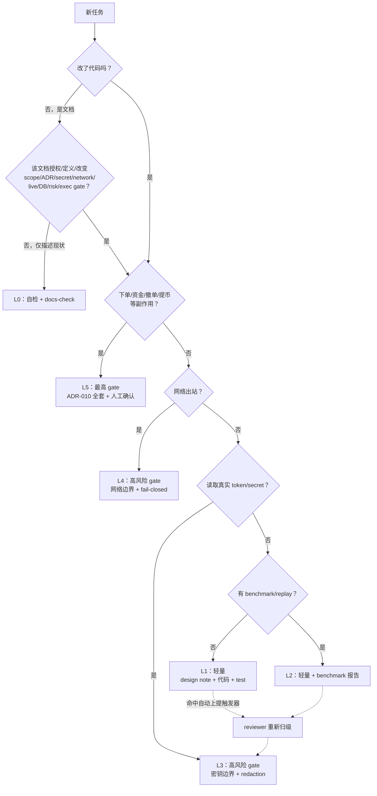

# ADR-016: Risk Gate Matrix（分级风险闸门）— P2-GOV-01

## Status

Accepted（经 Architect / GPT-5.5 于 `P2-GOV-01R1` 裁决"Accepted with modifications"，本版已按修订意见落地）。

它不替代、不删除任何既有 ADR，不改变任何 L3–L5 现行闸门。本文件由 Opus 审计/风险角色起草、由 Architect 裁决，**非交易、非 dry-run、非 live、非真实 token 读取、非 API/network、非任何执行授权**。

### 修订记录（P2-GOV-01R1，Architect 收口）

相对初版（Proposed）落地以下 Architect 修订意见：

1. **L0 不再等同"纯文档"**：文档按其**授权对象的能力等级**归级，而非按文件类型。见 Decision §「文档按授权能力归级」。
2. **L1/L2 新增 reviewer modifier**：native / C++ / unsafe / performance-critical 代码虽不升 L3–L5，但必须至少一次性能/内存安全 reviewer 复核（单轮，非多轮授权）。
3. **扩充防降级触发器**：新增 runtime 操作入口 route、credential-like path/clipboard/keyring/browser state 读取、外部采集/第三方 API/浏览器自动化、docs-only authorization packet 等条目。
4. **L3–L5 不削弱**，ADR-010 / ADR-015 / CLAUDE.md 硬边界优先。
5. 目标是砍**重复授权仪式**，不是污名化 design / test / review evidence；Tushare 18 轮链路保留为反面案例。

## Context

### 真实证据：18 轮仪式去"加载一个 token"

`P2-MD-07`（在本地加载一个 Tushare API token）走了 `BR-36 → BR-54` 将近 18 轮 `draft / review / audit / authorize / record / confirm / gate`。取证：

```text
git log --oneline -60 | grep -ciE 'authorize|review|record|confirm|gate|audit'  → 52 / 60
最近 20 个 commit 中 feat: 仅 2 个（BR-42 / BR-46），其余全是 docs 仪式
仪式 : 代码 ≈ 9 : 1
```

### 仓库当前的真实负载

```text
.py  : 412 个 / 156,513 行
.md  : 1,174 个 / 177,196 行   ← 文档行数比代码多 2 万行
治理文档：task-packets 305 + agent-runs 279 + review-checklists 191 + ADR 16 = 791+
原生高性能核心（C++/Rust）：0 行（git ls-files 无任何 .cpp/.hpp/.rs/CMakeLists/Cargo.toml）
```

### 问题定性

现行流程把**所有**任务默认按"高风险、需多轮人工评审"处理，与任务**实际触碰的能力**无关。结果：

- 一个无 token、无网络、无资金的纯性能代码任务，会和"真实下单"走同一条重型审批链；
- code-first / benchmark-first 的性能工作（`P2-CORE-01` 之后整条 native 线）会被仪式拖死在评审循环里；
- 真正高风险的边界（live 下单、密钥、kill switch）反而被淹没在与低风险任务相同的噪声里，**评审注意力被稀释**。

> 关键纠偏：本项目的病不是"文档太多"，而是"**仪式轮次太多**"。设计 note + 代码 + 测试 + benchmark 报告是必要的、应保留的最小文档集；`draft→review→audit→authorize→record→confirm` 的多轮空转才是要砍的对象。不要矫枉过正到"文档滚蛋"。

## Decision

按任务**实际触碰的能力**（而非自我声明）分为 L0–L5 六级闸门。每级规定：触发条件、必需交付物、评审强度、禁止项。

| Level | 触发条件（按实际能力，非声明） | 必需交付物 | 评审强度 | 多轮仪式 |
|---:|---|---|---|---|
| **L0** | 文档 / README / 非安全说明，**且不授权、不定义、不改变** scope / ADR / secret / network / live / DB / risk / execution gate 行为 | 文档本身 | 自检 + `docs-check` | 否 |
| **L1** | 代码：无 token、无网络、无交易、无 DB schema 变更 | design note + 代码 + unit test | 单轮 reviewer（native/perf 代码加 reviewer modifier，见下） | **否** |
| **L2** | 本地 synthetic benchmark / replay（无真实数据源） | L1 全部 + benchmark 报告（含硬件/编译参数/p50-p99/alloc count） | 单轮 reviewer（native/perf 代码加 reviewer modifier，见下） | **否** |
| **L3** | 真实 token / 密钥本地加载，**无网络出站** | L1 全部 + 密钥边界审查 + redaction 证据 | 高风险 gate（Senior Reviewer 单轮，可一次性裁定） | 一轮，不重复 |
| **L4** | 真实 API / 网络出站（read-only） | L3 全部 + 网络边界 + rate-limit + fail-closed 证据 | 高风险 gate（Senior Reviewer + Architect） | 按需 |
| **L5** | 下单 / 资金 / live execution / 提币 / 撤单等副作用 | 既有 `ADR-010` live readiness checklist 全部 + 人工确认 | 最高风险 gate（Architect + Opus Senior Reviewer，强制） | 强制，不可简化 |

### L0–L2 去仪式化的硬规则

1. L1/L2 任务**不写授权文档**，不走 `authorize/record/confirm` 多轮。只要 design note + 代码 + 测试（+ benchmark）齐全且单轮 reviewer 通过即可合入。
2. L1/L2 任务**不需要**为"是否可以开始"再开一个 packet 评审循环。packet 头部声明 level，reviewer 复核 level 是否正确，即开工。
3. `P2-CORE-01`（SPSC ring buffer + benchmark）属 **L1/L2**：无 token、无网络、无 API、无交易。因此**禁止**为它产出数千行 authorization 文档。

### 文档按授权能力归级（docs graded by authorized capability）

L0 不是"凡文档皆轻量"。文档若**授权、定义或改变**未来的高能力行为，按其授权对象的能力等级归级，不得当作 L0：

```text
docs-only authorization packet 授权未来 L3/L4/L5 行为  → 按被授权行为的能力等级归级，不当 L0
定义/改变 scope / ADR / secret / network / live / DB / risk / execution gate 的文档 → 按受影响边界归级
仅描述现状、不授权任何新能力的说明/README/run note/review note     → L0
```

理由：一份"读一个 token 的授权说明"虽然只是 Markdown，但它授权的是 L3 能力，必须按 L3 走 gate；不能因为"它只是文档"就放进 L0 免审。

### native / 性能代码的 reviewer modifier

native / C++ / `unsafe` Rust / performance-critical 代码即使无 token / 无网络 / 无资金，仍有**内存安全、构建链、benchmark 可复现性**风险。规则：

```text
不升级到 L3–L5（无资金/密钥/网络）
但必须至少一次性能 / 内存安全 reviewer 复核（单轮，非多轮授权仪式）
复核点：UB / 数据竞争 / 越界 / 生命周期、构建可复现、benchmark 方法是否自欺
```

### 防降级伪报（classification downgrade guard）

闸门按**实际能力**判定，不认自我声明。命中以下任一项，任务**自动上提**到对应等级，reviewer 有权且有责任重新归级：

```text
import / link 交易所 SDK 或私有 endpoint                       → 至少 L4
读取 .env / 环境变量中的 token / secret / cookie                 → 至少 L3
读取 credential-like path / clipboard / keyring / browser state   → 至少 L3
发起任何网络出站（含 DNS / WebSocket / REST）                    → 至少 L4
采集外部内容 / 调用第三方 API / 浏览器自动化                      → 按网络+合规风险归级（≥L4），不得伪装成 L1
新增 CLI / API route 且可能成为 runtime 操作入口                  → 重新归级，不默认 L1
docs-only authorization packet 授权未来 L3/L4/L5 行为             → 按被授权能力归级（见「文档按授权能力归级」）
产生下单 / 撤单 / 转账 / 提币 / 资金移动副作用                    → L5（无例外）
新增 / 修改 Alembic migration 或 DB schema                        → 叠加 DB Reviewer，不因 level 低而豁免
```

### 与既有硬边界的关系（不削弱）

CLAUDE.md §6 与既有 ADR 的所有交易/密钥/审计硬边界**全部归入 L5（或其触发项归入 L3/L4）**，本 ADR 一字不改：

- live 默认 off；API key 默认 no-withdrawal；`ENABLE_LIVE_TRADING=true` 不是 live-ready 证明 → 全部 L5；
- 无 auto-loop / dust auto-close / kill-switch auto-rearm / submit-gate auto-resume → 全部 L5，受 `ADR-010` / `ADR-015` 约束；
- 密钥永不进入 docs / logs / prompts / run notes / `system_settings` / 共享内存快照 → 跨所有 level 恒定生效。

**本 ADR 只对 L0–L2 去仪式，不碰 L3–L5 的任何交易安全闸门。**

## Consequences

正面：

- L1/L2 性能与工具代码的吞吐量提升一个数量级，`P2-CORE-01` 之后的 native 线不再被审批循环拖死；
- 评审注意力重新聚焦到真正高风险的 L3–L5；
- 文档体量与代码体量重新平衡。

负面 / 代价（冷酷写明）：

- **误降级风险**：有人可能把实为 L3 的任务伪报为 L1 以躲避 gate。缓解靠"防降级伪报"自动上提触发器 + reviewer 强制复核 level + level 写进 packet 头；但**无法 100% 防住恶意或疏忽误报**，残留风险存在。
- **审计纸面变薄**：L1/L2 留痕减少，若某条性能改动日后引入隐患，可追溯的治理证据比现在少。这是为速度付出的、被明确接受的代价。
- **归级判断成本**：每个任务开工前要判一次 level，引入一个轻量但非零的前置判断；归级有争议时仍需 Architect 裁定，可能短暂回到"问一句"的状态。
- **跨级任务的接缝**：一个任务若同时含 L1 代码与 L3 token 加载，必须按最高级别走 gate，不能拆开偷偷把 token 部分塞进 L1——这要求 reviewer 警惕"温水煮青蛙"式的能力蠕变。

## Non-goals

本 ADR 不授权：

- 任何 native / C++ / Rust 代码实现（`P2-CORE-01` 等仍需各自按 L1/L2 单独开工，本 ADR 只定义其闸门等级）；
- 削弱、绕过或简化任何 live / 下单 / 密钥 / kill switch / 提币闸门；
- 删除或静默覆写既有 ADR-001 ~ ADR-015；
- DB schema / migration 的豁免。

## Validation

本 ADR 为 docs-only。验证限于：

```powershell
make docs-check PYTHON=".\.venv\Scripts\python.exe"
git diff --check
```

以及对下游 packet 措辞的 level 归类一致性复核。受理前不产生任何代码或 runtime 行为变更。

## 决策流（参考）


