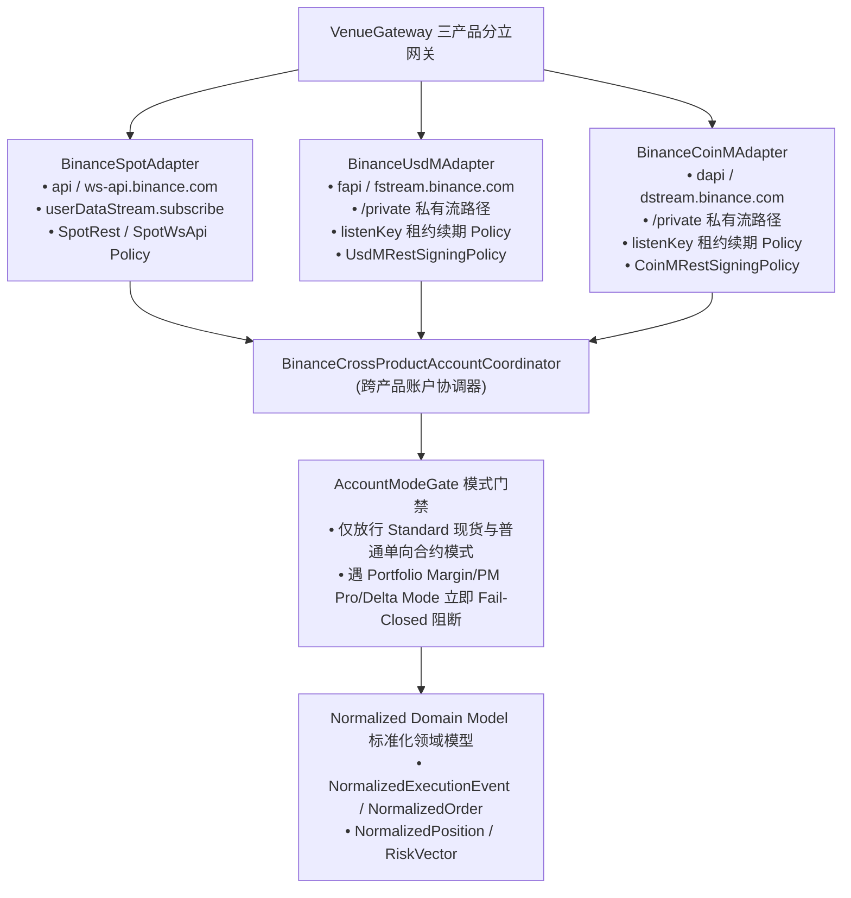
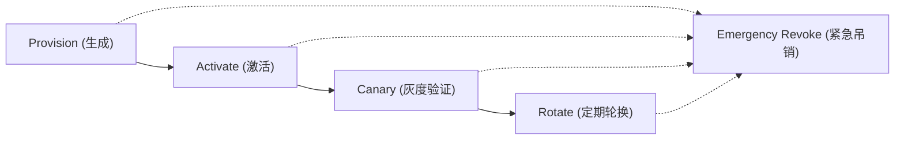
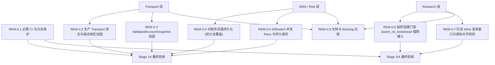
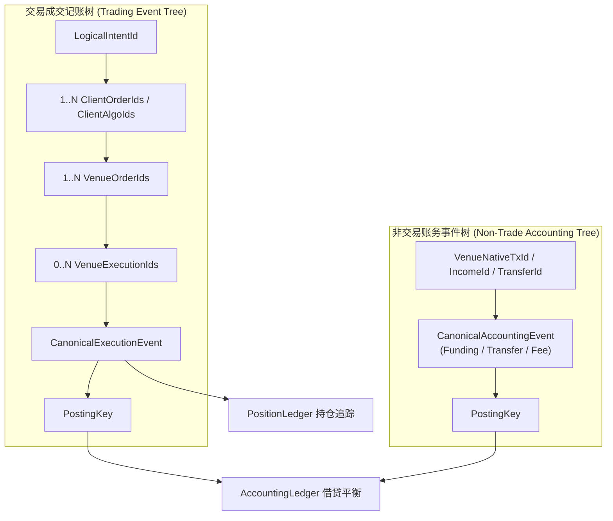

# HengYuan v2 全自动加密货币量化实盘系统实施指南与完整 TODO LIST（v2.5.6 冻结基线 + 2026-09-25 执行增补）

> **版本定位**：本规范（v2.5.6 True Code-Aligned Final Freeze — Baseline HEAD `8ed8a46` / PR #69，Snapshot 2026-08-30）作为 HengYuan v2 生产级量化交易系统的**最高受控工程实施蓝图与审计缺陷清零执行方案**。  
> **审计追踪原则 (Traceability Invariant)**：本表严格映射截至 baseline commit（HEAD `8ed8a46` / #69）已纳入基线的全部审计 Finding；完整性由 `Supplementary Audit Closure Ledger` 与 `Backlog Ledger`（REM-0.9）共同保证，确保审计证据链完整不可篡改。  
> **事件溯源与崩溃一致性 (Event-Sourcing Invariant)**：
> 
> $$
> \text{at-least-once ingestion} + \text{durable event identity} + \text{idempotent application} + \text{replayable projection} = \text{effectively-once local effect}
> $$
> 
> `ExecutionJournal` 是 HengYuan 本地 `CanonicalExecution` 的强持久真值源（Local Durable Source of Truth）；交易所权威对账是外部事实源，二者通过规范化对账屏障建立收敛一致性。  
> **排版与渲染标准**：本文档全量遵循标准 CommonMark / GFM 规范，所有列表内数学公式严格按 KaTeX / MathJax 标准独立成段排版，Mermaid 图表节点经过精密折行与宽度优化，彻底消除文字溢出。  
> **实盘安全红线**：仓库已有真实凭据只读查询、真实 REST POST 客户端实现及 Testnet 演示代码，不能再概称“所有代码均无网络”。任何真实资产接入与生产发单仍须先通过适用的安全、恢复、CI 与故障注入门禁，并由账户所有者（Owner）亲自手动确认；AI 会话绝不擅自发送真实资产订单。

## 2026-09-25 执行状态增补：动态基线与优先 TODO

> **效力与边界**：状态快照复核于 **2026-09-25 18:10 CST**，远端 `master` / `origin/master` 为 `f4ee620`（PR #107）；三个本地 worktree 均从该提交起步。下文原 v2.5.6 审计矩阵保留为 **2026-08-30、`8ed8a46` 历史快照**；其中“无真实 POST”“Stage 1A 尚未开始”“FI 门禁 EXISTS=0”等断言不得作为当前现状引用。`已合入` 仅表示代码进入远端主干；`已验收` 需要对应故障、恢复、跨平台和运行证据。截图为开发者进度陈述，不能替代终态日志。任务工时为低置信度规划量级，待 PR diff 与验收范围冻结后重新估算。

### A. 当前状态评估

| 领域 | 可核实状态 | 证据与限制 |
| :--- | :--- | :--- |
| 云端主干 | [PR #107](https://github.com/EypeZeo/hengyuan_v2/pull/107) 于 2026-09-25 合入，合并提交 `f4ee620`；#92–#107 已进入主干。该 SHA 的 [CI Native](https://github.com/EypeZeo/hengyuan_v2/actions/runs/36094061061)、[CI Spec Verification](https://github.com/EypeZeo/hengyuan_v2/actions/runs/36094061053)、[Main Merge Guard](https://github.com/EypeZeo/hengyuan_v2/actions/runs/36094061073) 显示 `completed/success`。 | 这三个 workflow 的成功不等于所有平台、变异测试或实盘门禁通过。快照查询时开放 PR 为 **0**；未据此断言所有远端分支状态。 |
| 已落地主干的执行底座 | #70 查询订单、#71 Spot 限流、#72 真实 REST POST 实现、#76–#77 现货用户流、#79 ExecutionJournal、#92 满环失效门禁、#93 目标持仓规划、#94 启动恢复、#95–#107 公共行情监督/回补/有效性链已合并；1A.1–1A.5 均需按剩余验收项继续，不得整组标 `DONE`。 | `native/include/hengyuan/binance_private_rest.hpp` 有 `submit_order()`；`native/include/hengyuan/feed_validity_gate.hpp` 等存在。代码实现不证明真实资金交易或完整故障收敛。 |
| 本地 6b-0b | `D:\My_Projects\hengyuan_v2`，分支 `feat/batch6-6b0b-verified-dry-run-evidence`，HEAD `f4ee620`；CMake、preflight harness 已修改，`verified_dry_run_evidence.hpp`、相关测试未跟踪；另有构建产物 `gen_store_fixture.obj`。状态 **实施中，未提交、无 PR**。 | `run_all()` 与四场景测试源码可见；harness 仍停在 `OperatorNotConfirmed`，未证明真实 SubmitPort 或外部订单。截图所报局部构建、测试和变异进度均未见可复核的完整终态日志或 PR 证据。 |
| 本地 6b-0e | `D:\My_Projects\hengyuan_v2_6b0e`，HEAD `f4ee620`；operator confirmation / 输入读取纯逻辑头、测试及 CMake、CI、`wsl_verify.sh` 未提交。状态 **实施中，未接入 harness、无 PR**。 | 仅能确认文件和 diff 存在；截图是拟开展/进行中的验证说明，不能记为验收。 |
| 本地 6c | `D:\My_Projects\hengyuan_v2_6c`，HEAD `f4ee620`；只见未跟踪的 `durable_audit_export.hpp`；CLI、测试、跨平台验证尚未见。状态 **实施中、无 PR**。 | 本轮读取该头文件未发现 NUL 字节；这只是单文件静态检查，不证明导出契约和故障测试通过。 |
| 本地分支差异 | 本地 `master` 停在 `3278180`（#92），落后 `origin/master` 15 提交；三个当前工作分支基点均为最新 `f4ee620`。 | 禁止用本地 `master` 的源码或测试数量表示当前云端状态；各 worktree 的未提交改动彼此不属于同一 PR。 |
| Stage 0 旧审计债 | 静态读取仍见 `PrivateRestConfig::connect_host_override`、`extra_trusted_ca_pem_path`，`KillSwitch::state_` 为普通字段，`AccountSnapshot::asset_count` 可写且容量 32，`assert_no_lookahead()` 为可选工具。 | REM-0.2/0.3/0.5/0.6 尚不能宣告关闭；REM-0.1/0.4 也未发现足以推翻旧门禁的完整新证据。应按当前源码重新逐项裁定旧矩阵，不把旧 Finding 状态机械外推。 |

### B. 更新后的优先 TODO（建议执行顺序）

状态词：`IN_PROGRESS`＝当前 worktree 有可见改动；`PARTIAL`＝主干有部分实现，契约仍欠闭环；`PENDING`＝尚无本任务的可见实施；`BLOCKED`＝**验收/实盘操作**被未满足门禁阻断，不表示上游模块禁止并行开发。表中“依赖”指**最终合并或验收条件**；可并行编码的任务不互相设置人为开工阻塞。估计单位为**单名熟悉仓库工程师的净开发人日**，不含 CI 排队、交易所可用性和 Owner 审核；跨模块合并项的量级尤其需要拆分后复估。

| ID / 状态 | 任务与可判定完成条件 | 优先级 / 估计 | 依赖 | 负责人建议 |
| :--- | :--- | :--- | :--- | :--- |
| **NOW-01 / IN_PROGRESS** | 完成 6b-0b：四种 dry-run 场景必须由实际 `orchestrate_submit()` 门禁链产生证据，检查拒绝、成功、UNKNOWN→同 ID 对账与 Kill；收齐适用的 MSVC、VPS、ASan、TSan、ARM64、WSL 结果及**完整变异终态**，审查后提交 PR。演练不得产生真实网络写入。 | **CRITICAL / 2–4 日** | 当前主干；相应平台的终态日志与变异存活项逐例解释 | Claude（当前 worktree 执行者）；Native reviewer 复核 |
| **NOW-02 / IN_PROGRESS** | 完成 6b-0e：确认门与 stdin 输入读取两个纯逻辑模块、超时/EOF/错误/重复确认负例和跨平台测试；集成前明确输入所有权、只读确认状态及与 NOW-01 证据的顺序约束；提交独立 PR。 | **CRITICAL / 2–4 日** | `f4ee620`；最终 harness 集成依赖 NOW-01 接口冻结 | Claude（当前独立 worktree 执行者）；Native reviewer |
| **NOW-03 / IN_PROGRESS** | 完成 6c 只读离线审计导出：校验序号、MAC 链、tip anchor、撕裂尾部和损坏/未知 key 情况；补齐 CLI、测试、MSVC 与 VPS none/address；保持 `DurableAuditSink` / `DurableRecordType` 现有 ABI；提交独立 PR。 | **HIGH / 3–6 日** | 现有 DurableAuditSink 格式；与 NOW-01/02 的 CMake、CI diff 做合并影响审查 | Claude（当前独立 worktree 执行者）；Audit reviewer |
| **GATE-01 / PARTIAL** | 逐项重验 REM-0.1/0.9 与 FI-041：分别记录 GitHub 必需检查配置、无路径盲区、MSVC 与 Sanitizer/ARM64 实际覆盖；本地签署测试只作为临时人工证据，不等价于 required CI。建立旧审计 ID→当前文件/测试/PR 的关闭清单。 | **CRITICAL / 2–4 日** | 当前 workflow、branch protection 配置证据；每个在制 PR 合并前复验 | CI/集成负责人 |
| **SAFE-01 / PENDING** | REM-0.2 通信端点与凭据边界：把生产认证 REST 的可注入 host/CA 与测试 seam 分开，所有请求在 DNS 前执行 TransportPolicy；验证空凭据、allowlist 长度、异常 `/time`。 | **CRITICAL / 3–6 日** | 现有真实 POST/Query 路径；FI-032/037/040 | Native 安全/REST 负责人 |
| **SAFE-02 / PENDING** | REM-0.3 账户快照封装：阻止公开可写 `asset_count` 越界；保留解析器现有超过 32 个非零资产时拒绝的 fail-closed 行为；资产名称、整数运算、时间戳经受控构造/解析，覆盖畸形输入负例。容量是否扩张另按真实分布和内存预算裁定。 | **CRITICAL / 3–5 日** | 当前 `account_truth.hpp` 与私有 REST 解析器；FI-033 | Native 数据模型负责人 |
| **SAFE-03 / PENDING** | REM-0.4：复核已有同步 POST 终态 durable ACK 各分支；重点补齐 `drain_reconcile_events()` 异步终态在内存发布、释放 InFlight 前的 durable ACK，并以崩溃点注入证明重启不丢终态、不重复计账。 | **CRITICAL / 4–8 日** | ExecutionJournal、WAL、FI-002/003/031/034；最终验收结合 NOW-01 证据，不阻塞并行开发 | Native OMS/持久化负责人 |
| **SAFE-04 / PENDING** | REM-0.5：KillSwitch 跨线程状态与持久锁存、发单切断点及重启恢复；TSan/负控/形式化证据同时成立。 | **CRITICAL / 4–8 日** | NOW-01/02 确认顺序与门禁契约；FI-023/036 | Native 并发/风控负责人 |
| **SAFE-05 / PENDING** | REM-0.6：全部投研/回测入口强制经过因果门禁，修复自检恒真路径；DSL 显式未来算子可直接阻断，手写策略和 CSV 的行为差分只覆盖被采样输入，剩余风险必须显式记录。 | **HIGH / 2–4 日** | 当前 Python CLI/validation 入口；AUDIT-P1-004 | Python 投研负责人 |
| **SAFE-06 / PENDING** | REM-0.7/0.8：分别修复历史页首游标与回填连续性，以及 SubmitOutcome 非法状态和单调超时；各自提供负例。 | **MEDIUM / 3–6 日** | 现有 backfill/OMS 测试；数据侧最终验收关联 SAFE-05 | Python 数据负责人 + Native OMS 负责人 |
| **SPOT-01 / PARTIAL** | TODO 1A.4 将 Spot 私网流由已停用的 REST listenKey 生命周期迁至 WS API `userDataStream.subscribe.signature`，处理 `{subscriptionId,event}`、代次、断线重订阅和 REST 权威对账；迁移可离线实施，旧协议不能通过当前联调验收。 | **CRITICAL / 5–9 日** | 最终验收需 SAFE-01、NOW-01 与交易所 Testnet/Demo 环境 | Spot 网关负责人 |
| **SPOT-02A / PARTIAL** | TODO 1A.1/1A.2：补全权威订单、账户与成交 QueryPort；元数据 epoch、时效/失效策略及 `CANCEL_ONLY`；将已存在的单窗口 POST 限流扩展为全调用点共享预算、多个 ORDERS 时窗与 429 冻结。 | **CRITICAL / 6–12 日（复估）** | 最终验收需 SAFE-01、SAFE-02、FI-012/032；可与 SPOT-01 并行 | Spot REST/限流负责人 |
| **SPOT-02B / PARTIAL** | TODO 1A.3–1A.5：使用户流、持久订单事件、活订单轮询、UNKNOWN 权威对账与恢复收敛；逐项关闭适用 FI。已有 POST、Journal、启动恢复只能计为部分实现。 | **CRITICAL / 8–15 日（复估）** | 最终验收需 SAFE-03/04、SPOT-01、SPOT-02A 和适用 FI；不以 6c 导出为编码前置 | Spot OMS/网关负责人 |
| **LIVE-01 / BLOCKED** | 仅在安全、协议、恢复、风险和对账门禁齐备后进行受控 Testnet 真实 POST 验收；真实资金与生产订单保持 Owner 手动确认硬门禁。 | **HIGH / 2–5 日（门禁通过后的验收）** | GATE-01、SAFE-01–04、SPOT-01/02A/02B、当前切片全部适用 FI 全通过 | 账户 Owner + 集成负责人 |
| **FUT-01A / PENDING** | TODO 1B/1D：先冻结 USD-M/COIN-M 共享 IP 权重、ORDERS 时窗与账户模式真值的单所有者合同，并核对产品特定端点、签名与错误语义。 | **HIGH / 3–6 日（复估）** | 官方 2026-06 整合合同；可与 Spot 收敛并行，验收需共享预算负例 | Futures 架构/限流负责人 |
| **FUT-01B / PENDING** | USD-M 首个安全切片：产品网关、订单/查询、UNKNOWN 收敛、仓位与模式对账，纳入共享预算。 | **HIGH / 8–15 日（复估）** | FUT-01A；最终验收复用已关闭的安全/审计不变量 | USD-M 网关负责人 |
| **FUT-01C / PENDING** | COIN-M 独立协议切片：反向合约估值、条件单/改单、产品特定恢复；验证两侧并发竞争共享额度。 | **HIGH / 8–15 日（复估）** | FUT-01A、首个网关通用合同；最终验收需专项 FI | COIN-M 网关负责人 |
| **DATA-01 / PENDING** | TODO 4.1/4.3：立即启动公开合约逐笔/L2 连续录制与缺口账本，以免回溯窗口继续流失；`historicalTrades` 一个月窗口和 200 权重纳入回补预算。私有 `userTrades` 三个月归档另需凭据、授权与适配器。 | **HIGH / 5–10 日（公开数据最小切片）** | 数据存储预算与公开协议核对；私有归档验收依赖安全的 Futures 适配器 | 数据平台负责人 |
| **RESEARCH-01 / PENDING** | TODO 2/3：建立点时文本/宏观特征与不可变 Frozen Holdout、ExperimentRegistry；分类先用已有规则与受控离线流程，不接新增推理服务。 | **MEDIUM / 8–15 日（门禁最小切片）** | SAFE-05、数据授权与点时可见性 | Python 投研负责人 |
| **RESEARCH-02 / PENDING** | TODO 4.2：以通过 DataQualityLedger 的 L2 数据校准保守排队模型，并与独立回测引擎比对；不以引擎宣传性能替代同机样本基准。 | **MEDIUM / 8–15 日** | DATA-01、RESEARCH-01 防前视门禁 | 回测负责人 |
| **LEDGER-01 / PENDING** | TODO 5.1：交易和非交易事件独立身份、`PostingKey` 幂等、Position/Accounting Ledger 投影与重放对账；6c 导出是独立审计读取能力。 | **HIGH / 10–20 日（复估）** | SAFE-03 终态合同、Spot/Futures 事件合同；可独立于 NOW-03 开工 | 账务/OMS 负责人 |
| **OPS-01 / PENDING** | TODO 6.1–6.5：可先建立单出口 IP 方案、时钟/观测基线与故障演练环境；canary 和生产上线另行验收。复用现有工具，不增设付费推理平台。 | **HIGH / 8–15 日（部署准备切片）** | 部署准备可并行；canary 验收需 LIVE-01、LEDGER-01、全部适用 FI 门禁和 Owner 授权 | 运维/集成负责人 + Owner |

### C. ADR-2026-09-25-FAST-DECISION：学习快速类型化决策思想，暂缓模型接入

**状态：决定延期采用 Jev、Laya 或同类新增模型/服务作为 HengYuan 运行时组件；允许研究其任务表达与验证方法，不形成实施依赖。** 这一决定遵循“低成本 Trading Node、Research/Data 与其解耦”的现有约束。术语上，Jev/Laya 不是传统 CART/GBDT 意义的“决策树”；它们将非结构化文本映射为预定义的 Choice、Score、Noul/是非等类型化输出，以单次请求的并行打分或非自回归前向计算减少逐 token 生成和解析成本。[Jev 接口与模型说明](https://docs.typesafe.ai/introduction/quickstart)；[Laya 官方仓库](https://github.com/NandhaKishorM/laya)。

| 评价维度 | 可核实性质 | 对本项目的裁决 |
| :--- | :--- | :--- |
| 算法思想 | 预先定义有限标签与评分准则、批量评估同一状态上的多个问题、返回概率/置信度；Laya 声称单前向、无自由文本生成。 | 可借鉴**固定标签、明确 Unknown/弃权、置信度校准、点时输入审计、离线批处理**的合同设计；这些做法无需增加模型运行时。 |
| 性能 | Laya 作者在 T4 上报告单问题约 32.8 ms、预加载 CPU 约 193–464 ms；Jev 厂商报告端到端约 70–500 ms。测量环境、问题分布和传输路径不同。 | 仅能推断相对自回归大模型的潜在文本分类延迟优势；**不能推断比仓库现有 C++ 确定性规则更快**，更不能把厂商数值写作 HengYuan p99 或交易收益。[Laya 测量](https://github.com/NandhaKishorM/laya)；[Jev 发布说明](https://typesafe.ai/blog/introducing-system-one-models-and-jev)。 |
| 潜在适用范围 | Stage 2 公告/舆情文本离线归类，Stage 3 假说资料整理，Stage 6 非权威告警分流；Jev 文档称英语效果最佳，Laya 公布英文 checkpoint 与多语路由，**中文同域质量未验证**。 | 仅供独立研究节点验证；不能把英文测量外推到中文公告。不得决定精确金额、过滤器、仓位、发单、Kill、UNKNOWN 对账和记账。[Jev 模型说明](https://docs.typesafe.ai/models)；[Laya 仓库](https://github.com/NandhaKishorM/laya)。 |
| 成本与维护 | Jev 按输入 token 计费，当前公开标价 $0.042/百万输入 token；Laya 权重/代码可自托管，但需 CPU/GPU 常驻、内存、版本/安全维护与本域校准。 | 用户明确不接受额外运行开销和成本；因此**当前不采购、部署或接入**。开源许可费用为零不等于总拥有成本为零。[Jev 官方价格](https://docs.typesafe.ai/models)；[Laya 部署说明](https://github.com/NandhaKishorM/laya)。 |
| 重启决策条件 | 需要独立、可复现的同域文本样本与现有规则基线，验证点时可见性、准确率/校准、误判风险、p99、全量运维成本。 | 只有明确业务需求、净收益证据且**不增加既定运行预算**，再由 Owner 与架构负责人重新审议；否则维持延期。任何离线试验也不得突破 Frozen Holdout。 |

### D. 风险与约束登记

| 风险 / 等级 | 当前证据 | 约束与处置 |
| :--- | :--- | :--- |
| **Spot 私网协议失效 / CRITICAL** | 官方宣布 2026-02-20 停用 REST `POST/PUT/DELETE /api/v3/userDataStream`；主干仍含旧 listenKey 创建与 `/ws/<listenKey>` 路径。 | SPOT-01 在 1A.4 验收前必须迁移；不得以旧用例绿标替代新协议联调。[Binance 变更](https://github.com/binance/binance-spot-api-docs/blob/master/CHANGELOG.md#2026-01-21)。 |
| **并行 PR 冲突及过早宣告完成 / HIGH** | 6b-0b、6b-0e 同改 `native/CMakeLists.txt`，6b-0e 改 CI/验证脚本；6c 尚无 CLI/测试；三个分支均未提交、无远端 PR。 | 按各分支独立审查、合并前对最新主干重新验证；截图中的局部测试与变异进度一律记待完成，直到有可复核终态日志。 |
| **审计快照漂移 / HIGH** | 原 §二、§三及结语停在 #69；主干已含 #72 POST、#79 Journal、#107 Feed。 | 原矩阵作历史基线；本增补优先。关闭 Finding 需 `Code→Contract→Fault→Test→Runtime→Budget` 全链证据，不据 commit 标题推断。 |
| **UM/CM 共享预算与账户模式 / HIGH** | Binance 2026-06 整合后共享 2400 IP 权重/分钟、1200 单/分钟及 300 单/10 秒；持仓模式从任一侧修改会影响两侧。 | FUT-01A 需共享预算所有者；保留产品特定签名和风控合同，不把两个产品错误地视为额度独立。[官方整合通知](https://developers.binance.com/en/docs/products/derivatives-trading-coin-futures/Important-CM-UM-Integration-Notice)。 |
| **历史数据不可回补 / HIGH** | 合约 `historicalTrades` 窗口 3→1 个月、权重 20→200，账户成交历史仅近 3 个月。 | DATA-01 需要主动录制和缺口账本；权重增加是限流成本，不虚构美元费用。[官方变更](https://developers.binance.com/en/docs/products/derivatives-trading-usds-futures/change-log)。 |
| **推理服务总成本增长 / HIGH** | 额外 API/GPU、网络延迟、模型漂移与维护；本项目尚无相对于确定性规则的同域净收益基准。 | ADR-FAST-DECISION 排除现阶段 Jev/Laya 类运行时依赖；优先复用现有 CPU、规则和离线评估。 |
| **实盘状态真值断链 / CRITICAL** | 真实 POST 实现已合并，但 REM-0.4/0.5、1A.4 新协议及完整恢复门禁未关闭。 | LIVE-01 阻塞；任何 timeout/5xx/截断响应均保持 UNKNOWN 并按同 ClientOrderId 权威查询，禁止盲重试。 |

### E. 下一开发周期动作

1. **先收敛当前并行工作**：6b-0b 完成变异全套、跨平台和假阳性审查后提交 PR；6b-0e、6c 分别补齐各自契约和终态测试，保持独立 PR。每次合并后重新核对其余 worktree 的基点与共享 CMake/CI 影响。
2. **建立可审查的关闭矩阵**：用 PR diff 与终态测试日志逐项裁定 REM-0.1–0.9、FI-001–041 的 `EXISTS/PARTIAL/PLANNED` 和门禁结果；更新原历史表前须保留旧证据来源。
3. **并行处理安全与现货 P0**：SAFE-01–04、SPOT-01、SPOT-02A/02B 按各自合同开工；只有在各自门禁及完整恢复证据齐备后，才推进 LIVE-01。Testnet / Demo 验证不授权生产真实订单。
4. **抢救有时间窗的数据并冻结成本边界**：DATA-01 的公开逐笔/L2 录制立即并行启动；FUT-01A 冻结共享额度与账户模式合同。Stage 2/3 不新增 Jev/Laya 推理服务、专用 GPU 或专门 LLMProvider 实施任务，先完成因果门禁和已有规则基线。

---

## 目录
0. [2026-09-25 执行状态增补：动态基线与优先 TODO](#2026-09-25-执行状态增补动态基线与优先-todo)
1. [认知重塑：收益来源、风险溢价与小本金生存三铁律](#一-认知重塑收益来源风险溢价与小本金生存三铁律)
2. [仓库真实资产客观映射表 (基于 2026-08-30 HEAD 8ed8a46 校准)](#二-仓库真实资产客观映射表-基于-2026-08-30-head-8ed8a46-校准)
3. [Codex 红队审计原始缺陷映射与处置矩阵 (Stage 0 任务清单)](#三-codex-红队审计原始缺陷映射与处置矩阵-stage-0-任务清单)
   - [三-A 补充审计与已关闭缺陷台账 (Supplementary Audit Closure Ledger)](#三-a-补充审计与已关闭缺陷台账-supplementary-audit-closure-ledger)
   - [三-B 暂缓优化缺陷台账 (Backlog Ledger)](#三-b-暂缓优化缺陷台账-backlog-ledger)
4. [三产品对等网关架构 (Spot / USDⓈ-M / COIN-M) 与账户模式门禁](#四-三产品对等网关架构-spot--usd-m--coin-m-与账户模式门禁)
5. [独立签名策略矩阵 (SigningPolicy Matrix) 与密码学后端](#五-独立签名策略矩阵-signingpolicy-matrix-与密码学后端)
6. [多产品动态约束引擎、Decimal64 算术与权威货币计算规范](#六-多产品动态约束引擎decimal64-算术与权威货币计算规范)
7. [生产级 API 凭据安全与全生命周期管理](#七-生产级-api-凭据安全与全生命周期管理)
8. [数据源与 API 选型调研：高可用方案与防前视设计](#八-数据源与-api-选型调研高可用方案与防前视设计)
9. [GitHub 顶级可复用开源“轮子”库清单](#九-github-顶级可复用开源轮子库清单)
10. [全阶段精细化实施 TODO LIST (垂直切片重构版)](#十-全阶段精细化实施-todo-list-垂直切片重构版)
   - [Stage 0：现存代码安全债务与缺陷清零 (Safety Debt Burn-down)](#stage-0现存代码安全债务与缺陷清零-safety-debt-burn-down)
   - [Stage 1A：现货最小安全垂直闭环 (Spot Safe Vertical Slice)](#stage-1a现货最小安全垂直闭环-spot-safe-vertical-slice)
   - [Stage 1B：USDⓈ-M 单资产/单向模式垂直闭环 (USD-M Safe Vertical Slice)](#stage-1busd-m-单资产单向模式垂直闭环-usd-m-safe-vertical-slice)
   - [Stage 1C：期现套利与两腿执行风控闭环 (Cross-Product Funding Slice)](#stage-1c期现套利与两腿执行风控闭环-cross-product-funding-slice)
   - [Stage 1D：COIN-M 币本位、条件单与高级订单扩展](#stage-1dcoin-m-币本位条件单与高级订单扩展)
   - [Stage 2：宏观点时日历、官方公告与社交舆情特征工程](#stage-2宏观点时日历官方公告与社交舆情特征工程)
- [Stage 3：策略实验治理与因果/防过拟合门禁（多智能体可选）](#stage-3策略实验治理与因果防过拟合门禁多智能体可选)
   - [Stage 4：微观结构校准回测、L2 数据湖与排队模拟仿真](#stage-4微观结构校准回测l2-数据湖与排队模拟仿真)
   - [Stage 5：完整复式记账总账、多币种实时盯市与投后财报](#stage-5完整复式记账总账多币种实时盯市与投后财报)
   - [Stage 6：生产级 7×24 云部署、NTP 同步与 Canary 渐进式上线](#stage-6生产级-724-云部署ntp-同步与-canary-渐进式上线)
11. [强制故障注入基准注册表 (Mandatory Fault Registry - 41项标签门禁矩阵)](#十一-强制故障注入基准注册表-mandatory-fault-registry---41项标签门禁矩阵)
12. [小本金起步策略实操指南与多因子风险矩阵](#十二-小本金起步策略实操指南与多因子风险矩阵)

---

## 一、 认知重塑：收益来源、风险溢价与小本金生存三铁律

### 1. 为什么散户觉得“不如抛硬币”？
- **散户的死穴**：简单技术指标在样本外通常难以维持稳定预测优势。策略净期望取决于：

  $$
  E[\text{PnL}] = P(\text{win}) \cdot E[\text{win}] - P(\text{loss}) \cdot E[\text{loss}] - \text{Cost}
  $$

  在 24 小时不间断、高杠杆爆仓多发的加密市场，对于边际 Alpha 较小的策略，高额手续费、点差跨价、滑点和市场冲击会迅速使其净期望转负。
- **可研究的收益来源、风险溢价与微观结构假说**：
  1. **资金费率与期现基差对冲（Delta-Neutral Funding/Basis）**：通过现货多头与永续空头对冲降低一阶方向性 Delta 暴露，赚取 Carry 风险溢价，但仍需承担执行腿风险、基差走阔风险、资金费率反转风险与保证金风险（属于相对低方向风险 / 中低运营风险策略）；
  2. **微观订单流不平衡与强平踩踏捕捉（OFI & Liquidation Cascade）**：在强平发生后秒级至短周期范围内，捕获短周期流动性真空与均值回复机会；
  3. **横截面多空对冲（Cross-Sectional Momentum）**：多最强强势币、空最弱垃圾币，显著降低共同市场 Beta 风险；
  4. **宏观与公告事件驱动（Event-Driven Alpha）**：美联储决议、监管判决、币安上币公告，离线训练好的确定性规则在秒级触发。

### 2. 月支配 500 元资金的生存三铁律
1. **严格风控预算管理**：每笔交易**预期风险预算** $\le \text{NAV} \times 1\%$，基于最坏可执行价格、手续费与滑点压力计算；实际损失可能因跳空、流动性及基础设施异常超出预算，因此另设组合级 Kill Switch 熔断；
2. **优先评估 Maker 执行**：评估 `LIMIT_MAKER` 挂单以降低主动跨价与冲击成本；不得假设所有市场 Maker 费率必然低于 Taker，手续费必须由动态 `FeeModel` 获取；
3. **低成本单节点部署与服务隔离**：核心 Trading Node 优先控制在低成本 VPS 预算内；Research/Data infrastructure 尽可能利用本地已有硬件和低成本存储，架构上严格解耦。

---

## 二、 仓库真实资产客观映射表 (基于 2026-08-30 HEAD 8ed8a46 校准)

> **历史快照声明**：本节行内的实现/就绪状态只适用于 2026-08-30 的 `8ed8a46`；当前执行状态以文首 2026-09-25 增补为准。

| 模块类别 | 仓库已有真实代码资产 | 审计状态定性 | 工程就绪状态 | 本规范后续实施目标 |
| :--- | :--- | :--- | :---: | :--- |
| **L4 签名与网络底座** | `binance_signer.hpp`, `binance_clock_sync.hpp`, `binance_query_signing.hpp`, `binance_environment.hpp` (#60), `binance_private_rest.hpp` (#67), `symbol_registry.hpp` (#69) | **PARTIAL — verified foundation** (真实签名 GET `/time`+`/account`+`/exchangeInfo` 已落地；但 `connect_host_override`/CA/`TransportPolicy` 未修/未接线；null-creds deref 风险存在；仅单一 HMAC 后端) | **PARTIAL** | 修补 F-P0-1/F-P0-2，扩展四套 SigningPolicy，正式化 ClockState，补 SymbolRegistry epoch/freshness |
| **L5 OMS 与下单执行** | `order_lifecycle.hpp`, `order_tracker.hpp`, `live_submit_orchestrator.hpp` (#61) | **SPEC / Dry-run only** (全仓 `grep verb::post` 零命中；SubmitPort/QueryPort 为网络测试桩；reconcile 分支终态未执行 durable 落盘) | **NOT_READY** | 落地真实 QueryPort + 现货 POST + UNKNOWN 对账与两分支终态强持久 |
| **分级风控与熔断** | `risk_gate.hpp`, `preflight_gate.hpp`, `kill_switch.hpp`, `exit_safety.hpp` (#61) | **PARTIAL — production semantics incomplete** (`risk_gate` 溢出与负价拦截已修且正确；但 `KillSwitch::state_` 非原子导致跨线程 Data Race，且无持久化锁存) | **NOT_READY** | 修复 KillSwitch 并发 Race 与持久锁存，建立 KillPublicationPoint 阻断屏障 |
| **策略规范 DSL** | `py_core/strategy_spec/` (Schema + Evaluator + Causal Operators) | **PARTIAL — verified foundation** (TOML 解析与单向 DAG 执行已具备，算子原生防前视，缺资金费率差与订单簿深度失衡算子) | **PARTIAL** | 扩展实盘专用算子库并强化执行沙箱 |
| **统计检验与投研门禁** | `py_core/validation/` (`cpcv.py`, `pbo.py`, `deflated_sharpe.py`, `cpcv_analysis.py`), `py_core/strategies/base.py` | **PARTIAL — core logic implemented** (`assert_no_lookahead` 全流水线零调用点；引擎 `no_future_shift_detected` 存在 vacuous 缺陷；缺 Frozen Holdout 与实验台账) | **NOT_READY** | 强制接入因果门禁 (Causality Gate)，修复引擎自检，建立单向不可变 Holdout |
| **审计流水与记账总账** | `durable_audit_sink.hpp`, `durable_log_store.hpp`, `durable_control_plane.hpp`, `trade_logger.hpp` | **PARTIAL — audit logging foundation only** (`DurableAuditSink` 具备真 fsync/OS 独占锁/HMAC 链/Torn-tail 恢复，但记账总账、`PostingKey`、`ExecutionJournal` 仍为 SPEC_ONLY) | **NOT_READY** | 拆分 AccountingLedger 与 PositionLedger，落地基于 `ExecutionJournal` 的事件溯源投影 |
| **CI 与跨平台构建** | `.github/workflows/` (`ci-native.yml`, `ci-python.yml`, `ci-native-sanitizers.yml`, `main-merge-guard.yml`) | **PARTIAL — per-PR baseline incomplete** (GCC-14 Release per-PR 全绿；GTest discovery 已缓解；但无 MSVC CI 任务，Sanitizer 为周更 cron，merge-guard 存在路径盲区) | **PARTIAL** | 实施 REM-0.1 与 REM-0.9，建立机械可判定的多平台与 Sanitizer 门禁 |

---

## 三、 Codex 红队审计原始缺陷映射与处置矩阵 (Stage 0 任务清单)

下表严格映射截至 baseline commit（HEAD `8ed8a46` / #69）的已纳入基线审计 Finding；完整性由 `Supplementary Audit Closure Ledger` 与 `Backlog Ledger`（REM-0.9）共同保证：

> **状态口径**：下列 `Pending` 和 `REMEDIATING` 是原审计快照值，非 2026-09-25 复验结论；见文首 `GATE-01`。

| 原始 Audit ID | 原始报告等级 | 缺陷处置状态 (Disposition) | 缺陷所在确切源码位置 / 模块 | 缺陷本质与安全危害 | 对应实施任务 ID | 闭环验证凭据 (Closure Evidence) | 最新验证 Commit | 阻塞门禁 |
| :---: | :---: | :---: | :--- | :--- | :--- | :--- | :---: | :--- |
| **AUDIT-P0-001** | **CRITICAL** | **REMEDIATING (P0)** | `native/include/hengyuan/live_submit_orchestrator.hpp` | 真实订单提交、UNKNOWN 对账与全局限流不存在（全仓 `verb::post` 零命中，发单皆为空 Seam） | **TODO 1A.1 ~ 1A.3** | FI-001 ~ FI-007 单元/桩测试报告 | Pending | 实盘订单提交 |
| **AUDIT-P1-001** | **HIGH** | **REMEDIATING (P0)** | `native/include/hengyuan/binance_private_rest.hpp` (`PrivateRestConfig`) | 暴露 `connect_host_override` 与 `extra_trusted_ca`，生产配置可导致凭据与签名外泄；#67/#69 新增 3 处使用点 | **REM-0.2** | FI-032 生产端点绑定单元测试 | Pending | 真实网络调用 |
| **AUDIT-P1-002** | **HIGH** | **REMEDIATING (P0)** | `native/include/hengyuan/order_tracker.hpp` | 对账确认终态仅写内存 AuditRing 即释放 Slot，崩溃重启丢失终态 | **REM-0.4** | FI-031 崩溃重启恢复测试日志 | Pending | 订单生命周期 |
| **AUDIT-P1-003** | **HIGH** | **REMEDIATING (P0)** | `native/include/hengyuan/account_truth.hpp` (`AccountSnapshot`) | `asset_count > 32` 越界风险、无界 `strlen`、`free + locked` 溢出、未来时间戳越界 | **REM-0.3** | FI-033 畸形快照 Fuzz 测试报告 | Pending | 账户数据解析 |
| **AUDIT-P1-004** | **HIGH** | **REMEDIATING (P0)** | `py_core/backtests/cli.py`, `py_core/validation/walk_forward.py` | `assert_no_lookahead()` 仅为可选工具未强制调用，回测流水线可放行未来函数策略 | **REM-0.6** | pytest 强制前视拦截用例通过 | Pending | 策略回测准入 |
| **AUDIT-P1-005** | **HIGH** | **REMEDIATING (P1)** | `py_core/market_data/binance_public_rest.py`, `warehouse_backfill.py` | 返回整页 Kline 数据可整体早于请求游标（`cursor_ms`），因内部连续被错误接受 | **REM-0.7** | 请求窗口与游标单测通过 | Pending | 数据质量门禁 |
| **AUDIT-P2-001** | **MEDIUM** | **REMEDIATING (P0)** | `native/include/hengyuan/binance_private_rest.hpp`, `transport_policy.hpp` | `TransportPolicy` 未接线；`allowlist count > 4` 可导致越界读取（并入 REM-0.2 统一收口） | **REM-0.2** | FI-037 Allowlist 边界与接线单测 | Pending | REST 通信门禁 |
| **AUDIT-P2-002** | **MEDIUM** | **REMEDIATING (P0)** | `native/include/hengyuan/binance_private_rest.hpp` | `credentials` 为空指针时调用 `fetch_account()` 发生空指针解引用 (Null Dereference) | **REM-0.2** | 空指针安全测试用例 | Pending | REST 通信门禁 |
| **AUDIT-P2-003** | **MEDIUM** | **REMEDIATING (P1)** | `native/include/hengyuan/live_submit_orchestrator.hpp` | `SubmitOutcome` 转换缺少 `default`，且 `Accepted` 未校验 `exchange_order_id > 0` | **REM-0.8** | 转换完备性测试 | Pending | 下单状态转换 |
| **AUDIT-P2-004** | **MEDIUM** | **REMEDIATING (P0)** | `native/include/hengyuan/kill_switch.hpp` | `KillSwitch` 为普通非原子字段，风控写与下单读存在并发 Data Race，且无跨重启持久化 | **REM-0.5** | FI-036 TSan 压力测试日志 | Pending | 实盘发单风控 |
| **AUDIT-P2-005** | **MEDIUM** | **REMEDIATING (P1)** | `native/include/hengyuan/order_tracker.hpp` | 轮询与超时计时使用 `now_ms - last_poll_ms`，无时钟回拨与下溢保护 | **REM-0.8** | 单调时钟超时测试 | Pending | 订单跟踪器 |
| **AUDIT-P2-006** | **MEDIUM** | **DEFERRED (P2)** | `native/include/hengyuan/durable_control_plane.hpp` | `noexcept` 构造内部分配失败将直接触发 `std::terminate` | **Backlog** | 待后续重构引入静态预分配 | Pending | 鲁棒性优化 |
| **AUDIT-P2-007** | **MEDIUM** | **DEFERRED (P2)** | `.github/workflows/` | CodeQL 在私有分支跳过；Python CI 缺少综合覆盖率门禁 | **Backlog** | 待配置 CodeQL 与 pytest-cov | Pending | CI 增强 |
| **AUDIT-P2-008** | **MEDIUM** | **DEFERRED (P2)** | `native/tests/test_durable_control_plane.cpp` | Windows 平台缺少对 NTFS Junction / Reparse Point 的防穿透专项测试 | **Backlog** | 待编写 Windows 专有测试用例 | Pending | 平台安全测试 |
| **AUDIT-P2-009** | **MEDIUM** | **REMEDIATING (P0)** | `.github/workflows/ci-native.yml` | MSVC Release 构建在 GoogleTest JSON discovery 失败，且 CI 缺少机械强制的 MSVC/Sanitizer 门禁 | **REM-0.1** | GitHub Actions 绿标运行日志 | Pending | 全项目研发准入 |
| **AUDIT-P3-001** | **LOW** | **DEFERRED (P3)** | `native/include/hengyuan/trade_logger.hpp` | `event_recorder` 使用裸 `fopen/fwrite`，缺少跨平台文件锁保护 | **Backlog** | 待迁移至跨平台安全文件 I/O | Pending | 日志健壮性 |
| **AUDIT-P3-002** | **LOW** | **DEFERRED (P3)** | `.github/workflows/` | GitHub Actions 与 pip 依赖采用 major tag，缺少 SHA256 锁死机制 | **Backlog** | 待执行 pip-compile 与 Action hash pinning | Pending | 供应链安全 |

---

### 三-A 补充审计与已关闭缺陷台账 (Supplementary Audit Closure Ledger)

下表记录历史 Batch-1 审计中已在代码库中修复并由 CI 验证关闭的补充审计发现：

| 补充审计 ID | 来源 | 缺陷内容描述 | 原始等级 | 缺陷所在源码位置 | 处置状态 | 修复 PR / Commit | 闭环验证凭据 | 关闭时间 |
| :---: | :---: | :--- | :---: | :--- | :---: | :---: | :--- | :---: |
| **SUPP-001** | Batch-1 | `BUILD-TSAN-GUARD`: CMake/CI 缺少针对 TSan 编译标志的显式守卫 | MEDIUM | `CMakeLists.txt` | **CLOSED** | PR #60 (`25528c3`) | WSL2 TSan 编译构建成功 | 2026-08-29 |
| **SUPP-002** | Batch-1 | `CLOCKPAIR-API`: ClockPair API 跨平台整型与时间类型转换安全性 | MEDIUM | `binance_clock_sync.hpp` | **CLOSED** | PR #60 (`25528c3`) | 跨平台单元测试通过 | 2026-08-29 |
| **SUPP-003** | Batch-1 | `LOCK-ORDER`: ClockSync 内部锁粒度与潜在顺序倒置隐患 | MEDIUM | `binance_clock_sync.hpp` | **CLOSED** | PR #60 (`25528c3`) | 并发压力测试通过 | 2026-08-29 |
| **SUPP-004** | Batch-1 | `RESERVED-PARAM`: QuerySigning 未对保留参数（signature 等）碰撞拦截 | HIGH | `binance_query_signing.hpp` | **CLOSED** | PR #60 (`25528c3`) | `test_query_signing.cpp` | 2026-08-29 |
| **SUPP-005** | Batch-1 | `BINDING-REF`: pybind11 签名绑定中的生命周期与引用悬挂风险 | HIGH | `py_native_bindings.cpp` | **CLOSED** | PR #60 (`25528c3`) | Python 签名集成测试通过 | 2026-08-29 |
| **SUPP-006** | Batch-1 | `DOC-DRIFT-1`: Binance REST L4 规范与 ClockSync 实现细节漂移 | LOW | `BINANCE_PRIVATE_REST_L4_SPEC.md` | **CLOSED** | PR #60 (`25528c3`) | 文档校准审核完成 | 2026-08-29 |
| **SUPP-007** | Batch-1 | `DOC-DRIFT-2`: QuerySigning 字符集编码规则文档说明漂移 | LOW | `BINANCE_PRIVATE_REST_L4_SPEC.md` | **CLOSED** | PR #60 (`25528c3`) | 文档校准审核完成 | 2026-08-29 |
| **SUPP-008** | Batch-1 | `GITIGNORE`: 缺少对测试数据与中间产物的显式忽略规则 | LOW | `.gitignore` | **CLOSED** | PR #60 (`25528c3`) | Git 工作区干净检查通过 | 2026-08-29 |
| **SUPP-009** | Batch-1 | `TEST-GAP`: 缺少空 Payload 与极值特殊字符签名的单测覆盖 | MEDIUM | `test_binance_signer.cpp` | **CLOSED** | PR #60 (`25528c3`) | 边界测试向量全覆盖 | 2026-08-29 |

---

### 三-B 暂缓优化缺陷台账 (Backlog Ledger)

| 暂缓项 ID | 来源 Finding ID | 处置状态 | 激活/解冻条件 | 最新验证 Commit |
| :---: | :---: | :---: | :--- | :---: |
| **BKL-001** | `AUDIT-P2-006` | DEFERRED (P2) | 启动重构引入固定大小静态预分配缓冲区时激活 | `8ed8a46` |
| **BKL-002** | `AUDIT-P2-007` | DEFERRED (P2) | 仓库转为 Public 仓库或获得 GitHub Advanced Security 授权时激活 | `8ed8a46` |
| **BKL-003** | `AUDIT-P2-008` | DEFERRED (P2) | 开展 Windows 平台生产部署合规专项测试时激活 | `8ed8a46` |
| **BKL-004** | `AUDIT-P3-001` | DEFERRED (P3) | 重构 TradeLogger 迁移至跨平台独占文件 I/O 时激活 | `8ed8a46` |
| **BKL-005** | `AUDIT-P3-002` | DEFERRED (P3) | 执行生产环境供应链依赖 SHA256 锁死（pip-compile / Action Pinning）时激活 | `8ed8a46` |

---

## 四、 三产品对等网关架构 (Spot / USDⓈ-M / COIN-M) 与账户模式门禁



---

## 五、 独立签名策略矩阵 (SigningPolicy Matrix) 与密码学后端

签名体系将**载荷序列化策略**与**密码学签名算法后端**（HMAC-SHA256, RSA, Ed25519）解耦：

| 签名策略类名 (SigningPolicy) | 适用通信通道 | 键值编码规则 (Key-Value Encoding) | 排序规则 (Ordering) | 待签名载荷构造契约 (Payload Contract) |
| :--- | :--- | :--- | :--- | :--- |
| **`SpotRestSigningPolicy`** | Spot REST API | 对 key 和 value 进行 percent-encoding，字面值 `&` 拼接 | 内部稳定字典序 (本仓库实现选择) | `signature_payload = queryString + requestBody` (两段间**无**分隔符)；实现必须严格保证 signed bytes == sent bytes |
| **`SpotWsApiSigningPolicy`** | Spot WebSocket API | 排除 `signature` 键，**不进行 Percent-encoding** | 参数名按字典序升序排列 (Alphabetical) | 拼接为 `k=v&k=v` 的纯 UTF-8 字节流 |
| **`UsdMRestSigningPolicy`** | USDⓈ-M Futures REST | 遵循 Futures 参数规范进行 Percent-encoding | 内部稳定字典序 | 构造完整 query/body 字符串后计算签名 |
| **`CoinMRestSigningPolicy`** | COIN-M Futures REST | 遵循 COIN-M 专用参数规范 | 内部稳定字典序 | 构造完整 query/body 字符串后计算签名 |

- **验收要求**：官方文档示例向量 + 仓库内部冻结 Golden Vectors + Testnet 联调测试。

---

## 六、 多产品动态约束引擎、Decimal64 算术与权威货币计算规范

### 1. 权威货币计算规范 (Authoritative Monetary Arithmetic Rule)
- **强制整数/定点数**：所有直接影响**订单合法性、价格、数量、余额、手续费、持仓、保证金、风险限额、PnL 与会计入账**的权威实盘计算路径（Authoritative Live Path），**严禁以二进制浮点数（`float / double / long double`）作为真值表示**；必须使用精确整数定点类型（`int64` ticks/lots）或专用定点包装；
- **浮点数适用边界**：`double` 仅允许用于非权威 Telemetry 遥测指标（如 Prometheus 延迟直方图）、研究统计、夏普比率计算、机器学习特征与 UI 前端展示，其计算结果**绝对不得直接逆向进入发单或账务真值路径**。

### 2. 多产品动态交易约束引擎 (ExchangeConstraintEngine)
- **多产品 Provider**：由 `SpotConstraintProvider`（组合 `exchangeInfo` + `myFilters` + `executionRules` + `referencePrice` + `referencePrice/calculation`）、`UsdMConstraintProvider`（解析 `PENDING_TRADING/TRADING/DELIVERING/CLOSE` 等状态）与 `CoinMConstraintProvider` 组成，统一输出 `NormalizedInstrumentConstraints`；
- **自成交预防 (STP)**：根据标的 `allowedSelfTradePreventionModes` 动态匹配 `SelfTradePreventionMode`（`EXPIRE_TAKER`, `EXPIRE_MAKER`, `EXPIRE_BOTH`, `DECREMENT`, `TRANSFER`, `NONE` 等，遇到未知 enum Fail-Closed）；订单终态 `EXPIRED_IN_MATCH` 由 OMS 处理；
- **合约估值多策略 (ContractValuationPolicy)**：
  - `SpotValuationPolicy`：线性标的计价；
  - `LinearUsdMValuationPolicy`：以 USDT/USDC 结算的线性合约；
  - `InverseCoinMValuationPolicy`：币本位反向合约（显式处理 Contract Size、张数换算与标的币结算 PnL，杜绝单位混淆 Bug）。

### 3. Decimal64 算术规范与可表示性门禁 (RepresentabilityGate)
```cpp
enum class RoundingMode {
    TowardZero, // 截断
    Floor,      // 向下取整 (买单数量、防止超卖及可用开仓计算使用)
    Ceil,       // 向上取整
    Nearest     // 四舍五入
};

struct UnsignedDecimal64 {
    std::uint64_t raw{0};
    std::uint8_t scale{0};
};

struct SignedDecimal64 {
    std::int64_t raw{0};
    std::uint8_t scale{0};
};
```
- **舍入策略解耦 (RoundingPolicy)**：根据字段语义（$\text{FieldType} \times \text{Side} \times \text{ConstraintPurpose}$）确定舍入模式，严禁简单粗暴地将买入/卖出方向与单一舍入硬绑定；当前等价能力已由 `binance_decimal.hpp` + `fixed_point.hpp` 的自由函数 + `int64` ticks 完整实现；
- **可表示性门禁 (RepresentabilityGate)**：标的上架与初始化时，严格检验 `maxPrice`、`maxQty`、`contractSize` 与 `scale` 计算名义价值时是否会超出 64 位定点整型安全表示范围，超出则标记为 `UnsupportedInstrument` 拒绝交易。

### 4. 双轨手续费模型 (Runtime vs Backtest)
- **实盘双轨模型 (RuntimeFeeProvider)**：
  - *盘前预估*：`CurrentFeeSnapshot` + Special/Tax/Discount 折算名义手续费；
  - *盘后真实入账*：以交易所成交回报中的 `actualCommission` 与 `commissionAsset` 为唯一真实凭据。
- **回测双轨模型 (BacktestFeeProvider)**：
  - *点时历史费率*：`HistoricalFeeModel`（带 `source`, `confidence`, `is_estimated` 标记）；
  - *缺失兜底*：采用保守费率场景（ConservativeFeeScenario），严禁实盘与回测费率模型倒挂。

---

## 七、 生产级 API 凭据安全与全生命周期管理

### 1. 最小权限与本地凭据防护盾 (Local Credential Guard)
- **权限分离**：Market Data 零 Key；Account Monitor 仅 `USER_DATA/USER_STREAM`；Execution 仅 `TRADE + USER_STREAM`（执行层在对账时协同只读 Key）；**提现权限（Withdrawal）永久禁用**；
- **安全防线说明**：禁用提现可显著降低凭据泄露后的直接资产转移风险，但不能防止持有 `TRADE` 权限的攻击者通过恶意挂单对敲或高杠杆造成损失，必须叠加本地凭据防护盾（`LocalExecutionPolicy::MaxOrderNotional`、`LocalExecutionPolicy::AllowedSymbols`）与组合日亏损熔断；
- **IP 强白名单**：API Key 强制绑定唯一的 **Single-Tenant Egress Public IP**。

### 2. 密钥全生命周期管理 (Credential Lifecycle)

- 凭据生命周期属性：`KeyId`, `Version`, `CreatedAt`, `RotationDueAt`, `LastUsedAt`, `AllowedIP`, `Permissions`；
- 平台特定存储：Linux 下使用 `0600` 专用服务账户权限与 systemd 凭据管理；Windows 下使用受限 NTFS ACL / DPAPI；
- 内存防护：使用 `SecureZeroMemory` (Windows) / `explicit_bzero` (Linux) 清理密钥内存；限制不受控 Core Dump 权限，对转储存储加密。

---

## 八、 数据源与 API 选型调研：高可用方案与防前视设计

| 数据分类 | 推荐 0 成本 / 极低成本高可用方案 | 延迟/SLA 定位 | 容灾与防前视治理 (Anti-Bias) |
| :--- | :--- | :--- | :--- |
| **突发快讯** | **Telegram 频道长连接监听 (`Telethon` 监听 Tree News 等)** | 亚秒级候选源 (<1s) | 仅作候选源，实测分布延时；加多源冗余 |
| **宏观经济** | **美联储 ALFRED / FRED API (`fredapi`) + BLS 官方日历** | 定时发布事件 | **必须使用 Point-in-Time 数据**（带 `vintage_date`，防数据后期修正产生前视） |
| **交易所公告** | **Binance Official Announcement Adapter (CMS/HTTP 轮询)** | 秒级 | 增加 Schema 监控、HTML/API Fallback 与多源校验 |
| **社交舆情** | **`RSSHub` (自建 Docker) + 社区爬虫 (`twscrape` 仅作 Research-only)** | 10秒 ~ 1分钟 | 不作为实盘 P0 强依赖，仅作辅助情绪特征 |
| **社区热度** | **Reddit 官方开发者 API (`PRAW` 库)** | 分钟级 | 动态频控，免费配额管理 |
| **清算流采样** | **Binance forceOrder 流 (`<symbol>@forceOrder`)** | 1000ms 窗口最大单 | **秒级采样异动特征**，严禁累加求和视作全量市场清算量 |
| **文本归类（现阶段）** | 现有确定性规则与离线人工标注基线；`LLMProvider` 实施延期 | 延迟/质量需同域测量，不预设 1~2 秒 SLA | 文本特征不得直连发单；点时输入和 Unknown/弃权状态必须可审计；见文首 ADR |

---

## 九、 GitHub 顶级可复用开源“轮子”库清单

| 开源项目 | GitHub 仓库 | 核心功能与复用点 | 建议使用方式 |
| :--- | :--- | :--- | :--- |
| **Telethon** | `LonamiWebs/Telethon` | 异步 Telegram 客户端，秒级监听群组与广播频道 | 编写常驻后台脚本监听 TreeNews，第一时间触发新闻信号 |
| **RSSHub** | `DIYgod/RSSHub` | 35k+ Star，将全网社交媒体（X/微博/新闻）转为标准 RSS/JSON | Docker 一键部署，订阅关键 KOL 推特与加密媒体 |
| **twscrape** | `vladkens/twscrape` | 免付费 Twitter 爬虫，支持推文搜索与账号时间线 | **仅用于离线 Research**，不作为实盘 P0 强依赖 |
| **fredapi** | `mortada/fredapi` | 圣路易斯美联储官方 FRED 数据 Python 绑定库 | 提取宏观历史指标并结合 ALFRED 点时发布日期 |
| **Instructor** | `jxnl/instructor` | 基于 Pydantic 强类型约束的大模型结构化输出引擎 | 仅列作历史候选；本轮 ADR 延期新增模型运行时与结构化输出依赖 |
| **CCXT** | `ccxt/ccxt` | 33k+ Star，跨交易所行情与交易统一接口库 | 快速拉取全市场资金费率、深度与盘口数据 |
| **NautilusTrader** | `nautechsystems/nautilus_trader` | 高性能 Rust/Python 事件驱动量化交易与高保真回测框架 | 借鉴其微观结构撮合排队与滑点模型设计 |
| **Pyfolio-reloaded**| `stefan-jansen/pyfolio-reloaded` | 经典投资组合收益风险分析与可视化报表库 | 生成夏普、回撤、月度收益分布热力图 |

---

## 十、 全阶段精细化实施 TODO LIST (垂直切片重构版)

### Stage 0：现存代码安全债务与缺陷清零 (Safety Debt Burn-down)

> **依赖门禁原则**：Stage 0 与后续切片可并行实施；下图箭头表示相应切片的**最终验收/真实网络操作门禁**，不限制离线开发。REM-0.9 文档台账需维护，但不是 Stage 1A 代码开工门禁。



- [ ] **REM-0.1 恢复全量 CI 绿基线与门禁强化 (Build Baseline Recovery & CI Gate Hardening) (对应 AUDIT-P2-009) (P0)**
  - **修复目标**：确认 `ci-native.yml` 中 GTest discovery 超时已由 `CMAKE_GTEST_DISCOVER_TESTS_DISCOVERY_TIMEOUT 120` 解决；
  - **覆盖矩阵与验证机制**：
    ① 新增 `windows-latest` MSVC 构建与测试任务，并以稳定检查名列为 branch-protection 必需检查；提交者签署的本地 MSVC `/W4 /WX` 日志仅作过渡期人工审查证据，不能替代自动门禁、不能单独关闭 REM-0.1；
    ② 将 `ci-native-sanitizers.yml`（至少 ASan+UBSan）从仅 schedule 改为 `pull_request` 触发，或在 branch-protection 中强制要求最近一次周更 Sanitizer 全绿；
    ③ 新增无 `paths:` 的 catch-all workflow，并验证 `main-merge-guard.yml` 在零匹配检查时 fail closed；以 GitHub 分支保护配置快照证明必需检查实际生效，配置不可见时保持 `UNVERIFIED`。
- [ ] **REM-0.2 生产通信层安全、端点绑定与空指针防御 (Production Transport, Endpoint Binding & Null-Check) (对应 AUDIT-P1-001, AUDIT-P2-001, AUDIT-P2-002) (P0)**
  - **消除隐患**：从 `PrivateRestConfig` **彻底删除** `connect_host_override` 与 `extra_trusted_ca_pem_path` 字段，改为仅测试专用 fixture（`TestTransportSeam`）可注入的独立类型；
  - **端点强制校验**：`binance_private_rest.hpp` 中所有公开请求协程在 DNS resolve 前必须调用 `TransportPolicy::check_endpoint()` 校验端点白名单；
  - **白名单边界修复**：`EndpointAllowlist::contains()` 循环强制 clamp 到 `kMaxEndpoints = 4`，`validate_policy()` 增加 `count > kMaxEndpoints` 拒绝校验；
  - **空指针防御**：`BinancePrivateRestClient` 构造函数对 `credentials` 执行非空断言/检查，`fetch_account()` 入口显式防护 `if (!creds_) return PrivateRestError::InvalidConfig;`；
  - **时钟幅度检查**：`sync_clock()` 发布时钟偏移前必须调用 `check_clock_skew()` 校验偏移幅度（防止恶意 `/time` 注入巨幅 offset）；
  - **冻结护栏**：`binance_private_rest.hpp` 新增任何 REST 请求方法时，PR 必须证明其先经过 `TransportPolicy::check_endpoint()`。
- [ ] **REM-0.3 账户快照安全边界加固 (ValidatedAccountSnapshot) (对应 AUDIT-P1-003) (P0)**
  - **重构结构体**：将 `AccountSnapshot` 内部字段（`assets`, `asset_count`）私有化，仅能通过安全工厂 `ValidatedAccountSnapshot::try_from(...)` 构造；
  - **防御边界**：资产名称严格按定长安全拷贝，**超长标识符显式拒绝（禁止 silent truncation）**；封装并校验 `asset_count <= kMaxAssets`，解析器超过现有 32 个非零资产时继续 fail closed。容量调整须先给出真实账户资产数分布与内存预算，不预设 1024；余额加法使用与当前有符号金额表示兼容的检查运算；时间戳校验增加未来时间戳动态容差上界。
- [ ] **REM-0.4 对账终态强持久化修复 (Reconcile Durability Fix - 双分支覆盖) (对应 AUDIT-P1-002) (P0)**
  - **修复双重持久化不变量**：除发单前 `durable-before-send` 外，强制落地后半程不变量：

    $$
    \text{AuthoritativeRemoteOrderState (FILLED/CANCELED/EXPIRED...)} \longrightarrow \text{DurableStateTransitionACK (WAL)} \longrightarrow \text{PublishToMemory} \longrightarrow \text{ReleaseInflightSlot}
    $$

  - **双分支并列覆盖**：同步 POST 路径已有若干 durable ACK，逐分支复核其失败语义与顺序；`order_tracker.hpp` 的 `drain_reconcile_events()`（异步对账终态）当前只写 AuditRing、更新 PositionTruth 并释放 InFlight，必须在内存发布及释放前取得终态持久 ACK。持久失败须保持可恢复的 UNKNOWN/占位状态；崩溃注入验证重放收敛。
- [ ] **REM-0.5 KillSwitch 跨线程并发安全、持久锁存与形式化验证 (对应 AUDIT-P2-004) (P0)**
  - **并发安全改造**：消除 `KillState state_` 跨线程数据竞争，并定义单调状态升级；原子 acquire/release 可用于状态发布，但单次重读本身不足以解决检查与 `submit_port.call()` 之间的竞态；
  - **切断点定义 (KillPublicationPoint)**：明确 Kill 发布与 Submit 授权的可线性化顺序，采用同步临界区或单所有者仲裁，确保 Kill 已发布后不能再授予新发单权限；以交错测试、TSan 和形式化负控验证；
  - **跨重启持久锁存**：锁存事件取得 durable ACK 后才发布已锁定的可恢复状态；持久失败或恢复状态不明时 fail closed，启动恢复不得默认解锁；
  - **形式化模型**：在 `formal/` 中新增一个 TLA+ 模型覆盖 Kill 发布序与发单切断点并发安全，并配备退出码倒置的负控检验。
- [ ] **REM-0.6 投研因果门禁强制接入与自检修复 (CausalityAdmissionGate) (对应 AUDIT-P1-004) (P0)**
  - **强制流水线拦截**：将因果校验提升为 `py_core/backtests/cli.py` 与所有 `validation/*` 入口的强制前置门禁；DSL 中可识别的未来引用算子（如 `shift(-1)`）明确拒绝并抛出 `LookaheadBiasError`；
  - **自检逻辑修复**：修复 `vectorized_engine.py` 中 `no_future_shift_detected` 在 `reindex()` 之后比对 index equality 导致的恒真漏洞，改为在 `reindex()` 前校验或对各 bar 做前缀截断差分；
  - **覆盖边界声明**：手写 Strategy 子类与 `--signals` CSV 通过入口约束及可观测的前缀/时间戳检查覆盖，行为差分只在被采样 bar 上生效；不得宣称检测所有隐藏数据依赖或未采样 bar，剩余风险进入实验审计。
- [ ] **REM-0.7 历史数据请求窗口与游标对齐校验 (RequestedWindowIntegrity) (对应 AUDIT-P1-005) (P1)**
  - **修复游标漂移 Bug**：在 `py_core/market_data/binance_public_rest.py` 中增加对**所有返回页（含首页）**的 `first_open_time >= normalized_cursor` 硬断言；跨页连续性检查改为使用 `page_open_times[0]` 与期望起点比对；
  - **数据湖衔接校验**：`warehouse_backfill.py` 强制断言首根拉取的 bar 与已覆盖端点 `covered_end_utc` 严格衔接，`BackfillReport` 增加 `is_contiguous` 字段。
- [ ] **REM-0.8 状态转换完备性与单调时钟超时 (对应 AUDIT-P2-003, AUDIT-P2-005) (P1)**
  - `SubmitOutcome` 补全 `default` 分支并严格校验 `exchange_order_id > 0`；`OrderTracker` 采用单调时钟计算超时；清理 `ServerTimeFetchResult::fetch_sample` 的脆弱 placeholder 初始化并在 `compute_clock_offset` 入口校验样本有效性。
- [ ] **REM-0.9 仓库文档漂移校准、Git 忽略与 Backlog 台账建立 (P2)**
  - 校准 `NATIVE_ARCHITECTURE.md`（修正“未实现认证 REST”描述为 #67 已落地）、`binance_signer.hpp` 头注释（已用于真实签名 `/account`）、`risk_gate.hpp:4`（移除 `__int128` 描述）、`ci-spec-verification.yml`（更新为 9 个模型）；
  - 在 `.gitignore` 中增加 `*.obj` 规则（忽略 `gen_store_fixture.obj` 等构建产物）；
  - 维护 §三-B `Backlog Ledger`，追踪全部 DEFERRED 缺陷项的解冻条件。

---

### Stage 1A：现货最小安全垂直闭环 (Spot Safe Vertical Slice)

- [ ] **TODO 1A.1 现货 SymbolRegistry 扩展、时钟就绪门禁与权威查询适配器 (Authoritative QueryPort) (P0)**
  - **实现文件**：扩展既有 `native/include/hengyuan/symbol_registry.hpp` (#69)，新增 `native/include/hengyuan/spot_query_adapter.hpp`；
  - **SymbolRegistry 增强**：① 拒绝重放的 `server_time_ms`；② 以稳定外部标的身份维护持久映射，保留现有 `symbol_id` 的稠密索引及容量边界，不能把字符串哈希直接作为数组下标；刷新 `exchangeInfo` 时验证映射与版本，重排无法保真则拒绝发布；③ 建立 preflight 元数据 epoch 与发单时 epoch 的显式比对；
  - **时钟就绪门禁 (ClockReadyGate)**：正式定义 `ClockState`（`Uninitialized`, `Synchronizing`, `Ready`, `Stale`, `Unsynchronized`）；首次 `/time` ClockPair 成功发布前，任何带签名的请求不得进入网络层；ClockPair 失效时 Fail-Closed 并重新同步；
  - **功能要求**：启动时取得 `exchangeInfo`、`myFilters`、`executionRules`、`referencePrice`、`referencePrice/calculation` 的初始快照；对会变化的规则/参考价定义刷新、新鲜度与过期 fail-closed 策略，本地预检查不保证交易所零拒单；实现 `GET /api/v3/order?origClientOrderId=<ClientOrderId>`、`GET /api/v3/openOrders` 与 `GET /api/v3/myTrades`；
  - **安全铁律**：POST 客户端已合入；**在准许真实网络写入前**，权威查询、对账、时钟与新鲜度门禁必须通过适用测试，不能把理想开发顺序当作当前仓库事实。
- [ ] **TODO 1A.2 现货限流 Actor、单出口 IP 绑定与归属契约 (Spot RateLimit Actor) (P0)**
  - 现有 `spot_rate_limit_budget.hpp` 已有 80/10/10 本地预算、三维单窗口追踪与 POST 接线；剩余工作是共享 Actor/单写者、GET/query/refresh 全调用点归账、多个 `ORDERS` 时窗、交易所响应头校正及 429/`Retry-After` 作用域冻结。`EmergencyReserve` 仅为本地配额，不能绕过交易所 429 冻结；以共享池耗尽和恢复负例验收。
- [ ] **TODO 1A.3 现货最小持久化发单、应急 WAL 与对账垂直闭环 (Spot Submit & Reconcile Slice) (P0)**
  - **垂直链路**：

    $$
    \text{Intent WAL} \longrightarrow \text{POST /api/v3/order (Regular)} \longrightarrow \text{UNKNOWN} \longrightarrow \text{GET /api/v3/order (Reconcile)} \longrightarrow \text{Terminal WAL} \longrightarrow \text{Minimal PositionTruth}
    $$

  - **应急持久化实现 (Emergency Durability)**：预分配 Emergency WAL 专用文件分区与保留磁盘空间；常规磁盘满时仅允许 EmergencyExit / EmergencyCancel 使用保留空间，常规新单 Fail-Closed；
  - **验收标准**：不得因 ambiguous retry 产生重复订单；同一 `VenueExecutionId` 不得被本地重复应用或重复入账。
- [ ] **TODO 1A.4 现货私有 WebSocket 用户数据流与会话对账 (Spot User Data Stream) (P0)**
  - 连接 `wss://ws-api.binance.com:443/ws-api/v3`，通过 `userDataStream.subscribe.signature` 订阅并管理 `SubscriptionId` 与 `ConnectionGeneration`；
  - 全量消费 `executionReport`、`outboundAccountPosition`、`balanceUpdate`、`externalLockUpdate`、`listStatus`、`eventStreamTerminated` 与 `serverShutdown`（JSON text-frame 事件）；启动时调用 `session.subscriptions` 校验活跃订阅，断线重连**强制触发 REST 对账屏障**。
- [ ] **TODO 1A.5 事件溯源架构、执行事件日记与存活订单轮询驱动器 (ExecutionJournal & Live Poller) (P0)**
  - **事件溯源架构**：

    $$
    \text{CanonicalExecution} \longrightarrow \text{Durable ExecutionJournal Append} \longrightarrow \text{Durable Sequence/EventId} \longrightarrow \text{Position Projection} \longrightarrow \text{Projection Checkpoint}
    $$

  - 以 `ExecutionJournal` 为本地 `CanonicalExecution` 的强持久真值源，`PositionTruth` 为可重放投影，通过检查点与日记重放实现崩溃一致性；采用 at-least-once 摄取与幂等应用，实现 effectively-once 本地执行效应；
  - **存活订单轮询驱动器**：实现将 `Accepted` / `PartiallyFilled` 订单持续轮询查询或消费 WS 事件直至 `is_exchange_final` 的驱动器，避免 64 个 InFlight 槽位单调耗尽。

---

### Stage 1B：USDⓈ-M 单资产/单向模式垂直闭环 (USD-M Safe Vertical Slice)

- [ ] **TODO 1B.1 BinanceUsdMAdapter 协议核对与合约租约式私网流 (P0)**
  - **协议核对前置**：开工前完成 `developers.binance.com` 当前 USD-M 协议核对（记录 `/private` 路径、`listenKey` 续期周期与 `serverShutdown`/`listenKeyExpired` 语义）；
  - **范围限定**：首发版本严格限定为 **Single-Asset Margin 模式 + One-Way 持仓模式**（暂不开启 Multi-Assets 与 Hedge 模式，降低风险模型复杂度）；
  - 对接 `fapi.binance.com` 与 `fstream.binance.com`，实现 `UsdMRestSigningPolicy`；维护 ListenKey 提前续期租约（Renew Deadline），全量消费 `ORDER_TRADE_UPDATE`, `ACCOUNT_UPDATE`, `ALGO_UPDATE`, `MARGIN_CALL`, `listenKeyExpired`。
- [ ] **TODO 1B.2 合约查询与对账适配器 (USD-M Query & Reconcile) (P0)**
  - 实现合约 `GET /fapi/v1/order?origClientOrderId=<ClientOrderId>`、`GET /fapi/v1/openOrders` 与 `GET /fapi/v1/userTrades`。
- [ ] **TODO 1B.3 USD-M 真实发单与持久化对账垂直切片 (USD-M Submit & Reconcile Slice) (P0)**
  - 实现 `POST /fapi/v1/order`，复用强持久 WAL、UNKNOWN 状态机与 ExecutionJournal，完成合约订单生命周期闭环。
- [ ] **TODO 1B.4 USD-M 限流与系统级过载策略 (USD-M RateLimit & -1008 Policy) (P0)**
  - USD-M 网关保持独立协议与本地流量归属，**UM/CM 共用的 IP `REQUEST_WEIGHT` 与账户 `ORDERS` 必须由跨产品单一预算所有者仲裁**；不得为两个网关分别发放完整额度。捕获 `-1008` 系统级过载状态，仅对满足交易所原生 `reduceOnly/closePosition` 豁免条件的请求提升优先级。2026-06 整合后的共用额度及口径见文首 FUT-01A 与[官方通知](https://developers.binance.com/en/docs/products/derivatives-trading-coin-futures/Important-CM-UM-Integration-Notice)。
- [ ] **TODO 1B.5 合约持仓与保证金模型 (LinearUsdMValuationPolicy) (P0)**
  - 实现保守本地风险估算，结合交易所权威持仓/风险快照进行漂移检测（RiskModelDrift 立即阻断 IncreaseRisk）。

---

### Stage 1C：期现套利与两腿执行风控闭环 (Cross-Product Funding Slice)

- [ ] **TODO 1C.1 跨产品账户协调器 (BinanceCrossProductAccountCoordinator) (P0)**
  - 严格执行 `AccountModeGate`（仅放行 Standard 模式，检测到 Portfolio Margin 立即 Fail-Closed）；2026-06 后 UM/CM `dualSidePosition` 由交易所统一，任一侧的修改会影响双方，须从两侧权威查询交叉验证且严禁在交易 Hot Path 自动修改账户模式；共享限流真值由 TODO 1B.4 的跨产品所有者维护。
- [ ] **TODO 1C.2 实时资金费率与基差数据管线 (LiveFundingBasisDataProvider) (P0)**
  - 实时采集当前/下一期 fundingRate、markPrice、perpPrice、spotPrice 与 basis；设定数据新鲜度阈值（Staleness Threshold），数据过期立即阻断套利准入。
- [ ] **TODO 1C.3 两腿执行风险控制器 (LegRiskController - 含 UNKNOWN 保护) (P0)**
  - **UNKNOWN 保护铁律**：当 Leg 2 处于 UNKNOWN 时，先触发对账确认真实敞口；若对账不可用且无法确定敞口上下限，进入 `IndeterminateExposure` 状态，**严禁盲目平仓并触发最高等级告警/人工干预**；仅在确认未对冲敞口后执行自动对冲/打平。
- [ ] **TODO 1C.4 套利经济性门禁 (FundingOpportunityGate) (P1)**
  - 计算预期资金费收入高于开平仓手续费、滑点与基差波动成本（$\text{ExpectedNetEdge} > \text{MinimumEdge}$）后方可准入。

---

### Stage 1D：COIN-M 币本位、条件单与高级订单扩展

- [ ] **TODO 1D.1 BinanceCoinMAdapter 与反向合约估值 (InverseContractValuationPolicy) (P1)**
  - 实现 COIN-M REST/WS，基于张数与标的币结算精确核算 PnL。
- [ ] **TODO 1D.2 一等 Algo 订单域与条件单生命周期 (FuturesAlgoOrder) (P1)**
  - OMS 正式扩展 `FuturesAlgoOrder` 与 `SpotOrderList`（OCO/OTO），消费 `ALGO_UPDATE` 事件。COIN-M 条件单按交易所当前 `algoOrder` 合同路由；改单请求的价格与数量同时给出。可保存 `modifyId` 回显用于关联，但交易所不保证其唯一性，不得替代本地持久幂等 ID 和 UNKNOWN 对账。[整合通知](https://developers.binance.com/en/docs/products/derivatives-trading-coin-futures/Important-CM-UM-Integration-Notice)；[改单变更](https://developers.binance.com/en/docs/products/derivatives-trading-usds-futures/change-log)。

---

### Stage 2：宏观点时日历、官方公告与社交舆情特征工程

- [ ] **TODO 2.1 Telegram 亚秒级快讯监听与双时间戳体系 (P1)**
  - 监听 `@TreeNews`，记录 `source_event_time_utc`、`recv_wall_time_utc`、`recv_monotonic_ns` 与 `process_time_utc`。
- [ ] **TODO 2.2 宏观经济 Point-in-Time 数据管理 (防前视偏误) (P0)**
  - ALFRED/FRED 点时数据模型（带 `vintage_date`），回测仅读取历史初值。
- [ ] **TODO 2.3 文本特征状态合同；LLMProvider 实施延期 (DEFERRED)**
  - 当前只保留输入点时、标签、Unknown/弃权及失败显式状态的设计约束，用现有规则基线开展离线评估；不新增 `LLMProvider` 代码、模型运行时、付费 API 或专用 GPU。若未来 ADR 重启，超时/提供方错误须显式表示，严禁伪装为 0.0，任何文本特征不得直连发单。

---

### Stage 3：策略实验治理与因果/防过拟合门禁（多智能体可选）

- [ ] **TODO 3.1 扩展 StrategySpec DSL 规范 (P1)**
  - 增加资金费率差、OFI 订单簿失衡因子，限定在 TOML 语法树内。
- [ ] **TODO 3.2 实验预算与不可变 Holdout 治理 (P0/P1；多智能体可选)**
  - 建立 `ExperimentRegistry` 限制累计调优次数；建立单向盲测 `Frozen Holdout`（仅输出 Pass/Fail，结果不反馈给调参引擎）。快速类型化决策仅作为离线方法研究：学习固定标签、弃权与概率校准，先对照现有规则；不得把付费 API、专用 GPU、常驻模型或多智能体平台写成实施前置依赖。

---

### Stage 4：微观结构校准回测、L2 数据湖与排队模拟仿真

- [ ] **TODO 4.1 原始 L2 行情录制湖与数据质量账本 (DataQualityLedger) (P0/P1)**
  - 持续录制 Diff Depth、Trades、Mark Price、ForceOrder；分段记录校验和并显式标注 `DATA_GAP`。合约 `historicalTrades` 仅最近 1 个月、单次权重 200，`userTrades` 仅最近 3 个月；为连续采集、归档和回补设限流与存储预算，不把事后 REST 查询当作长期原始 L2 的替代。[官方变更](https://developers.binance.com/en/docs/products/derivatives-trading-usds-futures/change-log)。
- [ ] **TODO 4.2 本地订单簿与保守排队估算 (Calibrated Queue Estimator) (P1)**
  - 严格定义 Conservative 模型（仅主动成交流推进排队，未知撤单不默认发生在前方）。
- [ ] **TODO 4.3 多产品历史资金费率事件驱动与双轨费率 (P0)**
  - 按真实历史 `fundingTime` 与 `fundingRate` 事件驱动现金流；基于 `BacktestFeeProvider` 加载历史费率。

---

### Stage 5：完整复式记账总账、多币种实时盯市与投后财报



- [ ] **TODO 5.1 账务与持仓分离的双树复式记账总账 (AccountingLedger & PositionLedger) (P0/P1)**
  - 分离交易成交树与非交易账务事件树，统一映射至全局唯一 `PostingKey`；
  - 数量对账 $\le$ 资产量子，估值对账在绝对 NAV 与相对基点预算内。
- [ ] **TODO 5.2 机构级专业财报自动化导出 (P1)**
  - 每日自动生成 Daily NAV、夏普比率、最大回撤持续期、PnL 归因表，导出 HTML 与 PDF。

---

### Stage 6：生产级 7×24 云部署、NTP 同步与 Canary 渐进式上线

- [ ] **TODO 6.1 独占 Egress IP 与服务架构解耦 (P0)**
  - 生产机绑定 Single-Tenant Egress Public IP；解耦 Trading Node 与 Research Node。
- [ ] **TODO 6.2 主机 NTP / Chrony 高精度时钟同步 (P1)**
  - Chrony 守护进程目标偏差 $< 5\text{ ms}$，预警阈值 $> 25\text{ ms}$。
- [ ] **TODO 6.3 生产多维可观测性度量 (Prometheus / Grafana) (P1)**
  - 采集 REST p50/p95/p99 延迟、时钟偏移、限流消耗水位、UNKNOWN 订单计数。
- [ ] **TODO 6.4 移动端 Telegram Bot 告警 (P1)**
  - 突发重大事件卡片、开平仓流水与每日资产负债简报。
- [ ] **TODO 6.5 Canary 渐进式上线与标签门禁验收 (P1)**
  - **场景专属对账 SLA (ReconciliationSLA)**：针对正常成交（NormalExecution）、WS重连（WsReconnect）、未决订单（AmbiguousOrder）、外部操作（ExternalActivity）分别配置对账收敛时限；
  - **标签门禁验收体系**：
    - *Pre-D3 Gate*：先枚举当前切片全部适用的 `PRE_D3` 故障，逐项达到 `ImplPathStatus == EXISTS`、要求的 `ValidationLevel` 且测试结果 `PASS`；缺项即阻塞，不先按 `EXISTS` 筛选；
    - *Pre-Owner-Live Gate*：对当前切片全部适用的 `PRE_OWNER_LIVE` 故障执行同一逐项判定；不适用项须有经审查的范围证据与明确豁免；
    - *Canary Graduation Gate*：完成全部带有 `CANARY` 标签的实操演练（**零超过场景专属 Reconciliation SLA 且仍无法解释的对账漂移**、零未恢复 UNKNOWN 订单、零重复入账）。

---

## 十一、 强制故障注入基准注册表 (Mandatory Fault Registry - 41项标签门禁矩阵)

> **复验要求**：下表的 `ImplPathStatus`、证据提交和计数属于原基线，不代表 2026-09-25 的已实现数量。按文首 `GATE-01` 对当前主干与即将合并的 6b 工作逐项复验后，再更新当前门禁结果。

> **门禁通过判定准则**：先按 GateTag 与当前产品切片列出**全部适用 Fault**，逐项要求实装路径状态 `EXISTS`、指定 `ValidationLevel` 和执行结果 `PASS`；`PARTIAL`/缺失/未执行直接阻塞，绝不先按 `EXISTS` 过滤而形成真空通过。不适用项须附产品范围与审查豁免证据。截至 baseline commit (`8ed8a46` / #69)，`PRE_D3` 门下 `EXISTS` 计数为 0；这是历史值，当前值按 `GATE-01` 重验。

| 注册用例 ID | 适用产品范围 | 首发阶段 | 门禁标签 (GateTag) | 验证级别 | 实装路径状态 (ImplPathStatus) | 故障注入场景 (Fault-Injection Scenario) | 预期系统行为与安全不变量 (Expected Outcome / Invariant) | 证据产物 | 最新验证 Commit |
| :---: | :---: | :---: | :---: | :---: | :---: | :--- | :--- | :--- | :---: |
| **FI-001** | PER_PRODUCT | 1A | PRE_D3 | L1 | PARTIAL | 网络发送前进程崩溃 (`kill -9` before send) | 交易所不存在该订单；重启回放 WAL 保持干净状态（依赖注入真实 AuditPort）。 | Crash log + WAL dump | 25528c3 |
| **FI-002** | PER_PRODUCT | 1A | PRE_D3 | L1 | NOT_TESTABLE_YET | 网络发送后、收到 ACK 前崩溃 | 订单标记为 `Unknown` / `PossiblySent`；重启触发 REST 对账屏障，绝不盲目重发。 | Reconcile audit trace | Pending |
| **FI-003** | PER_PRODUCT | 1A | PRE_D3 | L1 | NOT_TESTABLE_YET | 收到 ACK 后、State Transition WAL 持久化前崩溃 | 依赖 ClientOrderId 在重启对账中捕获并补全本地状态。 | Reconcile audit trace | Pending |
| **FI-004** | ALL | 0/1A | PRE_D3 | L1 | PARTIAL | WAL 尾部数据损坏 (Corrupted tail) | 校验 CRC/MAC 链失败，DurableAuditSink 区分 Torn-tail 并拒绝启动，禁止增仓。 | WAL recovery report | da0ec8e |
| **FI-005** | ALL | 1A | PRE_D3 | L1 | NOT_TESTABLE_YET | 常规磁盘满或 `fsync` 失败 (Disk full / I/O error) | 立即触发 Fail-Closed，仅允许 EmergencyExit / EmergencyCancel 使用预留空间，拒绝任何新开仓。 | Disk alert log | Pending |
| **FI-006** | PER_PRODUCT | 1A | PRE_D3 | L1 | PARTIAL | 交易所返回 HTTP 5xx 或 `-1007 TIMEOUT` | 订单进入 `Unknown` 状态，启动定时对账查询，禁止二次发单。 | State machine trace | 25528c3 |
| **FI-007** | PER_PRODUCT | 1A | PRE_D3 | L1 | PARTIAL | 网络 TCP 重置 / 掉线 (TCP Reset) | 标记为 `PossiblySent`，进入断网熔断状态。 | Transport log | 25528c3 |
| **FI-008** | ALL | 1A/5 | PRE_D3 | L1 | NOT_TESTABLE_YET | WebSocket 收到重复事件 (Duplicate WS event) | OMS 与 ExecutionJournal 通过 CanonicalEventId 校验命中，自动忽略重复流转。 | Journal dedupe trace | Pending |
| **FI-009** | PER_PRODUCT | 1A | PRE_D3 | L1 | NOT_TESTABLE_YET | 收到旧连接迟到事件 (Stale generation event) | 仅在权威对账屏障完成后按 generation 过滤并丢弃。 | Generation log | Pending |
| **FI-010** | ALL | 4 | PRE_OWNER_LIVE | L1 | NOT_TESTABLE_YET | L2 Diff Depth 发生消息序号跳跃或乱序 (Seq Gap) | 立即丢弃本地订单簿，重新拉取 REST 快照并重放缓冲 Diff。 | Depth resync trace | Pending |
| **FI-011** | SPOT | 1A | PRE_OWNER_LIVE | L2 | NOT_TESTABLE_YET | 收到服务端 `serverShutdown` 文本事件 | 立即优雅建立新连接并平滑迁移代次，旧连接断开。 | WS reconnect log | Pending |
| **FI-012** | PER_PRODUCT | 1A | PRE_OWNER_LIVE | L2 | NOT_TESTABLE_YET | 触发 HTTP 429 且带 `Retry-After` | 识别受限 RateLimitKey 作用域，严格冻结该作用域直至 `Retry-After` 结束，严禁以应急名义违规继续调用。 | RateLimit audit log | Pending |
| **FI-013** | PER_PRODUCT | 1A | PRE_OWNER_LIVE | L2 | NOT_TESTABLE_YET | 触发 HTTP 418 (IP Ban) | 进入全局禁用状态直至解封；解封后执行低频探活与权威对账，验证通过后方可恢复交易。 | Ban recovery report | Pending |
| **FI-014** | FUT | 1B | PRE_OWNER_LIVE | L2 | NOT_TESTABLE_YET | 收到 Futures `-1008` 系统级限流过载 | 仅对满足交易所原生 `reduceOnly/closePosition` 豁免条件的请求提升优先级，常规开仓暂停。 | Overload log | Pending |
| **FI-015** | ALL | 1A | PRE_D3 | L1 | PARTIAL | 本地与交易所时钟偏差超限 (Clock Skew > Limit) | 标记 `ClockState = Unsynchronized`，阻断增风险发单，发布前经 check_clock_skew 校验幅度。 | Clock skew alert | b1107a2 |
| **FI-016** | SPOT | 1A | PRE_D3 | L1 | NOT_TESTABLE_YET | 现货交易标的状态变为 `CANCEL_ONLY` | 允许撤单与改单；严禁发送任何新订单（包含平仓新单）。 | Preflight gate log | Pending |
| **FI-017** | FUT | 1B | PRE_OWNER_LIVE | L1 | NOT_TESTABLE_YET | 合约状态变为 `DELIVERING` / `SETTLING` / `CLOSE` | 阻断开仓单，仅允许按交割/结算规则处理持仓。 | Contract status log | Pending |
| **FI-018** | ALL | 1A | PRE_D3 | L1 | PARTIAL | 遇到未知的 FilterType 或 SymbolStatus | 未知状态/枚举 Fail-Closed；未知 FilterType 遵循当前兼容跳过原则，待策略明确后裁决。 | Metadata gate log | 8ed8a46 |
| **FI-019** | ALL | 1A | PRE_OWNER_LIVE | L2 | NOT_TESTABLE_YET | API Key 权限失效或在后台被吊销 | 标记 `AuthState[key] = Revoked`，重新计算派生权限并推送移动端告警。 | Auth state log | Pending |
| **FI-020** | ALL | 1A | PRE_OWNER_LIVE | L2 | NOT_TESTABLE_YET | 用户私有数据流心跳假死 (Heartbeat Stale) | 标记 `DataState[channel] = Stale`，触发超时看门狗并尝试重建。 | Data state log | Pending |
| **FI-021** | ALL | 1C | PRE_OWNER_LIVE | L1 | NOT_TESTABLE_YET | 套利两腿中 Leg 1 成交而 Leg 2 处于 UNKNOWN | 严禁盲目平仓；先触发对账确认真实敞口，若不可对账进入 Indeterminate 并人工干预。 | Leg risk trace | Pending |
| **FI-022** | ALL | 1A | PRE_D3 | L1 | PARTIAL | 策略主进程崩溃退出 (单进程架构) | 重启后完整执行 WAL 回放与全量 REST 对账恢复。 | Recovery audit | Pending |
| **FI-023** | ALL | 0/1A | PRE_D3 | L1 | NOT_TESTABLE_YET | 触发 Kill Switch (持久化锁存状态) | 锁存取得 durable ACK 后发布；失败时仍 fail closed；按线性化次序切断新发单授权，重启保持锁定，需 Owner 手动指令解除。 | Latched state dump | Pending |
| **FI-024** | ALL | 1A | PRE_D3 | L1 | PARTIAL | 传输层 TLS 证书失效 / 握手降级 / JSON 格式畸形 | 拒绝建立连接或丢弃畸形帧，Fail-Closed 私网通道并告警。 | TLS alert log | efd2763 |
| **FI-025** | ALL | 6 | CANARY | L4 | NOT_TESTABLE_YET | 外部在手机/网页端手动下单 (External Manual Trade) | 监听或对账捕获外部成交，更新 PositionLedger 并重新评估组合风险。 | Canary drill log | Pending |
| **FI-026** | ALL | 6 | CANARY | L4 | NOT_TESTABLE_YET | 外部在手机/网页端手动撤单 (External Manual Cancel) | 对账更新订单状态为 Cancelled，同步刷新 OMS 挂单簿。 | Canary drill log | Pending |
| **FI-027** | ALL | 6 | CANARY | L4 | NOT_TESTABLE_YET | 外部发生账户资金划转 (External Balance Transfer) | 对账检测到可用余额突变，重新评估可开仓限额与保证金率。 | Canary drill log | Pending |
| **FI-028** | ALL | 6 | CANARY | L4 | NOT_TESTABLE_YET | 外部手动修改持仓模式或杠杆倍数 | 检测到 PositionMode/Leverage 突变，校验 AccountModeGate，不合规则报警锁定。 | Canary drill log | Pending |
| **FI-029** | FUT | 1B | PRE_OWNER_LIVE | L2 | NOT_TESTABLE_YET | Futures ListenKey 租约续期失败 / 到期失效 | 捕获 `listenKeyExpired` 或续期超时，立即启动应急重连与对账屏障。 | Lease timeout trace | Pending |
| **FI-030** | ALL | 1A | PRE_D3 | L1 | PARTIAL | 订单在 Preflight 校验中途交易所元数据变更 | 校验 MetadataSnapshot 版本与 rules_version 失效，拦截发单并触发元数据重新对账。 | Preflight race log | 8ed8a46 |
| **FI-031** | ALL | 0/1A | PRE_D3 | L1 | NOT_TESTABLE_YET | 对账确认终态后、Terminal WAL ACK 前进程崩溃 | 重启后再次拉取权威订单状态，补全 Terminal ACK，防重复记账与孤儿悬挂。 | Reconcile crash log | Pending |
| **FI-032** | ALL | 0 | PRE_D3 | L0 | PARTIAL | 生产构建传入 `connect_host_override` 或自签 CA | 编译期删除配置字段或启动期直接硬拒绝并终止进程，防凭据外泄。 | Unit test failure | Pending |
| **FI-033** | ALL | 0 | PRE_D3 | L0 | PARTIAL | 传入恶意畸形或越界 `AccountSnapshot` 数据 | 安全工厂校验失败拦截，绝不发生内存越界或崩溃。 | Fuzz test report | Pending |
| **FI-034** | ALL | 1A | PRE_D3 | L1 | NOT_TESTABLE_YET | 撤单与成交并发竞争 (Cancel/Fill Race) | 本地状态与权威状态收敛，可能收敛为 FILLED、PARTIALLY_FILLED+CANCELED 或 CANCELED，禁止状态倒退与重复累计。 | Race reconciliation trace | Pending |
| **FI-035** | SPOT | 1A/5 | PRE_OWNER_LIVE | L1/L2| NOT_TESTABLE_YET | 支付交易手续费的 BNB 资产余额耗尽 | 实际成交回报中的 `commission / commissionAsset` 为唯一账务真值，更新费率预估并告警。 | Fee accounting audit | Pending |
| **FI-036** | ALL | 0 | PRE_D3 | L0 | NOT_TESTABLE_YET | 跨线程高并发读写 KillSwitch (TSan 压力测试) | TSan 零数据竞争；Kill 发布与 Submit 授权有可线性化先后，发布后不得授予新发单权限。 | TSan log + stress trace | Pending |
| **FI-037** | ALL | 0 | PRE_D3 | L0 | PARTIAL | TransportPolicy 未接线导致绕过白名单/尺寸检查 | 协程在发起连接前强制执行 TransportPolicy 检查，不合规请求直接拦截。 | Unit test log | Pending |
| **FI-038** | SPOT | 1A | PRE_D3 | L1 | NOT_TESTABLE_YET | InFlightRegistry 64 槽被未对账 Accepted 占满 | 轮询驱动器驱动存活订单至终态，防止第 65 笔订单触发异常阻断。 | Registry stress log | Pending |
| **FI-039** | SPOT | 1A | PRE_D3 | L1 | NOT_TESTABLE_YET | exchangeInfo refresh 标的顺序变动导致 symbol_id 漂移 | 外部标的身份与持久稠密 `symbol_id` 映射保持一致；无法保真时拒绝发布，防止错单。 | Symbol map test | Pending |
| **FI-040** | ALL | 0/1A | PRE_D3 | L1 | NOT_TESTABLE_YET | 恶意 /time 返回合理 RTT 与巨幅 serverTime 偏移 | check_clock_skew 校验偏移幅度，拒绝发布异常时钟偏移。 | Clock skew test | Pending |
| **FI-041** | ALL | 0 | PRE_D3 | L0 | PARTIAL | PR 触及 workflow paths 并集外导致零检查合并 | catch-all workflow 保证每个 PR 至少产生检查，merge-guard 消除盲区。 | Merge guard audit | Pending |

---

## 十二、 小本金起步策略实操指南与多因子风险矩阵

针对每月 500 元（约 70 USDT）可支配资金与交易所动态约束：

| 策略编号 | 策略名称 | 资本门槛要求 | 核心 Alpha 假说 | 风险敞口与前置风控模型 |
| :--- | :--- | :--- | :--- | :--- |
| **策略 1 (推荐起步)** | **Delta-Neutral 资金费率与基差对冲** | 动态计算：`spot_min + perp_min + buffer` (经 `StrategyCapitalFeasibilityGate` 评估) | 经 `FundingOpportunityGate` 校验预期费率收益高于全部开平仓与基差成本后触发；由 `LegRiskController` 管理两腿非原子执行风险（含 UNKNOWN 保护与 Indeterminate 阻断）。 | **相对低方向风险 / 中低运营风险**（非零风险：需防范费率反转、期现开平仓滑点、基差走阔与单腿执行风险；设定基差止损）。 |
| **策略 2 (条件受限)** | **现货网格 Maker 做市** | 经 `GridFeasibilitySolver` 逐格求解，**推荐 $\ge 200$ USDT** | 在震荡区间密集布设 LIMIT_MAKER 挂单吃微观波动差价。 | **中风险**（小本金资金不足以铺满网格；需防范单边单向击穿；开启 STP 防自成交）。 |
| **策略 3A (微观动量)** | **OFI 订单簿微观失衡动量跟随** | 经可行性门禁评估 | 深度失衡与盘口消耗速度突破时触发快速跟进。 | **中高风险**（设 0.8% 初始 stop-distance prior，最长持仓 15 分钟由策略主动退出）。 |
| **策略 3B (强平反弹)** | **大额爆仓后流动性真空均值回复** | 经可行性门禁评估 | 基于 `forceOrder` 1000ms 窗口采样流识别大额清算后秒级超跌反弹。 | **中高风险**（采样流非全量 tape；需实测端到端网络延迟与排队深度，严禁追单）。 |

---

> **2026-08-30 原结语的历史口径**：本 v2.5.6 规划基线冻结时，Stage 0 缺陷清零与 Stage 1A 垂直切片尚未开始。此后 #70–#107 已合入多个底座切片；当前实施状态、剩余门禁与执行顺序以文首 2026-09-25 增补为准。全部适用故障注入与 Owner 实盘确认门禁仍须逐项满足。
